# Unit - 5
:::info[TITLE]
## Mobile Application Attacks
:::

## 1. Weak Server-Side Controls

### 1.1 Overview and Proliferation Factors
Weak Server-Side Controls encompass security defects, misconfigurations, and logic flaws that execute on backend systems (web servers, application servers, databases, and APIs) supporting a mobile application rather than on the mobile device itself.

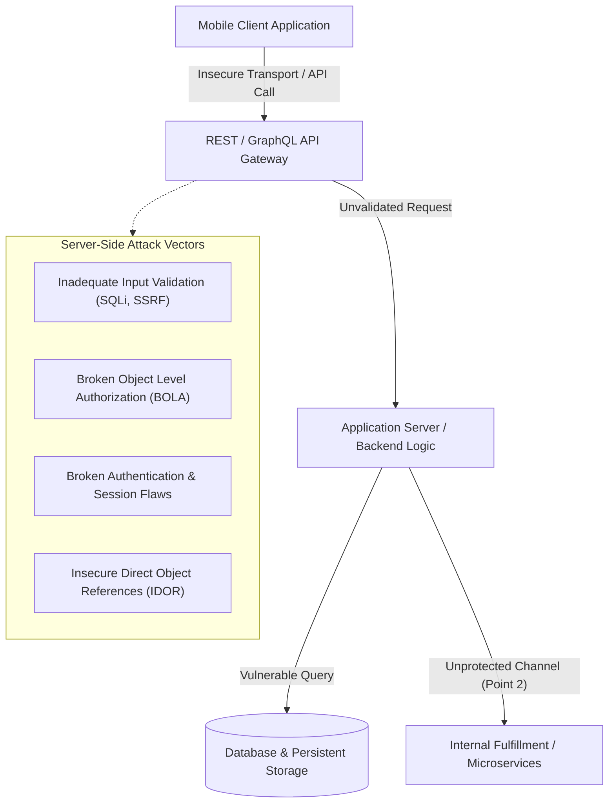

#### 1.1.1 Root Causes of Proliferation
- **Developer Knowledge Gaps:** The rapid evolution of mobile-focused backend technologies and frameworks has resulted in developers lacking deep server-side security fundamentals.
- **Insecure Framework Defaults:** Widespread adoption of rapid-development frameworks that default to insecure configurations or omit built-in sanitization.
- **High Rates of Outsourced Development:** Mobile client applications are frequently developed by third-party vendors without end-to-end security governance.
- **Disproportionate Security Budgets:** Development budgets prioritize visual UI/UX and mobile-specific features, underfunding backend hardening.
- **False Assumption of Client Isolation:** The erroneous belief that the mobile operating system's sandbox shields backend servers from malicious traffic.
- **Cross-Platform Compilation Complexities:** Cross-platform frameworks introduce abstraction layers that can obscure backend request flows and serialize payloads insecurely.

### 1.2 Ten Critical Server-Side Architecture Weaknesses

| Weakness | Vulnerability Mechanism | Impact |
| :--- | :--- | :--- |
| **1. Inadequate Input Validation** | Failure to filter, sanitize, or type-check incoming API parameters. | SQL Injection, Remote Code Execution (RCE), Path Traversal, and Command Injection. |
| **2. Insufficient Authentication & Authorization** | Missing role checks, weak token validation, or reliance on client-side status flags. | Account takeover, horizontal/vertical privilege escalation, and BOLA/IDOR exploits. |
| **3. Insecure Data Storage** | Backend databases storing unencrypted sensitive customer records or using weak hashing. | Bulk data breaches, credential dumping, and regulatory non-compliance. |
| **4. Poor Session Management** | Predictable session tokens, missing idle timeouts, or tokens that never invalidate upon logout. | Session hijacking, session fixation, and unauthorized replay attacks. |
| **5. Lack of Error Handling & Logging** | Stack traces or verbose database errors returned to the mobile client in JSON responses. | Information disclosure providing attackers internal architectural roadmaps. |
| **6. Exposure of Sensitive APIs** | Unprotected administrative endpoints, legacy debug routes, or hidden internal APIs exposed to the Internet. | Direct access to underlying business logic, system configurations, and batch jobs. |
| **7. Vulnerabilities in Third-Party Components** | Using outdated server libraries, unpatched dependencies, or vulnerable container images. | Known CVE exploits, supply chain attacks, and remote service compromise. |
| **8. Insecure Communication** | Cleartext internal transport between microservices, reverse proxies, and databases. | Internal network sniffing, Man-in-the-Middle (MITM) tampering, and credential harvesting. |
| **9. Inadequate Security Configuration** | Default administrative credentials, unnecessary open ports, verbose HTTP headers, or missing CORS. | System enumeration and unauthorized administrative takeover. |
| **10. Insufficient Monitoring & Intrusion Detection**| Lack of centralized API telemetry, threshold alerting, and real-time anomalous request detection. | Undetected lateral movement, sustained credential brute-forcing, and data exfiltration. |

### 1.3 Prevention Strategies
- **Automated Security Scanning:** Deploy Automated Dynamic Application Security Testing (DAST) and Interactive Application Security Testing (IAST) scanners to quickly identify known vulnerabilities across endpoints.
- **Detailed Manual Assessment:** Human-driven penetration testing to identify multi-step business logic flaws, authorization bypasses, and chained exploits that automated tools cannot identify.
- **Secure Software Development Lifecycle (SSDLC):** Integrate threat modeling, static code analysis (SAST), code reviews, and dependency scanning into the CI/CD pipeline rather than relying on perimeter controls like MDM (Mobile Device Management) or MAM (Mobile Application Management).
- **Zero-Trust Input Principle:** Never treat client-transmitted data as safe. Enforce strict server-side schema validation, parameterized queries, and context-aware sanitization.

### 1.4 Twelve Mobile Vulnerability Scanners

| Scanner | Type | Primary Capabilities |
| :--- | :--- | :--- |
| **1. App-Ray** | Automated SAST/DAST | Continuous mobile security scanning and compliance auditing for iOS and Android. |
| **2. Astra Pentest** | Automated & Manual | Comprehensive API and mobile vulnerability scanner with integrated pentest reporting. |
| **3. Codified Security** | Automated SAST | Cloud-based static analysis engine detecting security flaws directly from compiled APK/IPA binaries. |
| **4. MobSF (Mobile Security Framework)**| Automated SAST/DAST/API | Open-source all-in-one framework for static, dynamic, and API security assessment. |
| **5. Dexcalibur** | Dynamic Instrumentation | Reverse-engineering and dynamic analysis platform for Android Dalvik/ART engines. |
| **6. StaCoAn** | Static Analysis | Cross-platform tool for developers and bug hunters to analyze mobile codebases for hardcoded secrets. |
| **7. Runtime Mobile Security (RMS)** | Dynamic Analysis | Web interface powered by Frida for manipulating Android and iOS apps at runtime. |
| **8. Ostorlab** | Cloud DAST/SAST | Automated multi-engine scanner analyzing mobile binaries for vulnerabilities and privacy leaks. |
| **9. Quixxi** | Assessment & Protection | Vulnerability assessment engine combined with automated binary shielding and anti-tamper wrappers. |
| **10. SandDroid** | Dynamic Sandbox | Automated sandbox performing dynamic execution and behavioral analysis of Android applications. |
| **11. QARK (Quick Android Review Kit)**| Static Analysis | Open-source Python tool designed by LinkedIn to audit source code and packaged APKs for flaws. |
| **12. ImmuniWeb** | AI-Driven Mobile Pentest | AI-augmented mobile and backend API compliance testing against OWASP Mobile and MASVS standards. |

## 2. Insecure Data Storage

### 2.1 Threat Vectors and Risk Profile
Insecure Data Storage occurs when an application stores unencrypted, improperly protected, or unhashed sensitive data within a device's local file system, external media, or memory.

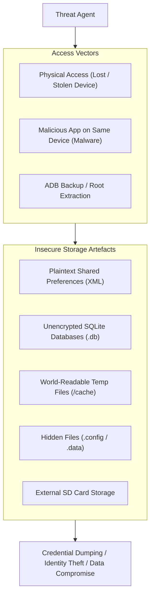

- **Threat Vectors:**
  - **Physical Device Access:** Attackers obtain lost, stolen, or seized devices and extract data via physical acquisition, bootloader exploits, or desktop backups.
  - **Malware & Rogue Applications:** Malicious apps running alongside the target exploit OS vulnerabilities, improper permissions, or shared external storage.
- **Architectural Golden Rule:** Mobile developers must assume the client device is untrusted and that threat actors can achieve root/physical access. Storing data unencrypted is functionally equivalent to having an unlocked device.

### 2.2 Vulnerable Storage Mechanisms and Mitigations

#### 2.2.1 Shared Preferences
- **Mechanism:** XML-based key-value storage stored under `/data/data/<package_name>/shared_prefs/`.
- **Vulnerability:** Saving sensitive tokens, passwords, or PII in cleartext.
- **Mitigation:**
  - Avoid storing sensitive data in Shared Preferences whenever possible.
  - Use `EncryptedSharedPreferences` (backed by Android KeyStore) for AES-256-GCM encryption.
  - Always enforce `MODE_PRIVATE` during creation (never `MODE_WORLD_READABLE` or `MODE_WORLD_WRITEABLE`).
  - Purge sensitive keys upon session logout.

#### 2.2.2 SQLite Databases
- **Mechanism:** Relational storage files (`.db`, `.sqlite`) under `/data/data/<package_name>/databases/`.
- **Vulnerability:** Unencrypted databases readable by rooted devices or backup utilities.
- **Mitigation:**
  - Use transparent database encryption via **SQLCipher** (AES-256 with PBKDF2 key derivation).
  - Enforce role-based access control and sanitize database access.
  - Delete temporary tables and cached records upon user logout.

#### 2.2.3 Temporary (`tmp`) Files
- **Mechanism:** Unpurged runtime scratch buffers, temporary download segments, or cached images written to `/cache` or `/tmp`.
- **Vulnerability:** Residual files persisting across sessions that remain exposed to inspection or shared storage.
- **Mitigation:**
  - Restrict temporary files strictly to the application's internal private cache (`context.getCacheDir()`).
  - Secure file permissions and explicitly call `file.delete()` immediately upon task completion or user exit.
  - Use encrypted transit (SFTP/FTPS/HTTPS) when receiving file assets.

#### 2.2.4 Hidden Files
- **Mechanism:** Prefixing filenames with a period (`.`) to hide them from standard file managers (e.g., `.keys`, `.userdata`).
- **Vulnerability:** Relying on security through obscurity; files remain fully accessible to shell commands (`ls -la`) or inspection utilities.
- **Mitigation:** Store all critical files exclusively in private application directories, apply cryptographic protection via Android KeyStore, and delete them when no longer required.

### 2.3 Vulnerable Code vs. Secure Implementation

#### 2.3.1 Insecure Storage Example (Plaintext Output)
```java showLineNumbers
// VULNERABLE: Stores raw credentials in plaintext inside private directory
private void saveCredentials(String username, String password) {
    try {
        FileOutputStream fos = openFileOutput("credentials.txt", Context.MODE_PRIVATE);
        fos.write(username.getBytes());
        fos.write(password.getBytes());
        fos.close();
    } catch (Exception e) {
        e.printStackTrace();
    }
}
```

#### 2.3.2 Secure Remediation (EncryptedSharedPreferences via KeyStore)
```java showLineNumbers
// SECURE: Uses AndroidX Security library backed by hardware-backed Android KeyStore
import androidx.security.crypto.EncryptedSharedPreferences;
import androidx.security.crypto.MasterKeys;

public void saveCredentialsSecurely(Context context, String username, String token) {
    try {
        String masterKeyAlias = MasterKeys.getOrCreate(MasterKeys.AES256_GCM_SPEC);

        SharedPreferences sharedPreferences = EncryptedSharedPreferences.create(
            "secure_prefs",
            masterKeyAlias,
            context,
            EncryptedSharedPreferences.PrefKeyEncryptionScheme.AES256_SIV,
            EncryptedSharedPreferences.PrefValueEncryptionScheme.AES256_GCM
        );

        SharedPreferences.Editor editor = sharedPreferences.edit();
        editor.putString("USER_ID", username);
        editor.putString("AUTH_TOKEN", token);
        editor.apply();
    } catch (Exception e) {
        e.printStackTrace();
    }
}
```

### 2.4 Platform-Specific Storage Best Practices

#### 2.4.1 iOS-Specific Controls
- **Credential Storage:** Never store user credentials in the file system or plist files.
- **Standard Cryptography:** Utilize Apple's native **CommonCrypto** framework or verified white-box cryptography solutions.
- **Database Encryption:** Employ **SQLCipher** for local SQLite database encryption.
- **Apple Keychain API:** Store short cryptographic items (passwords, tokens, keys) in the secure Keychain.
- **Accessibility Attribute:** Use `kSecAttrAccessibleWhenUnlocked` or `kSecAttrAccessibleAfterFirstUnlockThisDeviceOnly` to protect Keychain records.
- **Data Protection API:** For bulk file storage, enforce hardware-backed file encryption using `NSFileProtectionComplete`.

#### 2.4.2 Android-Specific Controls
- **Hardware-Backed KeyStore:** Store all cryptographic keys within the **Android KeyStore** provider to prevent private key extraction.
- **Enforce Encryption:** Force encryption using `DevicePolicyManager.setStorageEncryption()`.
- **Prohibit Hardcoded Keys:** Never embed encryption keys or initialization vectors (IVs) within source code; decompiler tools like JADX expose them instantly.
- **Restrict File Modes:** Avoid deprecated flags like `MODE_WORLD_READABLE` or `MODE_WORLD_WRITEABLE`.
- **External Storage Safeguards:** Never store unencrypted application data on external SD cards (`Environment.getExternalStorageDirectory()`); if required, encrypt data via `javax.crypto` (AES-GCM).

### 2.5 Security Testing and Exploitation Methodology
1. **Environment Setup:** Deploy application on a configured physical device or emulator with dynamic instrumentation tools installed.
2. **Manual Exploration:** Interact with all workflows, authenticate, populate forms, and inspect generated files using `adb shell` and file explorers.
3. **Automated Scanning:** Run static scanners (MobSF, QARK) to identify insecure storage API calls.
4. **Vulnerability Replication:** Attempt extraction of artifacts using backup utilities (`adb backup`) and check world-readable flags.
5. **Exploitation & Verification:** Use rooting/jailbreaking, SQL injection, and runtime hooks to verify access to confidential data.

## 3. Insufficient Transport Layer Protection (ITLP)

### 3.1 Overview and Protocol Mechanics
Insufficient Transport Layer Protection (ITLP) occurs when an application transmits sensitive data over network communication channels without adequate encryption, leaving data vulnerable to interception, tampering, and eavesdropping.

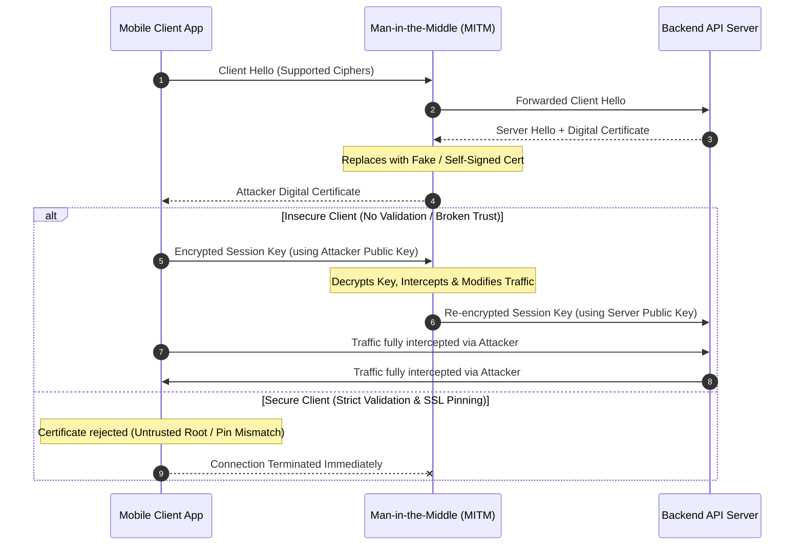

#### 3.1.1 How TLS Works
1. **Client Initiation:** Client initiates a TLS handshake by sending a `ClientHello` listing supported cipher suites.
2. **Server Presentation:** Server responds with a `ServerHello` and its X.509 digital certificate.
3. **Client Verification:** Client validates the certificate path, expiration, revocation status, and hostname.
4. **Session Key Generation:** Client and server negotiate symmetric session keys using asymmetric encryption or Diffie-Hellman exchange.
5. **Symmetric Encryption:** All subsequent payload data is encrypted using high-performance symmetric algorithms (e.g., AES-GCM, ChaCha20-Poly1305).

### 3.2 The Two Primary Attack Exploitation Points

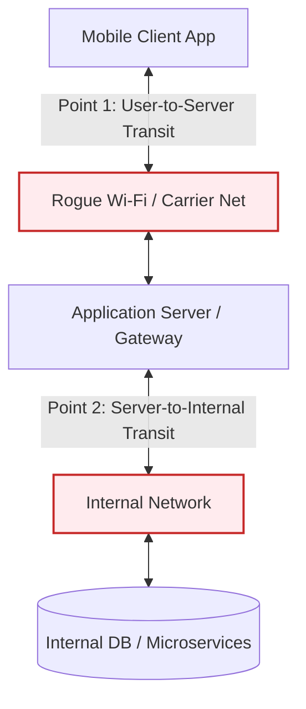

#### 3.2.1 Point 1: Transit Between Mobile User and Application Server
- **Vulnerability:** Unencrypted HTTP traffic, weak ciphers, or unverified certificates traversing carrier networks or public Wi-Fi hotspots.
- **Exploitation:** Attackers execute ARP spoofing, rogue access points (Evil Twin), or DNS poisoning to capture credentials, PII, session cookies, and authentication headers.
- **Scenario:** An application enforces HTTPS during initial login but downgrades to cleartext HTTP for profile updates, allowing an attacker on the same wireless network to hijack the session cookie.

#### 3.2.2 Point 2: Transit Between Application Server and Internal Network
- **Vulnerability:** Backend servers decrypt external TLS and forward sensitive transactions across internal networks, database links, or fulfillment services over unencrypted connections.
- **Exploitation:** Malicious insiders, compromised internal systems, or lateral-movement attackers sniff internal network segments to capture database credentials, payment transactions, and authentication records.

### 3.3 ITLP Hardening and Remediation Checklist
- **Zero-Trust Network Model:** Assume all transit layers (cellular carriers, Wi-Fi networks, and internal backplanes) are compromised.
- **Universal Transport Encryption:** Enforce TLS across all API endpoints, web sockets, third-party analytics connections, and WebViews.
- **Prevent Mixed-Mode Sessions:** Prohibit mixing HTTP and HTTPS content within the same application session.
- **Strong Cipher Suites:** Restrict supported suites to TLS 1.3 or modern TLS 1.2 configurations with perfect forward secrecy (ECDHE) and robust key sizes (AES-128/256).
- **Public CA Trust:** Utilize certificates issued by recognized, accredited Certificate Authorities.
- **Prohibit Self-Signed Certificates:** Enforce strict certificate validation and reject unverified or self-signed certificates.
- **SSL/TLS Certificate Pinning:** Implement certificate or public key pinning within mobile clients to neutralize custom rogue CA installations.
- **Full Certificate Chain Verification:** Validate the entire trust hierarchy up to the root certificate, including hostname verification and revocation checks (OCSP/CRL).
- **Security Alerts:** Notify users via UI prompts and terminate network sessions upon detecting invalid or suspicious certificates.
- **Avoid Insecure Auxiliary Channels:** Never transmit sensitive data, authorization tokens, or passwords over unencrypted SMS, MMS, or push notifications.

## 4. Unintended Data Leakage (UDL)

### 4.1 Concept and Operating Mechanism
Unintended Data Leakage (UDL) occurs when an application inadvertently places sensitive data into device storage locations or operating system subsystems that are accessible to other applications running on the same device.

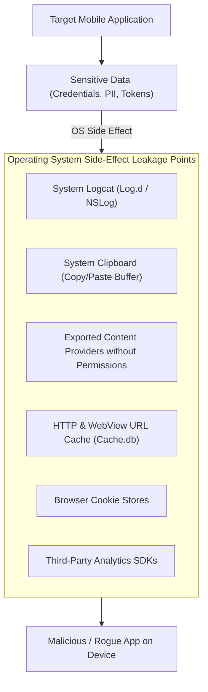

- **Mechanism:** The developer writes functional code to process user input or server payloads. As an unintended side-effect of the mobile operating system (e.g., automated crash reporting, UI state caching, keyboard autocorrect dictionaries, or diagnostic logging), data is silently mirrored to accessible system buffers.
- **Exploitation:** A low-privilege rogue application installed on the same device queries standard OS APIs (e.g., reading the clipboard, inspecting logcat, or querying exported providers) without requiring root permissions.

### 4.2 Insecure Data Storage vs. Unintended Data Leakage

| Dimension | Insecure Data Storage | Unintended Data Leakage |
| :--- | :--- | :--- |
| **Developer Intent** | **Deliberate Storage:** The developer intentionally saves data locally, but selects an insecure format or location. | **Inadvertent Side-Effect:** The developer does not intend to store data locally; the OS or runtime writes it automatically. |
| **Primary Mechanism** | Plaintext files, unencrypted SQLite databases, or world-readable files. | OS clipboard caching, system logging, URL caching, crash dumps, and keyboard prediction. |
| **Typical Remediation** | Apply robust encryption (e.g., SQLCipher, EncryptedSharedPreferences). | Sanitize inputs, disable OS caching flags, restrict logging, and scrub buffers. |

### 4.3 Six Common Leakage Vectors & Countermeasures

#### 4.3.1 Leaking Content Providers
- **Mechanism:** Android Content Providers declared without explicit permissions or with `android:exported="true"`.
- **Mitigation:** Set `android:exported="false"`, or enforce custom permissions with `protectionLevel="signature"`.

#### 4.3.2 Copy/Paste Buffer Caching
- **Mechanism:** Sensitive fields (e.g., credit card numbers, passwords) copied to the global operating system clipboard remain accessible to any application with clipboard monitoring enabled.
- **Mitigation:** Clear the clipboard programmatically after sensitive operations; disable copy/paste functionality on sensitive password input fields.

#### 4.3.3 Application Logging
- **Mechanism:** Developers leave diagnostic statements (`Log.d()`, `Log.v()`, `NSLog()`) in production code, emitting sensitive tokens and credentials into system logcat.
- **Mitigation:** Strip logging statements automatically during production compilation using ProGuard/R8 rules:
  ```properties
  -assumenosideeffects class android.util.Log {
      public static *** d(...);
      public static *** v(...);
  }
  ```

#### 4.3.4 URL Caching
- **Mechanism:** WebViews and HTTP networking clients cache complete URLs, including query parameters containing sensitive session tokens or API keys, within local disk caches.
- **Mitigation:** Pass sensitive parameters exclusively within the HTTP request body via POST/PUT requests; configure HTTP cache-control headers (`no-cache`, `no-store`).

#### 4.3.5 Browser Cookie Objects
- **Mechanism:** Persistent cookies stored by embedded WebViews (`CookieManager`) can be accessed if file permissions or sandbox boundaries are misconfigured.
- **Mitigation:** Configure cookies with `HttpOnly`, `Secure`, and `SameSite` flags; explicitly purge session cookies via `CookieManager.getInstance().removeAllCookies()` on logout.

#### 4.3.6 Analytics Sent to Third Parties
- **Mechanism:** Commercial analytics, crash reporting, and marketing SDKs automatically scrape device state, user identity, and UI inputs, transmitting telemetry to third-party endpoints.
- **Mitigation:** Audit third-party SDK telemetry, sanitize data payloads before passing them to external trackers, and minimize external dependency usage.

## 5. Poor Authentication and Authorization

### 5.1 Security Risks and Impact
Improper authentication and authorization architectures expose mobile backends and client applications to severe security risks, including:
- **Account Takeover:** Automated credential stuffing, password spraying, and brute-force attacks compromising user accounts.
- **Privilege Escalation:** Standard users gaining unauthorized administrative access (vertical escalation) or accessing records of other users (horizontal escalation / BOLA).
- **Data Breaches & Fraud:** Unauthorized execution of sensitive financial transactions or bulk extraction of confidential data.

### 5.2 Ten Principles for Robust Authentication and Authorization

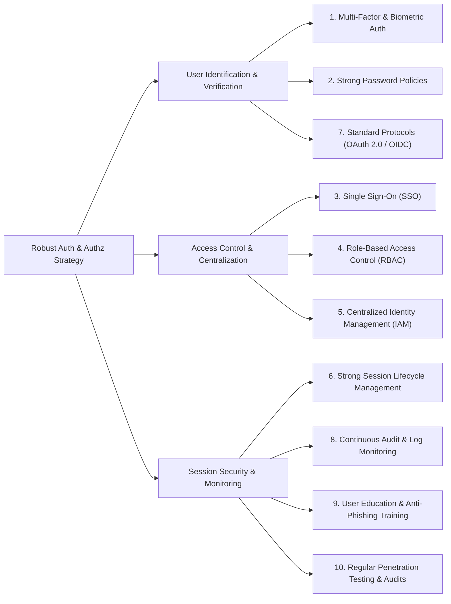

1. **Implement Strong Authentication Methods:**
   - Enforce Multi-Factor Authentication (MFA) via time-based one-time passwords (TOTP) or hardware tokens.
   - Integrate biometric authentication (fingerprint/facial recognition) backed by secure hardware (Secure Enclave / TEE).
   - Implement risk-based adaptive authentication that challenges users based on anomalous location, IP velocity, or device state.
2. **Enforce Secure Password Policies:**
   - Enforce complexity (minimum length, character classes) and reject breached passwords against known wordlists.
   - Restrict password reuse and enforce secure reset workflows without leaking account existence.
3. **Implement Single Sign-On (SSO):**
   - Streamline identity validation across enterprise applications using federated SSO.
   - Use standardized, secure authorization protocols such as **OAuth 2.0** and **OpenID Connect (OIDC)**.
4. **Implement Role-Based Access Control (RBAC):**
   - Enforce the Principle of Least Privilege across all API endpoints and resources.
   - Granularly restrict access based on defined roles and perform regular access reviews.
5. **Centralize Authentication and Authorization:**
   - Consolidate identity management through enterprise Identity and Access Management (IAM) systems.
   - Prevent fragmented authentication logic across independent backend services.
6. **Implement Strong Session Management:**
   - Enforce short idle timeouts and hard session expirations.
   - Protect session cookies using `HttpOnly`, `Secure`, and `SameSite=Strict` attributes to eliminate client-side script access.
7. **Adopt Secure, Standardized Protocols:**
   - Adhere strictly to OAuth 2.0 RFCs, utilizing Proof Key for Code Exchange (**PKCE**) for mobile clients instead of deprecated implicit grants.
8. **Regularly Audit and Monitor Authentication Logs:**
   - Centralize authentication logs into a SIEM system to monitor failed login spikes, credential stuffing, and unauthorized access attempts in real time.
9. **Provide Continuous User Education:**
   - Train users on password hygiene, social engineering awareness, and multi-factor prompt security.
10. **Conduct Regular Security Assessments:**
    - Perform scheduled penetration testing, code reviews, and threat modeling against authentication endpoints.

## 6. Broken Cryptography

### 6.1 Definition and Fundamentals
Broken Cryptography refers to situations where cryptographic primitives, algorithms, key management workflows, or implementations fail to provide confidentiality, integrity, or authenticity. This failure occurs due to algorithmic vulnerabilities, mathematical advances, flawed implementation, or increasing computational power.

### 6.2 Seven Root Causes of Cryptographic Failure

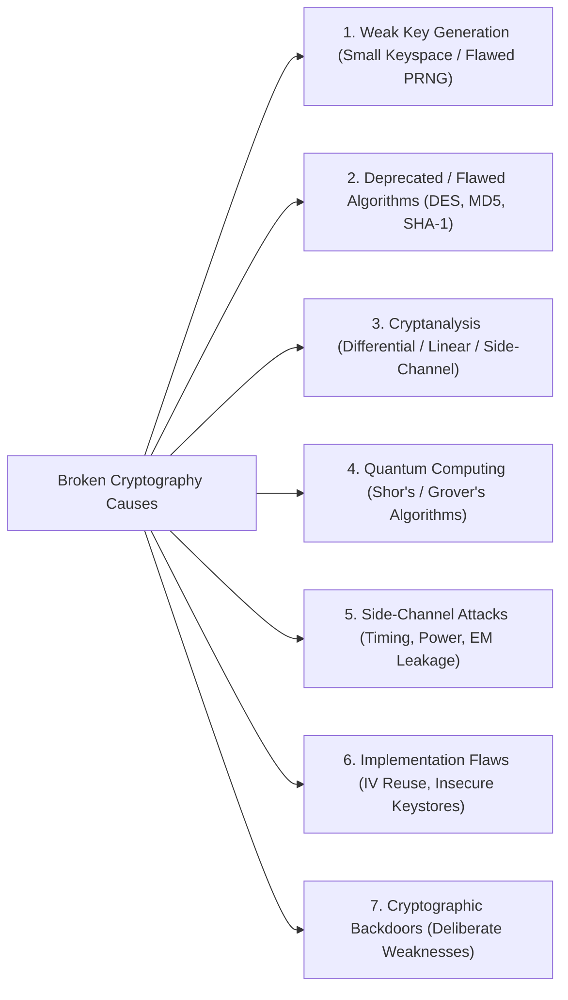

#### 6.2.1 Weak Key Generation
- **Vulnerability:** Generating keys using predictable random number generators (e.g., standard `java.util.Random` instead of `java.security.SecureRandom`) or using small keyspaces.
- **Impact:** Attackers can recreate seeds, predict generated keys, and brute-force the keyspace.

#### 6.2.2 Vulnerabilities in Algorithms
- **Vulnerability:** Utilizing legacy, mathematically broken, or deprecated cryptographic algorithms (e.g., DES, 3DES, RC4, MD5, SHA-1).
- **Impact:** Collision vulnerabilities (MD5/SHA-1) and low key-length vulnerabilities (DES 56-bit) permit rapid brute-forcing.

#### 6.2.3 Cryptanalysis
- **Vulnerability:** Theoretical and practical advances in mathematical cryptanalysis, such as linear and differential cryptanalysis.
- **Impact:** Allows attackers to decrypt ciphertexts or recover keys significantly faster than brute-force mathematical bounds.

#### 6.2.4 Quantum Computing
- **Vulnerability:** Asymmetric algorithms relying on integer factorization or discrete logarithms (RSA, ECC, Diffie-Hellman) are vulnerable to **Shor's Algorithm** executed on cryptographically relevant quantum computers.
- **Impact:** Complete exposure of asymmetric public-key cryptography; symmetric keys are also weakened by **Grover's Algorithm** (requiring key size doubling to AES-256).

#### 6.2.5 Side-Channel Attacks
- **Vulnerability:** Information leakage during physical algorithm execution, including execution timing variations, power consumption spikes, and electromagnetic emanations.
- **Impact:** Attackers analyzing physical side-channels can infer secret key bits without breaking the mathematical algorithm.

#### 6.2.6 Implementation Flaws
- **Vulnerability:** Flaws in how a secure algorithm is written in code. Examples include reusing Initialization Vectors (IVs) or nonces in AES-GCM mode, hardcoding secret keys in source files, and writing keys to unencrypted swap memory.
- **Impact:** Complete loss of confidentiality and integrity even when using standard algorithms like AES.

#### 6.2.7 Cryptographic Backdoors
- **Vulnerability:** Intentional mathematical or architectural weaknesses inserted into cryptographic standards, hardware modules, or proprietary encryption libraries.
- **Impact:** Enables specific third parties or state actors to bypass encryption controls unnoticed.

## 7. Client-Side Injection

### 7.1 Overview
Client-side injection vulnerabilities occur when an application accepts untrusted data that is subsequently interpreted, rendered, or executed as code within the client execution environment (e.g., a mobile browser, WebView, or local client template engine). This contrasts with server-side injection, which executes malicious commands within backend databases, servers, or operating systems.

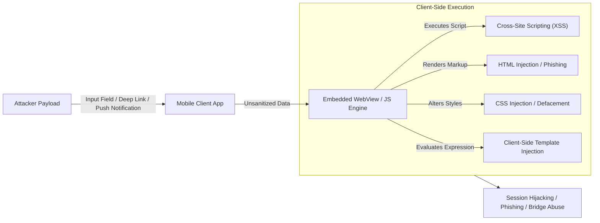

### 7.2 Primary Types of Client-Side Injection

#### 7.2.1 Cross-Site Scripting (XSS) in Mobile Applications
- **Mechanism:** Malicious JavaScript injected into mobile WebViews (`android.webkit.WebView`, `WKWebView`) via input forms, deep links, or compromised server responses.
- **Mobile-Specific Impact:** In addition to stealing cookies, mobile XSS can bridge into the native layer if the WebView exports native interfaces (e.g., Android `addJavascriptInterface`). This can allow an attacker to read local contacts, track GPS location, or access private application files.

#### 7.2.2 HTML Injection (Content Spoofing)
- **Mechanism:** Injecting arbitrary HTML tags into rendered web views or rich-text containers without script execution.
- **Impact:** Visual defacement, dialog spoofing, and credential phishing overlays that trick users into entering sensitive credentials within a trusted application frame.

#### 7.2.3 CSS Injection
- **Mechanism:** Injecting unauthorized Cascading Style Sheets into the application's rendered web context.
- **Impact:** Altering application layouts, hiding important security disclosures, or using CSS attribute selectors and background URL requests to exfiltrate keystrokes and sensitive form data.

#### 7.2.4 Client-Side Template Injection (CSTI)
- **Mechanism:** Occurs when applications dynamically concatenate untrusted user input into client-side template engines (such as AngularJS, Vue.js, or Mustache) instead of binding parameters.
- **Impact:** Allows attackers to break out of template sandboxes, execute arbitrary JavaScript, and achieve client-side remote code execution.

## 8. Security Decisions via Untrusted Input

### 8.1 Risks of Input-Driven Security Logic
Relying on untrusted, client-supplied input to drive critical authorization, authentication, routing, or access control decisions compromises system boundaries. Threat actors can manipulate request parameters, HTTP headers, hidden form fields, and client-side flags to deceive backend systems into granting unauthorized access.

### 8.2 Eight Defensive Design Principles

```mermaid
flowchart LR
    Rule["Defensive Engineering for Untrusted Input"]
    
    Rule --> R1["1. Strict Input Validation (Allow-listing & Schema Enforcement)"]
    Rule --> R2["2. Principle of Least Privilege (Minimize Capabilities)"]
    Rule --> R3["3. Context-Aware Decision Logic"]
    Rule --> R4["4. Canonicalization & Input Encoding"]
    Rule --> R5["5. Context-Specific Output Escaping"]
    Rule --> R6["6. Telemetry, Logging & Anomaly Monitoring"]
    Rule --> R7["7. Developer Security Awareness Training"]
    Rule --> R8["8. Thorough Vetting of Third-Party Libraries & APIs"]
```

1. **Strict Input Validation:**
   - Enforce rigorous allow-lists (regex, character bounds, length checks) on all incoming parameters before evaluation.
   - Reject malformed data rather than attempting to sanitize bad input.
2. **Principle of Least Privilege:**
   - Grant the minimum permissions required to process untrusted requests.
   - Isolate execution contexts handling untrusted data.
3. **Context-Aware Decisions:**
   - Evaluate input in relation to the operational context. Verify that inputs making access claims match verified session properties.
4. **Input Encoding & Canonicalization:**
   - Canonicalize inputs to a standard representation prior to inspection to eliminate bypasses based on multi-byte characters or encoding variations.
5. **Context-Specific Output Escaping:**
   - Escape untrusted output based on the destination context (HTML body, JavaScript variable, SQL statement, or JSON object) to neutralize injection vulnerabilities.
6. **Logging and Monitoring:**
   - Log input validation failures to detect automated fuzzing and reconnaissance attempts.
7. **Developer Security Awareness:**
   - Train developers to recognize dangerous coding patterns, such as using untrusted parameters to specify file paths, component intents, or SQL queries.
8. **Third-Party Library & API Governance:**
   - Validate and sanitize data passed to and received from third-party libraries, SDKs, and external microservices.

## 9. Improper Session Handling

### 9.1 Overview and Role of Stateful Sessions
Mobile applications rely on session tokens (such as JWTs, OAuth access tokens, or session cookies) to maintain state between the mobile client and backend servers. Improper session handling occurs when an application fails to manage the lifecycle, storage, transmission, or entropy of these tokens securely.

### 9.2 Six Core Session Handling Vulnerabilities

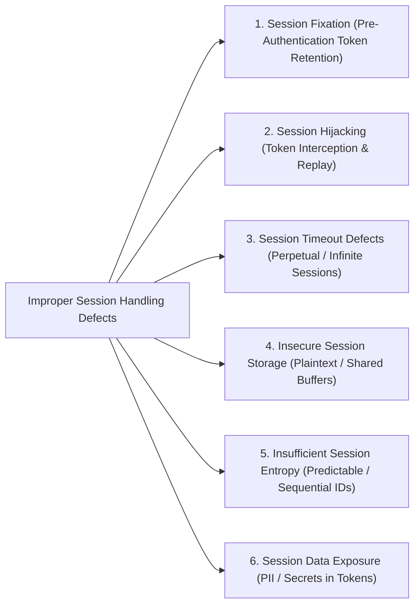

#### 9.2.1 Session Fixation
- **Vulnerability:** The application retains an existing session identifier across privilege level changes (e.g., after user login).
- **Exploitation:** An attacker sets a known session identifier in the victim's client. Once the victim authenticates, the attacker uses the fixed identifier to access the account.
- **Remediation:** Always invalidate the existing session identifier and generate a cryptographically new token upon authentication.

#### 9.2.2 Session Hijacking
- **Vulnerability:** Attackers intercept or steal a valid, active session token via network sniffing, XSS, device malware, or log exposure.
- **Remediation:** Enforce TLS across all communications, utilize `HttpOnly` and `Secure` cookie flags, bind tokens to client context, and support token revocation.

#### 9.2.3 Session Timeout Defects
- **Vulnerability:** Sessions lack idle timeout limits or maximum lifetime caps, remaining valid indefinitely.
- **Remediation:** Enforce short idle timeouts (e.g., 10-15 minutes of inactivity) and maximum absolute session expirations (e.g., 8-24 hours).

#### 9.2.4 Insecure Session Storage
- **Vulnerability:** Session tokens stored in cleartext in world-readable Shared Preferences, external storage, unencrypted SQLite databases, or web local storage.
- **Remediation:** Store session credentials strictly within the hardware-backed **Android KeyStore** or **iOS Keychain**.

#### 9.2.5 Insufficient Session Entropy
- **Vulnerability:** Session identifiers generated using predictable algorithms, incremental counters, or weak pseudorandom number generators.
- **Remediation:** Generate session identifiers using cryptographically secure random number generators with at least 128 bits of entropy.

#### 9.2.6 Session Data Exposure
- **Vulnerability:** Embedding sensitive user data, passwords, or internal security permissions directly inside unencrypted session tokens (e.g., plaintext JWT claims).
- **Remediation:** Store sensitive state server-side; encrypt token payloads if sensitive claims must be transmitted.

## 10. Lack of Binary Protection

### 10.1 Definition and Reverse Engineering Risks
Lack of Binary Protection refers to compiling, packaging, and distributing mobile applications without implementing defensive compiler flags, binary hardening controls, anti-tamper mechanisms, or runtime protection.

- **Consequences of Inadequate Protection:**
  - **Reverse Engineering:** Attackers easily decompile applications to near-original source code using tools like JADX, Ghidra, and IDA Pro to extract intellectual property and discover vulnerabilities.
  - **Binary Tampering & Repackaging:** Adversaries modify bytecode (e.g., patching Smali instructions) to bypass licensing, disable authentication, inject malware, re-sign, and redistribute the trojanized app.
  - **Dynamic Manipulation:** Attackers attach debuggers or inject Frida hooks into unhardened binaries to manipulate runtime memory.

### 10.2 Eight Essential Binary Hardening Mechanisms

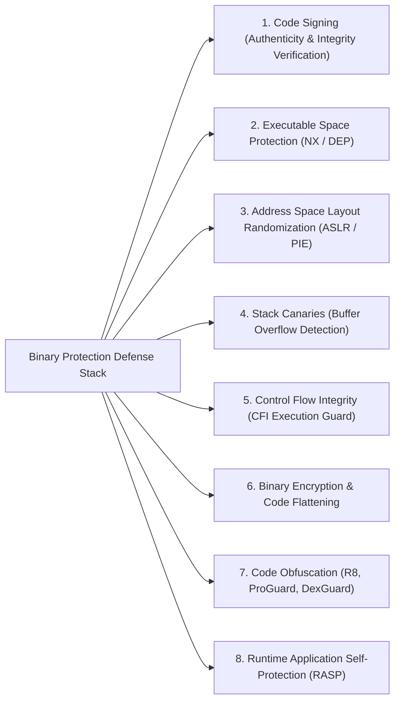

| Hardening Mechanism | Technical Implementation | Threat Neutralized |
| :--- | :--- | :--- |
| **1. Code Signing** | Cryptographic digital signatures applied to APK/AAB or IPA packages using developer private keys. | Detects unauthorized tampering, modified binaries, and trojanized repackaging. |
| **2. Executable Space Protection (NX / W^X)**| CPU-level memory page protection designating memory as either writable or executable, never both. | Prevents execution of shellcode injected into stack or heap data pages. |
| **3. ASLR / PIE** | **Address Space Layout Randomization** paired with **Position Independent Executables (PIE)** randomizes memory offsets of code, stack, and libraries. | Thwarts memory corruption exploits and Return-Oriented Programming (ROP) attacks. |
| **4. Stack Canaries** | Compiler inserts random integer guards before the saved frame pointer and return address on the stack. | Detects and aborts execution upon stack buffer overflows before control flow is redirected. |
| **5. Control Flow Integrity (CFI)**| Hardware and compiler checks verifying that indirect function calls and jumps target legitimate binary locations. | Prevents execution hijacking by ensuring runtime paths conform to compile-time call graphs. |
| **6. Binary Encryption** | Encrypts binary segments, decrypting them dynamically only within protected memory during runtime. | Hinds static disassembly and binary extraction via disassemblers. |
| **7. Code Obfuscation** | Renames classes and methods to meaningless symbols, flattens control flow, and encrypts strings (e.g., ProGuard, R8, DexGuard). | Hinders static code analysis and reverse-engineering efforts. |
| **8. Runtime Application Self-Protection (RASP)**| Embedded runtime integrity hooks that detect debuggers (`ptrace`), root/jailbreak environments, emulators, and active hooking frameworks (Frida). | Terminates the application when running in hostile, compromised, or monitored execution environments. |