# Unit - 1
:::info[TITLE]
## Advanced Meterpreter Concepts
:::

## 1. Multiple Communication Channels

Meterpreter requires a persistent, resilient communication channel between the target host and the Metasploit infrastructure to orchestrate post-exploitation operations.

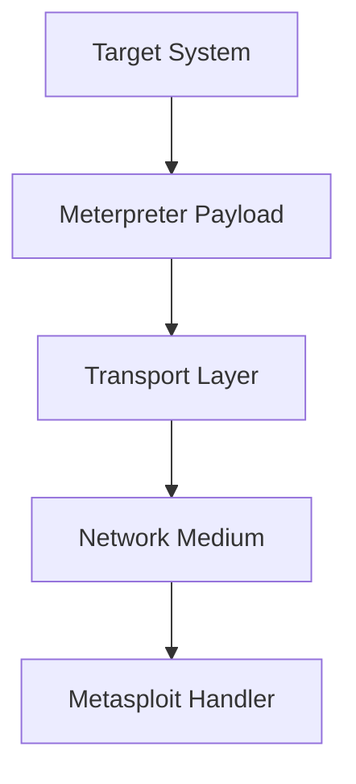

### 1.1 Meterpreter Communication Fundamentals

#### 1.1.1 Target-to-Handler Communication Flow
The communication pipeline establishes an interactive bridge across multiple layers:
1. **Target:** The compromised endpoint running the active memory process.
2. **Meterpreter:** The in-memory reflective payload executing commands and managing session state.
3. **Transport:** The configured protocol layer packaging and transmitting data.
4. **Network:** The underlying transmission media (LAN, WAN, Internet, enterprise firewalls).
5. **Handler:** The listening instance (`exploit/multi/handler`) within Metasploit that receives and decodes data streams.

#### 1.1.2 Communication Channel Properties
The chosen communication channel directly dictates the operational characteristics of the session:
- **Session Communication Mode:** Determines whether data exchange is synchronous, asynchronous, or streaming.
- **Protocol Selection:** Dictates whether the connection uses raw TCP sockets, HTTP requests, encrypted HTTPS tunnels, or Windows named pipes over SMB.
- **Connection Behavior:** Governs retry mechanisms, keep-alive frequencies, and response latency.
- **Session Resilience:** Dictates how the session survives network disruptions, firewall resets, or egress proxy re-authentication.

### 1.2 Multi-Channel Capabilities and Objectives

#### 1.2.1 Rationale for Multiple Channels
Configuring redundant or diverse communication channels provides critical operational advantages:
- **Connection Reliability:** Automatically recovers sessions when unstable physical or wireless links drop.
- **Bypassing Network Restrictions:** Allows fallback to permissible outbound ports (such as port 443) when standard ports (such as port 4444) are blocked.
- **Transport Flexibility:** Provides runtime adaptability without requiring re-exploitation.
- **Support for Red-Team Assessments:** Mimics realistic threat actors who establish multiple egress paths.
- **Path Redundancy:** Maintains persistent command and control (C2) even if network administrators terminate a single established connection.

#### 1.2.2 Core Channel Terminology
- **Primary Transport:** The currently active communication mechanism carrying traffic between Meterpreter and the handler.
- **Transport List:** The registry of all configured communication mechanisms associated with the active session.
- **Transport Failover:** The automatic or manual transition to an alternate configured transport when the primary transport becomes unresponsive or severed.

### 1.3 Communication Channel Architecture

#### 1.3.1 Transport Multiplexing Architecture
Meterpreter decouples the core payload logic from its underlying network transport layer. A single Meterpreter session instance can switch dynamically between several protocols:

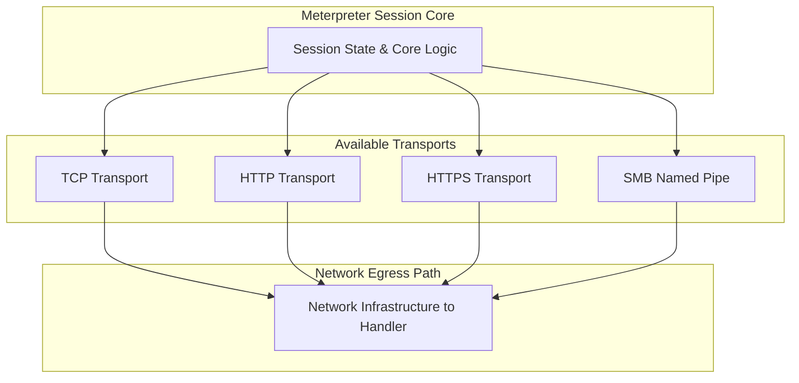

#### 1.3.2 Transport Characteristics
Each communication transport presents distinct trade-offs across five operational dimensions:
- **Protocol Characteristics:** Raw binary packet streams versus RFC-compliant web traffic headers.
- **Visibility:** High-entropy cleartext signatures versus encrypted TLS payloads.
- **Network Requirements:** Direct IP-to-IP routing versus intermediate web proxy support.
- **Performance:** Low latency raw sockets versus request-response polling overhead.
- **Security Implications:** Exposure to deep packet inspection (DPI) versus seamless egress blending.

### 1.4 Transport Management Operations

#### 1.4.1 Channel Control Operations
Meterpreter exposes native commands to control its underlying communication channels:
- **View Configured Transports (`transport list`):** Displays all registered transports, showing protocol, URI, host, port, and status.
- **Add a Transport (`transport add`):** Appends a backup communication path (e.g., adding an HTTPS transport to an existing TCP session).
- **Remove a Transport (`transport remove`):** Deletes a registered transport profile from memory.
- **Switch Between Transports (`transport next` / `transport prev`):** Manually switches the active channel to test alternate paths.
- **Configure Transport Behavior:** Adjusts timeouts, retry counters, and sleep durations for failover policies.

#### 1.4.2 Dynamic Transport Switching Workflow

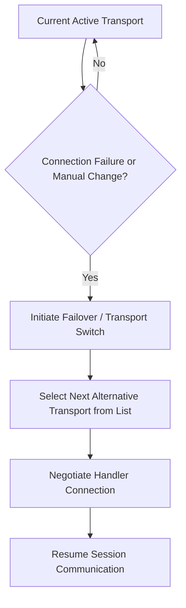

:::warning[ISOLATED LAB REQUIREMENT]
In academic and training environments, multiple transport management and dynamic failovers must only be demonstrated inside an isolated laboratory network to avoid generating unauthorized cross-segment telemetry.
:::

## 2. Meterpreter Transports

A transport serves as the foundational communication pipe through which the Meterpreter payload exchanges command strings and binary results with the Metasploit framework handler.

### 2.1 Transport Architecture & Classification

#### 2.1.1 Payload Functionality vs. Transport Mechanism
- **Payload (Functionality):** Defines what actions execute on the endpoint (e.g., hash dumping, privilege escalation, file downloads).
- **Transport (Communication Mechanism):** Defines how data packets travel between the target and the testing infrastructure.

#### 2.1.2 Supported Transport Protocols
Meterpreter categorizes transports into four primary protocol families:
1. **TCP (Transmission Control Protocol)**
2. **HTTP (Hypertext Transfer Protocol)**
3. **HTTPS (HTTP over TLS/SSL)**
4. **SMB (Server Message Block / Named Pipes)**

### 2.2 TCP Transport

#### 2.2.1 Mechanics and Characteristics
- **Direct Socket Connection:** Establishes a raw, bidirectional stream between the target process and the listener port.
- **Minimal Overhead:** Operates with near-zero protocol packaging, maximizing throughput for large memory dumps or file transfers.
- **Operational Speed:** Offers the fastest response times for interactive command execution.
- **Use Case:** Ideal for internal lab environments, isolated assessment ranges, and networks without egress filtering.

#### 2.2.2 Security Telemetry and Detection
Raw TCP connections display identifiable anomalies that modern defensive appliances flag:
- **Firewall Logs:** Persistent connections over non-standard high ports (e.g., 4444) stand out in egress logs.
- **NetFlow / IPFIX:** Long-duration sessions with sustained unidirectional or bidirectional flows without standard application banners.
- **IDS/IPS Systems:** Snort and Suricata signatures trigger on initial unencrypted Meterpreter staging handshakes.
- **EDR Network Telemetry:** Process-to-network telemetry links uncommon host executables (e.g., `rundll32.exe`, `spoolsv.exe`) directly to external TCP sockets.

### 2.3 HTTP Transport

#### 2.3.1 Web-Based Communication Mechanics
- **Encapsulation:** Packages Meterpreter Type-Length-Value (TLV) packets inside standard HTTP `GET` and `POST` request/response bodies.
- **Proxy Traversal:** Leverages system proxy settings and traverses corporate boundary proxies that permit outbound web traffic.
- **Telemetry Profile:** Produces standard HTTP request headers, response codes (e.g., 200 OK), and web transactions.

#### 2.3.2 Defensive Telemetry Points
Security Operations Center (SOC) analysts identify rogue HTTP sessions by inspecting:
- **Destination Reputation:** Connections heading to un-categorized external IP addresses or freshly registered domains.
- **URL Patterns:** Repetitive URI path lengths and pseudo-random alphanumeric query strings characteristic of Metasploit URI generators.
- **User-Agent Headers:** Default or mismatched User-Agent strings that fail to match the host OS architecture.
- **Beaconing Frequency:** Fixed-interval HTTP polling visible in web proxy and firewall logs.
- **Originating Process:** Legitimate web requests originate from browsers (`chrome.exe`), whereas Meterpreter originates from hijacked binaries (`cmd.exe`, `powershell.exe`, injected services).

### 2.4 HTTPS Transport

#### 2.4.1 Encrypted Channel Mechanics
- **TLS Encrypted Payloads:** Wraps all session communications inside an SSL/TLS tunnel, encrypting command streams and exfiltrated data.
- **Confidentiality:** Neutralizes inline packet sniffers and legacy Network Intrusion Detection Systems (NIDS) unable to inspect payload contents.
- **Traffic Masking:** Blends session communications into ambient encrypted web traffic.

#### 2.4.2 Encryption Limitations and Network Visibility

:::tip[EXAM TIP: FILELESS & ENCRYPTED DOES NOT MEAN INVISIBLE]
While HTTPS conceals the raw data payload, the underlying metadata remains fully accessible to network security controls.
:::

Defenders expose HTTPS Meterpreter sessions by analyzing:
- **Source and Destination Addresses:** Non-corporate external IP addresses hosting self-signed certificates.
- **Connection Timing and Volume:** Rhythmic beaconing intervals and abnormal upload-to-download data ratios.
- **TLS Fingerprinting (JA3 / JA4):** Specific SSL client cipher suites, extensions, and elliptic curve formats that differ from standard desktop browsers.
- **Certificate Inspection:** Default Metasploit SSL certificates (often containing randomized or dummy organizational names) detected during certificate exchange before the handshake completes.
- **Process Context:** EDR agents verify which host binary initiated the TLS socket.

### 2.5 SMB Transport

#### 2.5.1 Named Pipes & Windows Internal Communication
- **Named-Pipe Transport:** Meterpreter communicates over Windows Named Pipes encapsulated within the Server Message Block (SMB) protocol over port 445/139.
- **Internal Host-to-Host Operations:** Ideal for communicating between compromised internal nodes where direct internet egress is blocked.
- **Native Protocol Resemblance:** Emulates standard inter-process and file-sharing traffic native to Active Directory environments.

#### 2.5.2 Lateral Movement & Security Relevance
SMB transport plays a central role in enterprise post-exploitation assessments:
- **Lateral Movement Investigation:** Blue teams monitor named-pipe creation events across the domain.
- **Internal Traffic Baselines:** Helps identify lateral connections originating from unauthorized workstations rather than file servers.
- **Windows Attack Detection:** Correlates named pipes against known Metasploit defaults (e.g., `\pipe\msf-pipe` or randomized pipe naming conventions).

### 2.6 Comprehensive Transport Comparison

| Transport | Protocol | Main Characteristic | Network Visibility | Primary Detection Artifact |
|---|---|---|---|---|
| **TCP** | Raw TCP | Direct socket, fast, low overhead | High | Unusual port numbers, raw packet signatures, firewall egress alerts |
| **HTTP** | HTTP (Plaintext) | Web-based, proxy traversal | Moderate | Proxy logs, URI randomness, User-Agent anomalies, lack of SSL |
| **HTTPS** | HTTP over TLS | Encrypted payload, mimics web traffic | Reduced Content Visibility | JA3/JA4 fingerprints, suspicious SSL certificates, connection periodicity |
| **SMB** | SMB / Named Pipe | Internal Windows inter-process communication | High Internal Relevance | Event ID 5145, named pipe creation, abnormal workstation-to-workstation port 445 traffic |

### 2.7 Dynamic Transport Switching & Failover

#### 2.7.1 Switching Architecture
When a primary transport path is blocked or severed, Meterpreter activates its configured fallback mechanism:

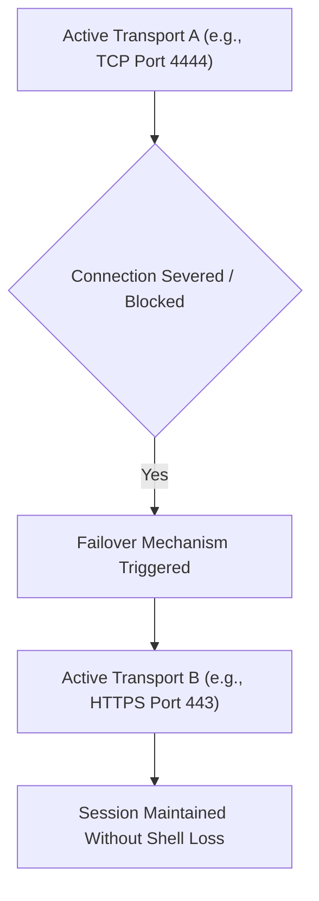

#### 2.7.2 Security Significance for Defenders
Dynamic transport switching proves why defenders must never rely on single-point controls:
- **Do Not Rely Exclusively On:**
  - Blocking single ports (e.g., blocking port 4444 does not block port 443).
  - Blocking specific protocols (e.g., falling back from TCP to HTTPS).
  - Filtering fixed IP destinations (e.g., rotating C2 domain names or proxies).
- **Core Defense Strategy:** Correlate endpoint telemetry (process execution, thread injection) with holistic network behavior (flow analytics, beaconing anomalies) rather than relying solely on perimeter port filtering.

## 3. Pivoting & Port Forwarding

In enterprise penetration tests, target assets frequently reside on isolated internal subnets without public internet connectivity.

### 3.1 Network Pivoting Fundamentals

#### 3.1.1 Concept of a Bridgehead / Foothold
Pivoting is the technique of routing traffic through an already compromised system (the *foothold* or *bridgehead*) to reach inaccessible subnets and secondary hosts.

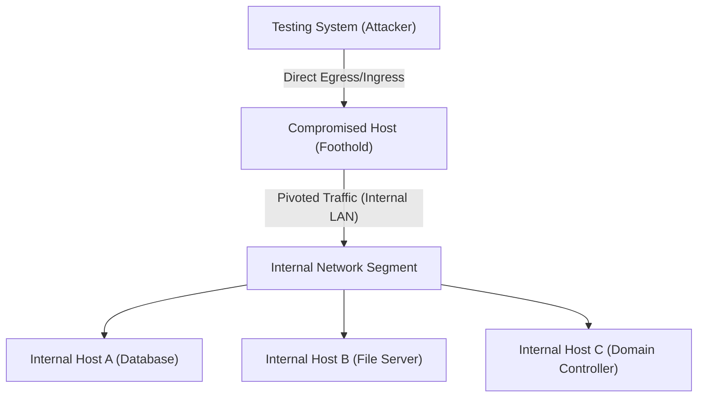

#### 3.1.2 Rationale and Reachability Use Cases
- **No Direct Routing:** The testing team cannot reach the target subnet due to Network Address Translation (NAT) or firewall isolation.
- **Zone Boundary Crossing:** The foothold resides in a DMZ, dual-homed with one network card facing the internet and a second connected to the internal LAN.
- **Enterprise Emulation:** Replicates how advanced threat actors expand unauthorized reach through corporate networks.

### 3.2 Pivoting vs. Multiple Transports

Pivoting and multiple transports are distinct concepts addressing different operational challenges:

| Dimension | Multiple Transports | Network Pivoting |
|---|---|---|
| **Primary Scope** | Session Egress Path | Network Reachability |
| **Focus** | How the Meterpreter session communicates with the handler | How traffic reaches secondary systems through an existing foothold |
| **Path Definition** | Endpoint $\leftrightarrow$ Metasploit Handler | Metasploit $\rightarrow$ Foothold $\rightarrow$ Internal Targets |
| **Primary Goal** | Communication resiliency & evasion | Lateral access across segmented networks |
| **Protocol Impact** | Switches transport mechanisms (e.g., TCP to HTTPS) | Routes arbitrary network packets through an existing session tunnel |

### 3.3 Meterpreter Port Forwarding

#### 3.3.1 Port Mapping Architecture
Meterpreter's port forwarding (`portfwd`) binds a local listening port on the attacker's testing machine and tunnels traffic through the established Meterpreter session to a specific service on an internal target host:

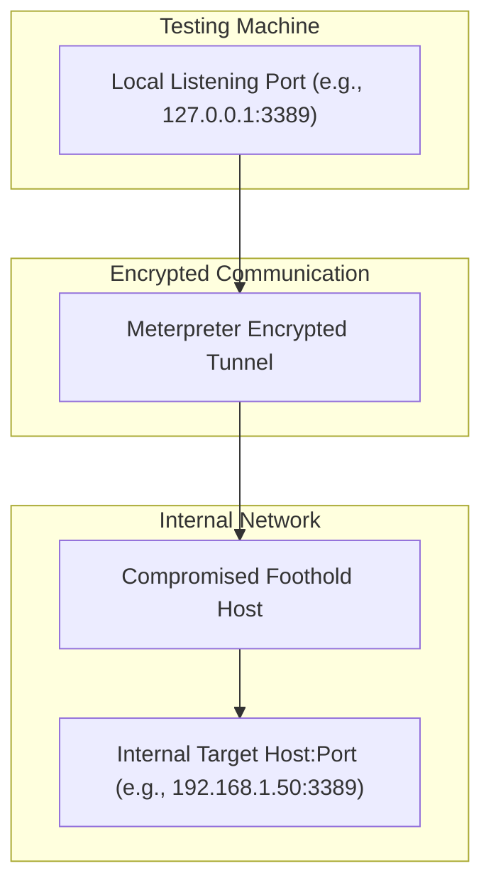

#### 3.3.2 Command Implementation and Tunnel Routing
Common syntax executed in the Meterpreter console:
```bash
# Forward local port 3389 to internal host RDP port 3389 through the active session
portfwd add -l 3389 -p 3389 -r 192.168.1.50

# List active port forwarding rules
portfwd list

# Remove an active rule
portfwd delete -l 3389 -p 3389 -r 192.168.1.50
```

### 3.4 Security Implications & Tunnel Detection

#### 3.4.1 Exposure of Internal Subnets
- Port forwarding turns a single compromised workstation into a full network relay.
- It exposes non-routable administrative services (SMB, RDP, SSH, web consoles) directly to the tester's attack tools without deploying extra malware to the final target.

#### 3.4.2 Port Forwarding Detection Indicators
Defenders identify pivoting activities through the following telemetry signals:
- **Unexpected Listening Ports:** Anomalous high-order listening sockets opened on endpoints.
- **Unusual Local Loopback Connections:** Spikes in connections bound to `127.0.0.1` on the testing system or internal jump hosts.
- **Anomalous Internal Service Access:** Workstation-to-workstation connections across protocols like SMB, RDP, or MSRPC that violate normal baseline workflows.
- **Abnormal Network Routing Changes:** Modifications to the local host routing table (`route add` or Metasploit `autoroute` subnet mappings).

## 4. Meterpreter Anti-Forensics

Meterpreter operates as an in-memory post-exploitation payload designed to minimize physical forensic artifacts.

### 4.1 Anti-Forensics Principles in Post-Exploitation

#### 4.1.1 Goals of In-Memory Execution
- **Reduce Disk Artifacts:** Avoid writing executable files (`.exe`, `.dll`) to the target hard drive.
- **Minimize Forensic Evidence:** Prevent file creation timestamps, MFT (Master File Table) entries, and prefetch records from logging execution.
- **Complicate Forensic Investigation:** Limit residual artifacts to volatile memory (RAM), which clears upon a host reboot.
- **Reduce Operational Footprint:** Leave the target file system in its pre-engagement state.

#### 4.1.2 The Limits of "Fileless" Operations
While fileless techniques evade traditional disk-based antivirus scanners, they generate distinctive volatile artifacts in system memory.

### 4.2 The Meterpreter Forensic Trail

:::note[CORE DFIR PRINCIPLE]
**Fileless $\neq$ Invisible.** Operating purely in memory does not eliminate detection; it shifts the investigation from disk forensics to volatile memory forensics and behavioral telemetry.
:::

#### 4.2.1 Core Forensic Evidence Categories
Investigators identify Meterpreter sessions through specific forensic artifacts:
- **Process Injection:** Memory allocations with `PAGE_EXECUTE_READWRITE` (RWX) permissions inside running processes.
- **Suspicious Memory Regions:** Unbacked executable memory (executable memory areas not mapped to any valid on-disk PE image).
- **Network Sockets:** Active TCP/HTTPS connections associated with processes that typically do not generate network traffic (e.g., `notepad.exe`, `calc.exe`).
- **Process Anomaly Behavior:** Discrepancies between parent-child process hierarchies (e.g., `services.exe` spawning `powershell.exe`).
- **Authentication Events:** Login and token impersonation records in the Windows Security Log.
- **EDR Telemetry:** Endpoint telemetry tracking API calls such as `OpenProcess`, `VirtualAllocEx`, and `WriteProcessMemory`.

### 4.3 Process Injection Mechanics

#### 4.3.1 Injection Architecture & Techniques
Meterpreter leverages process injection (such as Reflective DLL Injection or process migration via `migrate`) to shift its payload from an unstable or transient process into a legitimate, long-running Windows process:

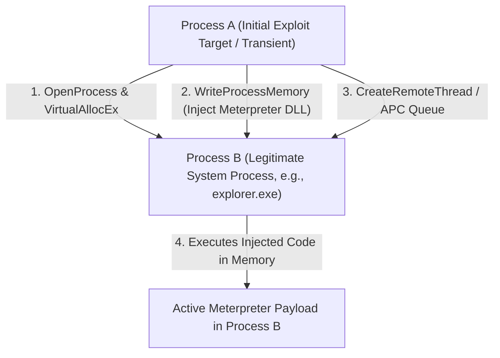

#### 4.3.2 DFIR Relevance and Memory Artifacts
Digital Forensics and Incident Response (DFIR) specialists inspect:
- **Process Relationships:** Anomalous parent-child process structures.
- **Memory Permissions:** Memory segments marked `RWX` containing PE headers (`MZ` / `PE` signatures).
- **Remote Thread Activity:** Thread creation events targeting remote processes via API calls (`CreateRemoteThread`, `NtCreateThreadEx`).
- **Cross-Process Access:** Unusually high process access masks (`PROCESS_ALL_ACCESS`).
- **Unbacked Loaded Modules:** Dynamic code executing in heap or stack regions without a backing file on disk.

### 4.4 Event Log Tampering and the Event ID 1102 Alert

#### 4.4.1 The Log Clearing Paradox
During post-exploitation, attackers may attempt to erase traces by clearing the Windows Event Logs (e.g., executing Meterpreter's `clearev` command). However, the act of clearing logs generates its own clear, auditable forensic artifact.

#### 4.4.2 Windows Security Event ID 1102
- **Event ID 1102:** "The audit log was cleared."
- **Event Source:** Microsoft Windows Security Auditing.
- **Logged Details:** Records the username, domain, logon ID, and exact timestamp of the account that cleared the log.
- **SOC Perspective:** In modern Security Operations Centers, Event ID 1102 is treated as a **High-Priority Critical Security Alert**, immediately signaling active compromise or tampering.

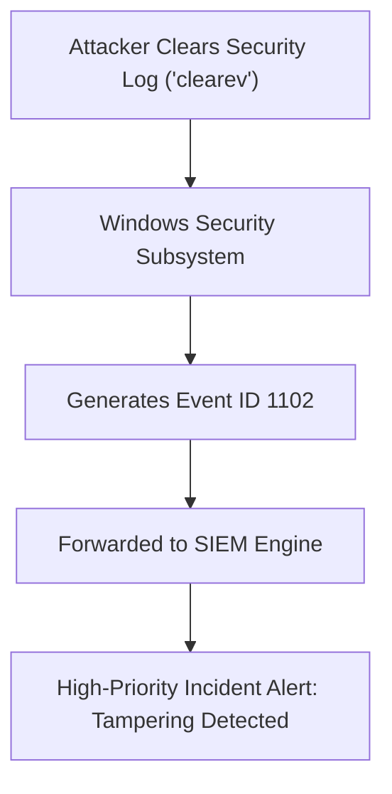

### 4.5 OPSEC in Authorized Testing

#### 4.5.1 Operational Security Definition
**OPSEC (Operational Security)** in penetration testing refers to the systematic practice of minimizing unnecessary noise, maintaining containment, and adhering strictly to authorized boundaries.

#### 4.5.2 Best Practices for Ethical Security Professionals
- **Execute Only Required Tests:** Avoid running invasive scanners or noisy commands outside the approved plan.
- **Strictly Follow Rules of Engagement (RoE):** Respect testing windows, blacklisted targets, and scope limits.
- **Avoid Unnecessary System Modifications:** Do not delete files, change production passwords, or alter operational system configurations.
- **Document Every Action:** Maintain detailed timestamped command logs (`spool` files) to assist blue teams in log correlation.
- **Preserve Evidentiary Integrity:** Take screenshots, record hashes of test artifacts, and maintain chain of custody.
- **Clean Up Artifacts:** Terminate injected threads, remove temporary accounts, restore modified registry keys, and delete test files upon completion.

:::important[PROFESSIONAL OPSEC GOLDEN RULE]
A professional penetration test is **not a competition to leave zero evidence**. Its objective is to provide a comprehensive, transparent security assessment that helps the organization locate and remediate risk.
:::

### 4.6 Multi-Layered Anti-Forensics Detection

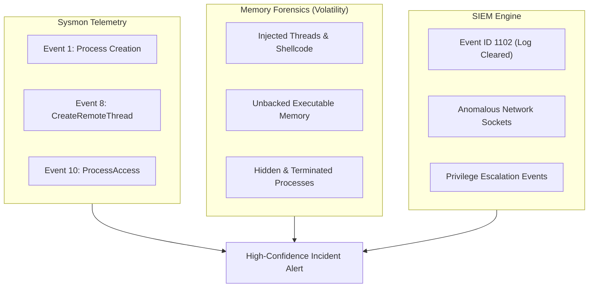

- **Sysmon (System Monitor):** Detects execution and injection mechanics via Event ID 1 (Process creation), Event ID 8 (CreateRemoteThread), and Event ID 10 (ProcessAccess).
- **Memory Forensics:** Volatility plugins (`malfind`, `pslist`, `pstree`, `ldrmodules`) detect unbacked code pages, injected DLL stubs, and hidden processes.
- **SIEM Correlation:** SIEM platforms aggregate event log clearing alerts, process execution logs, and network connection metadata into a unified threat timeline.

## 5. Desktop & Keystroke Sniffing

Meterpreter provides post-exploitation capabilities to interact directly with graphical user interfaces (GUIs), capture user input, and intercept desktop sessions.

### 5.1 Graphical Desktop Interaction

#### 5.1.1 Capabilities
When running inside an interactive desktop session, Meterpreter allows testers to interact with the GUI:
- **Screenshot Capture (`screenshot`):** Grabs a static image of the target host's active desktop and saves it locally.
- **Real-Time Screen Sharing (`screenshare`):** Streams live video feeds of the target desktop directly into the tester's web browser.
- **User Interface Control (`uictl`):** Enables or disables the physical keyboard and mouse on the target endpoint.

#### 5.1.2 Security Impact of Desktop Compromise
Gaining desktop access exposes sensitive information that may not exist on disk:
- Unsaved open documents, spreadsheets, and emails.
- Proprietary internal web portals and applications.
- Credentials entered in password managers or web browsers.
- Real-time user communication (Slack, Microsoft Teams, email drafts).

### 5.2 Desktop Session Context (`get_desktop`)

#### 5.2.1 Interactive Sessions vs. Service Isolation
Windows isolates services and user interfaces into separate session environments:
- **Session 0:** Dedicated to non-interactive system services (Session 0 Isolation). Processes running here (e.g., `SYSTEM` services) cannot directly interact with user desktop screens.
- **Session 1+:** Dedicated to interactive logged-in users running GUI shells (`explorer.exe`).

#### 5.2.2 Context Significance for Exploit Modules
The `get_desktop` command reports the active session context:
- If Meterpreter resides in a service context (`Session 0`), graphical features (`screenshot`, `screenshare`, `keyscan`) will fail or capture blank screens.
- To interact with a user's desktop, the tester must identify an interactive process belonging to a logged-in user and migrate (`migrate <PID>`) into that user's process space.

| Factor | Service Context (Session 0) | User Interactive Context (Session 1+) |
|---|---|---|
| **Typical Account** | `NT AUTHORITY\SYSTEM` | Logged-in Domain / Local User |
| **GUI Availability** | None (Isolated) | Full Desktop Available |
| **Screenshot Status** | Fails / Blank image | Succeeds / Displays user display |
| **Keystroke Sniffing** | Captures service input only | Captures all active user keystrokes |

### 5.3 User Interface Control (`uictl`)

#### 5.3.1 Input Interception and Disruption
Meterpreter provides commands to lock or hijack the physical input devices of a target machine:
```bash
# Disable user keyboard input
uictl disable keyboard

# Disable user mouse input
uictl disable mouse

# Re-enable user input devices
uictl enable keyboard
uictl enable mouse
```

#### 5.3.2 Defensive Monitoring Signals
Defenders detect unauthorized GUI control by monitoring:
- User reports of frozen or erratic mouse and keyboard behavior.
- EDR alerts on background processes issuing user32 input hooks (`BlockInput`, `SetCursorPos`).
- Spikes in outbound screen-scraping bandwidth.

### 5.4 Keystroke Sniffing (Keylogging)

#### 5.4.1 Targeting the Credential-Use Process
Traditional credential theft targets stored secrets (e.g., dumping password hashes from SAM or NTDS.dit). In contrast, keystroke sniffing attacks the **credential-use process** directly:
- Captures cleartext passwords as the user types them.
- Intercepts Multi-Factor Authentication (MFA) tokens and one-time passwords (OTPs).
- Bypasses password managers by recording credentials entered during initial vault unlocking.

#### 5.4.2 High-Value Data Captured
- Application and domain login credentials.
- Confidential chat and email messages.
- Command-line arguments containing API keys or tokens.
- Proprietary document contents.

### 5.5 Keyscan Operational Workflow

#### 5.5.1 Three-Stage Keyscan Lifecycle
Meterpreter executes keylogging through a structured, in-memory lifecycle:

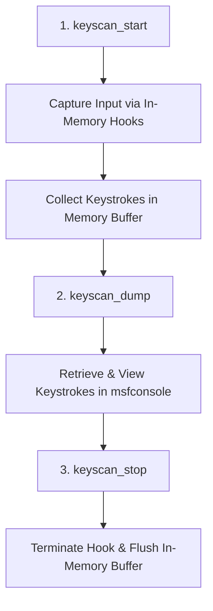

#### 5.5.2 Meterpreter Console Implementation
```bash
# Step 1: Start keystroke capture
meterpreter > keyscan_start
Starting keylog sniffer...

# Step 2: Dump recorded keystrokes from memory buffer
meterpreter > keyscan_dump
Dumping captured keystrokes...
Administrator<CR>P@ssw0rd2026!<CR>

# Step 3: Stop keystroke collection
meterpreter > keyscan_stop
Stopping keylog sniffer...
```

### 5.6 Keylogger Detection and Defensive Controls

#### 5.6.1 Detection Mechanisms
- **API Monitoring:** Monitors suspicious calls to Windows user input APIs (`SetWindowsHookEx`, `GetAsyncKeyState`, `GetKeyboardState`).
- **Behavioral Detection:** Detects non-interactive binaries recording continuous input events while taking periodic screenshots.
- **Memory Analysis:** Identifies injected DLL stubs (`ext_server_sniffer.dll`) in process memory holding circular keystroke buffers.

#### 5.6.2 Endpoint Defense Controls
- **Endpoint Detection & Response (EDR):** Identifies API hooking patterns in userland processes.
- **Application Control:** Restricts unauthorized processes from executing or accessing user process memory.
- **Principle of Least Privilege:** Limits user accounts to minimize the impact of an interactive session compromise.
- **Hardware MFA Tokens:** Hardware-backed security keys (e.g., FIDO2 / WebAuthn) resist keyboard-sniffing interception.

## 6. Meterpreter Resource Scripts

Resource scripts automate sequences of Metasploit commands to ensure repeatability and consistency during security assessments.

### 6.1 Resource Scripts Fundamentals

#### 6.1.1 Definition and Operational Purpose
A **Resource Script** is a plain text file (commonly with a `.rc` extension) containing a sequence of commands to be executed sequentially by Metasploit.
- **Automation:** Replaces repetitive manual entry of reconnaissance and post-exploitation commands.
- **Standardization:** Enforces consistent testing procedures across team engagements.
- **Consistency:** Ensures critical audit steps are executed uniformly across all target systems.
- **Reproducibility:** Allows lab exercises and compliance assessments to be repeated reliably.

### 6.2 Structure and Execution Workflow

#### 6.2.1 Script Execution Sequence
When a resource file is executed, Metasploit parses and runs each command line-by-line:

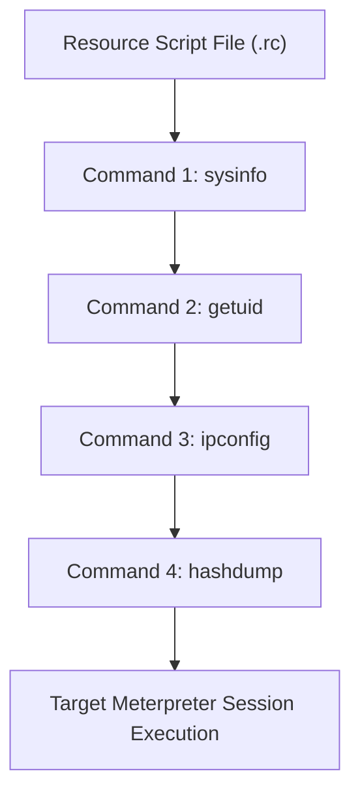

#### 6.2.2 Standard Post-Exploitation Resource Workflow
A standard post-exploitation resource script gathers system baseline details:
1. **System Information:** Collect OS release, architecture, and computer name (`sysinfo`).
2. **User Context:** Identify the active security account (`getuid`, `getprivs`).
3. **Network Configuration:** Enumerate IP interfaces, routing tables, and active sockets (`ipconfig`, `route`, `netstat`).
4. **Security Controls Check:** Identify active antivirus and endpoint protections.
5. **Evidence Collection:** Capture screenshots and retrieve system hashes.

### 6.3 Resource Script Execution Mechanics

#### 6.3.1 Execution via Metasploit Console
Resource scripts can be launched from the main Metasploit console or directly inside an active Meterpreter session:
```bash
# Launching a resource script from msfconsole
msf6 > resource /opt/scripts/post_audit.rc

# Launching inside an active Meterpreter session
meterpreter > resource audit_workstation.rc
```

#### 6.3.2 Security Risk: Malicious Automation Scaling
While automation improves testing efficiency, it can also accelerate malicious attacks:
- Threat actors leverage automated scripts to quickly dump credentials and move laterally across multiple hosts within seconds of establishing access.
- **Defensive Imperative:** Security teams must configure behavioral detection to identify **rapid sequences of post-exploitation commands**, rather than focusing solely on individual command executions.

### 6.4 Automated Session Execution with AutoRunScript

#### 6.4.1 AutoRunScript Architecture
Metasploit handlers support automated post-session execution through `AutoRunScript` and `InitialAutoRunScript`. Once an exploit succeeds and a session initializes, the specified script runs automatically without user interaction.

```bash
# Configure the handler to automatically execute a post module upon session creation
msf6 exploit(multi/handler) > set AutoRunScript post/windows/gather/enum_logged_on_users
AutoRunScript => post/windows/gather/enum_logged_on_users
```

#### 6.4.2 Security Significance and Behavioral Detection
- **Operational Speed:** Executes migration, persistence, or data collection immediately after session establishment.
- **Detection Pattern:** Defenders spot automated sessions by looking for a burst of reconnaissance commands (e.g., `whoami`, `systeminfo`, `net user`, `route print`) executing within milliseconds of process spawning.

## 7. Timeout & Sleep Control

Meterpreter provides session controls to manage connection stability, network delays, and communication intervals.

### 7.1 Session Timeout Control

#### 7.1.1 Objectives and Connection Stability
Timeout settings dictate how Meterpreter handles communication delays, transient packet loss, and link disconnects:
- **Connection Reliability:** Prevents sessions from terminating prematurely during temporary network drops.
- **Session Stability:** Maintains listener state during high-latency WAN or satellite links.
- **Reconnection Handling:** Configures how many seconds Meterpreter attempts to re-establish contact before terminating.

#### 7.1.2 Metasploit Timeout Parameters
Meterpreter manages two primary timeout values:
- **`SessionExpirationTimeout`:** The total time a session can remain disconnected before it terminates itself in memory.
- **`SessionCommunicationTimeout`:** The maximum duration Meterpreter will wait for a response packet before closing the active socket.

### 7.2 Session Sleep Control

#### 7.2.1 Inactivity Cycling Architecture
Sleep control instructs the Meterpreter payload to enter a dormant, inactive state for a defined duration between communication cycles:

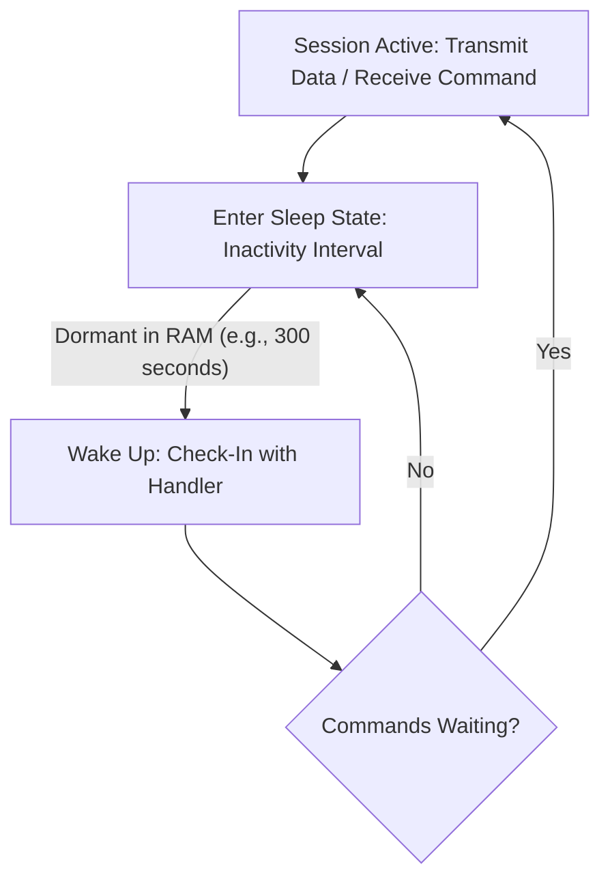

Command syntax executed in Meterpreter:
```bash
# Place the session into sleep mode for 120 seconds
meterpreter > sleep 120
```

#### 7.2.2 Security Relevance & Network Stealth
Configuring sleep intervals alters the payload's network profile:
- **Reduces Network Noise:** Decreases socket transmission volume to evade threshold-based traffic monitors.
- **Regulates Responsiveness:** Balances operator interactivity against operational stealth.
- **Evades Behavioral Monitors:** Extended sleep periods break continuous traffic patterns that trigger automated alert rules.
- **Traffic Profile:** Alters connection timing to blend in with normal background enterprise network activity.

### 7.3 Timeout vs. Sleep Control Comparison

#### 7.3.1 Key Architectural Differences
- **Timeout:** A defensive parameter designed to preserve session state through network drops.
- **Sleep:** An operational timing control used to adjust communication frequency.

#### 7.3.2 Summary Comparison Matrix

| Feature | Timeout Control | Sleep Control |
|---|---|---|
| **Main Purpose** | Connection stability and session persistence | Regulates communication frequency and activity timing |
| **Primary Concern** | Handling network latency and disconnections | Managing network noise and operational visibility |
| **Operational Effect** | Configures wait and retry policies before termination | Enforces periods of dormancy between communication cycles |
| **Detection Indicator** | Socket timeouts, half-open connections, and reset packets | Periodic beaconing patterns and scheduled check-ins |

## 8. Windows Registry Interaction

The Windows Registry is a central hierarchical database storing low-level configuration settings for the operating system, hardware, installed software, and user preferences.

### 8.1 Windows Registry Architecture

#### 8.1.1 Purpose and Hierarchical Structure
The registry controls Windows operational behavior, service definitions, driver configurations, and security settings.

#### 8.1.2 Major Registry Root Keys
- **`HKLM` (HKEY_LOCAL_MACHINE):** Contains system-wide settings applicable to all users, including OS startup, hardware profiles, security configurations, and installed applications.
- **`HKCU` (HKEY_CURRENT_USER):** Stores settings specific to the currently logged-in user (environment variables, personal application configurations).
- **`HKCR` (HKEY_CLASSES_ROOT):** Manages file associations, drag-and-drop protocols, and COM object registrations.
- **`HKU` (HKEY_USERS):** Houses the profile hives for all accounts loaded on the system.
- **`HKCC` (HKEY_CURRENT_CONFIG):** Points to the hardware profile gathered at system boot.

### 8.2 Meterpreter Registry Operations

#### 8.2.1 Native Registry Commands
Meterpreter provides commands to query and modify the Windows Registry directly from memory:
- **`reg enumkey`:** Enumerate subkeys within a specified registry path.
- **`reg queryval`:** Query the data and type of a specific registry value.
- **`reg setval`:** Create or modify a registry value.
- **`reg deleteval`:** Remove a specific registry value.
- **`reg deletekey`:** Recursively delete a registry key.

#### 8.2.2 Key Enumeration and Modification Workflows
```bash
# Query the Windows Run key for persistent autostart applications
reg queryval -k "HKLM\Software\Microsoft\Windows\CurrentVersion\Run" -v SecurityHealth

# Create a registry value to modify system behavior
reg setval -k "HKLM\System\CurrentControlSet\Control\Terminal Server" -v "fDenyTSConnections" -t "REG_DWORD" -d "0"
```

### 8.3 Registry Permissions & Security Context

#### 8.3.1 Access Control Lists (ACLs) and Privileges
Registry access is governed by the Windows Access Control List (ACL) assigned to each key and the security token of the active Meterpreter process:
- Modifying system-wide keys under `HKLM` requires administrative privileges (`Administrator` or `NT AUTHORITY\SYSTEM`).
- Standard users are generally restricted to modifying user-specific paths under `HKCU`.

#### 8.3.2 Privilege Boundaries (Access $\neq$ Unrestricted Access)
A compromised Meterpreter session operates strictly within the security boundaries of its current user token. If an exploit compromises an unprivileged user process, the tester cannot modify system services or disable security controls until privileges are elevated.

### 8.4 Registry Redirection and WOW64 Architecture

#### 8.4.1 32-bit vs. 64-bit Views
On 64-bit Windows installations, the 64-bit Windows-on-Windows subsystem (WOW64) isolates 32-bit applications to prevent compatibility conflicts.

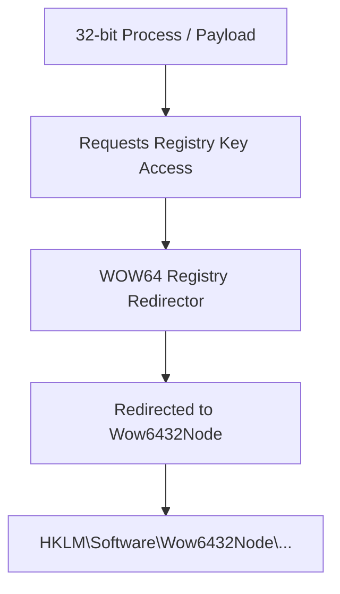

#### 8.4.2 Wow6432Node Redirection Mechanism
- When a 32-bit Meterpreter payload queries `HKLM\Software\Example`, the operating system automatically redirects the query to `HKLM\Software\Wow6432Node\Example`.
- **Testing Impact:** If a tester attempts to read or write keys configured by 64-bit software while operating inside a 32-bit process, the operation will fail or view an alternate registry path. Testers must account for process architecture or migrate into a native 64-bit process.

### 8.5 Registry as an Attack & Persistence Artifact

#### 8.5.1 Common Startup and Autorun Registry Locations
Attackers and penetration testers leverage known registry autorun paths to maintain persistence across reboots:
- `HKLM\Software\Microsoft\Windows\CurrentVersion\Run`
- `HKCU\Software\Microsoft\Windows\CurrentVersion\Run`
- `HKLM\Software\Microsoft\Windows\CurrentVersion\RunOnce`
- `HKLM\System\CurrentControlSet\Services` (Service registration)
- `HKLM\Software\Microsoft\Windows NT\CurrentVersion\Winlogon` (Userinit and Shell values)

#### 8.5.2 Dual Identity: Attack Vector vs. Forensic Artifact
The registry serves two key roles in security:
1. **Attack Vector:** An execution path for persistence, privilege escalation, and security policy tampering.
2. **Forensic Artifact:** Every registry modification updates the parent key's `LastWriteTime` timestamp. Forensic tools parse these timestamps to construct reliable incident timelines.

## 9. Meterpreter API & Mixins

Meterpreter employs an extensible, object-oriented software architecture separating client-side controllers from in-memory target engines.

### 9.1 Meterpreter Client-Server Architecture

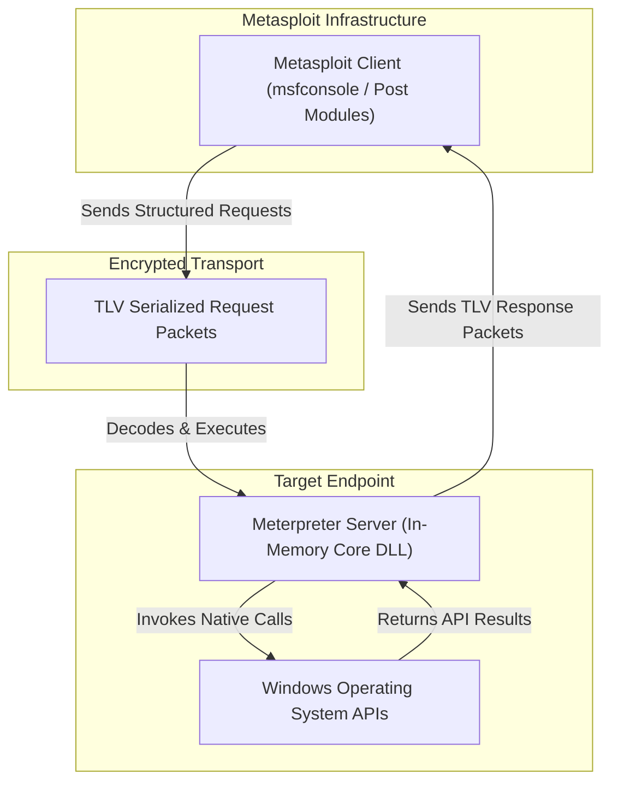

#### 9.1.1 Architectural Separation
- **Meterpreter Client:** Runs within the Metasploit Framework on the tester's machine. It handles user command parsing, manages active sessions, and serializes requests.
- **Meterpreter Server:** Executes entirely in the memory space of the target process. It listens for incoming commands, interacts with native operating system APIs, and transmits structured responses.

:::important[CLIENT/SERVER TERMINOLOGY NOTE]
The terms *client* and *server* describe the software architecture of Meterpreter components, not the direction of the underlying network connection (which is often a reverse connection initiated by the target).
:::

### 9.2 The TLV (Type-Length-Value) Protocol

#### 9.2.1 Protocol Structure
All communications between the Metasploit client and the Meterpreter server use the **TLV (Type-Length-Value)** protocol:
- **Type ($T$):** A 32-bit integer identifying the data type or command identifier (e.g., string, integer, composite group).
- **Length ($L$):** A 32-bit integer defining the byte length of the value field.
- **Value ($V$):** The raw binary data payload.

#### 9.2.2 Advantages of Serialized Binary Packaging
- **Architecture Independence:** Ensures data serializes cleanly across mixed architectures (e.g., x86 handler controlling an ARM or x64 target).
- **Extensible Packet Structure:** Allows complex requests to be nested inside parent packet envelopes.
- **Compact Footprint:** Reduces bandwidth usage compared to text-based formats like JSON or XML.

### 9.3 Modular Meterpreter Extensions

#### 9.3.1 Core Extensibility Model
The Meterpreter server core is kept lightweight to maximize injection stability and stealth. Additional functionality loads dynamically at runtime as modular extensions:

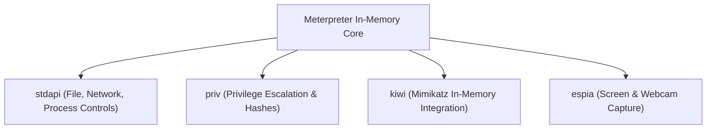

#### 9.3.2 Benefits of the Extension Model
- **Reduced Core Payload Size:** Ensures initial staging payloads remain small enough to fit within constrained memory buffers during exploit delivery.
- **Dynamic In-Memory Loading:** Modules compile into reflective DLLs that stream over the encrypted channel and inject directly into target RAM (`use <extension>`).
- **Code Reusability:** Developers can build specialized functional plugins without rewriting the core communication engine.

### 9.4 Metasploit Mixins Architecture

#### 9.4.1 Ruby Mixins Concept
The Metasploit Framework is written in Ruby. Because Ruby does not support multiple inheritance, it provides **Mixins** (modular code blocks included into class declarations) to provide shared functionality across multiple classes.

#### 9.4.2 Architectural Benefits
- **Code Reuse:** Prevents duplicate network socket or payload handling code across exploit modules.
- **Standardized Functionality:** Ensures all modules handle parameters like timeouts, proxies, and threading uniformly.
- **Abstraction:** Encapsulates complex OS-level system calls into accessible Ruby method helpers.

### 9.5 Core Post-Exploitation Mixins
Metasploit provides standard mixin libraries for module development:
- **`Msf::Post::Common`:** Provides core post-exploitation helpers, including process checking, report logging, and host metadata collection.
- **`Msf::Post::Windows::Priv`:** Standardizes privilege checks and token elevation routines (`is_admin?`, `is_system?`).
- **`Msf::Post::File`:** Abstracts file-system interactions across target platforms, providing unified helpers for reading, writing, and uploading files.

## 10. VNC Injection

VNC (Virtual Network Computing) Injection allows penetration testers to gain interactive, graphical desktop control of a compromised Windows system without deploying third-party software to disk.

### 10.1 In-Memory VNC Injection Mechanics

#### 10.1.1 Concept and Definition
**VNC Injection** is a post-exploitation technique where an optimized VNC server component is loaded directly into the memory space of a running target process via reflective DLL injection, streaming the target desktop display back over the established session.

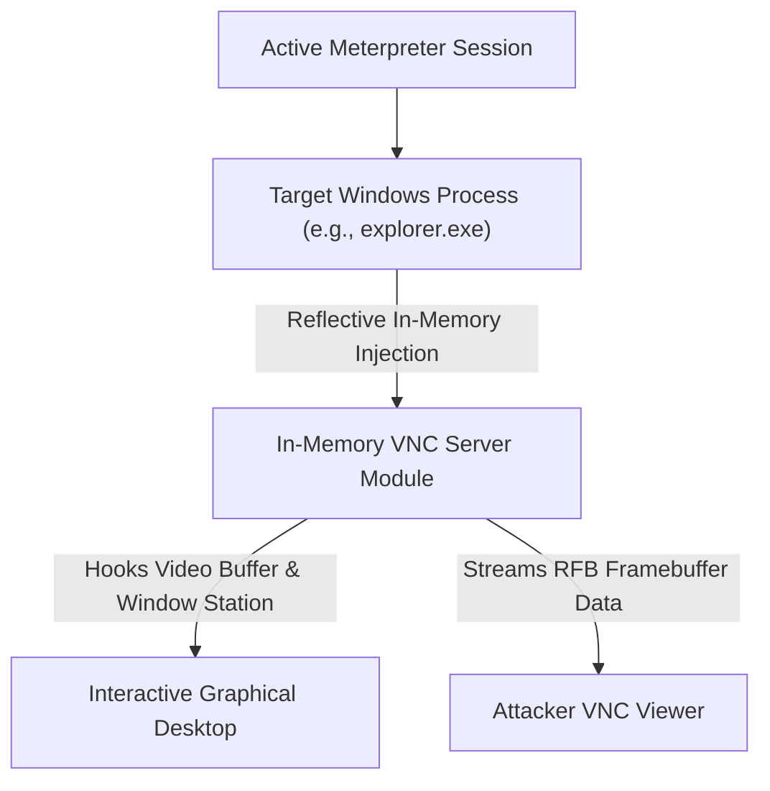

#### 10.1.2 Remote Graphical Interaction Workflow
1. The tester issues the `run vnc` or `payload/windows/vncinject/reverse_tcp` module.
2. Metasploit injects an in-memory VNC server reflective DLL into a target process in the user's interactive session.
3. The server hooks into the target desktop's graphics subsystem.
4. An RFB (Remote Framebuffer) connection tunnels back to the Metasploit listener, launching a local viewer window to control the target desktop.

### 10.2 VNC Injection and Process Injection Mechanics

#### 10.2.1 In-Memory Loading and Remote Threads
VNC injection uses standard process-injection primitives:
- Allocating executable memory pages within the target process (`VirtualAllocEx`).
- Writing the VNC server image into allocated memory (`WriteProcessMemory`).
- Creating a remote thread to start the VNC server engine (`CreateRemoteThread`).
- Attaching the thread to the target user's interactive window station (`WinSta0\Default`).

#### 10.2.2 Observable Behavioral Indicators
These operations generate clear behavioral telemetry:
- Memory allocations marked with `RWX` permissions in userland applications.
- Processes opening handle permissions (`PROCESS_VM_WRITE`, `PROCESS_VM_OPERATION`) to remote processes.
- Sudden network socket creation from applications that normally do not produce network traffic.

### 10.3 VNC Detection Triad

Security operations teams identify VNC injection by correlating three telemetry sources:

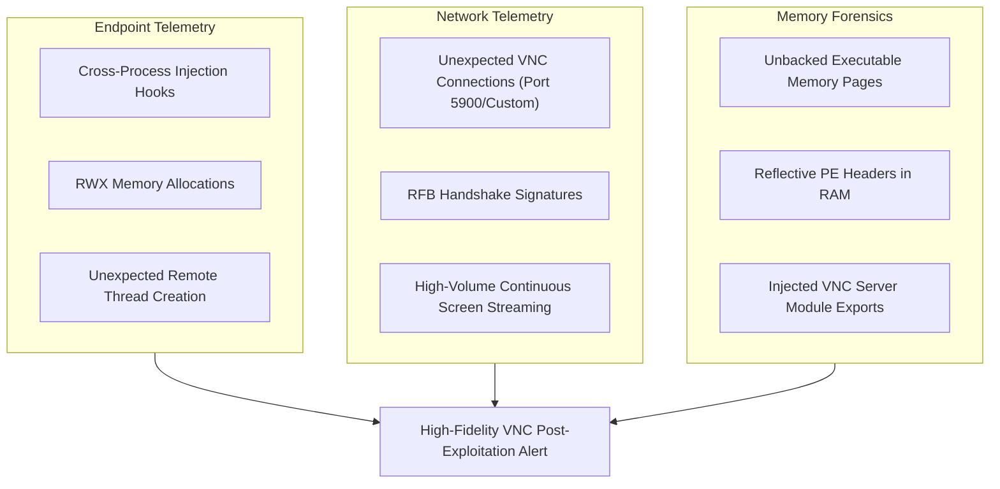

## 11. Remote Desktop (RDP) Enablement & Security

The Remote Desktop Protocol (RDP) provides native graphical remote management access to Windows environments.

### 11.1 Remote Desktop Protocol Fundamentals

#### 11.1.1 RDP Service Architecture
RDP operates as a core Windows component hosted inside the Terminal Services subsystem (`TermService`), running within a shared `svchost.exe` process instance.

#### 11.1.2 TCP Port 3389
- By default, the RDP service listens for incoming connections on **TCP port 3389** (and optionally UDP 3389 for performance optimization).
- It provides full, interactive desktop access, complete with audio redirection, clipboard sharing, and drive mapping.

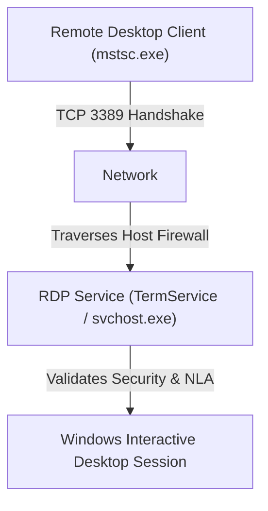

### 11.2 Foothold Conversion: Enabling RDP Remotely

#### 11.2.1 Tactical Objectives in Assessments
In authorized penetration tests, enabling RDP demonstrates how an initial, non-interactive command-line foothold can be elevated to full administrative GUI access, highlighting the potential business impact.

#### 11.2.2 The Three Reconfiguration Requirements
To convert a foothold into an interactive RDP session, three conditions must be satisfied:
1. **Registry Reconfiguration:** Enable the Terminal Server service by updating registry policies.
2. **Firewall Reconfiguration:** Open TCP port 3389 in the local Windows Defender Firewall.
3. **User Account Authorization:** Ensure the target user account possesses remote desktop login privileges.

### 11.3 RDP Registry Reconfiguration & DFIR Markers

#### 11.3.1 Terminal Server Key (`fDenyTSConnections`)
Windows controls whether remote desktop connections are accepted via the `fDenyTSConnections` registry value:
- **Registry Location:** `HKLM\System\CurrentControlSet\Control\Terminal Server`
- **Value Name:** `fDenyTSConnections`
- **Configuration States:**
  - `1`: Remote Desktop connections disabled (default security posture).
  - `0`: Remote Desktop connections enabled.

Meterpreter automation module:
```bash
msf6 post(windows/manage/enable_rdp) > set SESSION 1
msf6 post(windows/manage/enable_rdp) > run
```

#### 11.3.2 Forensic Artifacts and Registry Timestamps
Tampering with this key creates specific forensic artifacts:
- Modifying `fDenyTSConnections` updates the `LastWriteTime` timestamp of the `Terminal Server` key in the system hive.
- Security event logs track the parent process and user security context that modified the key.

### 11.4 RDP Firewall Configuration

#### 11.4.1 Firewall Rule Modification
Enabling the registry setting alone is insufficient if the host firewall drops incoming packets on port 3389. Attackers or automated modules execute firewall configuration commands to permit traffic:
```powershell
# Open port 3389 via Windows netsh firewall utility
netsh advfirewall firewall set rule group="remote desktop" new enable=Yes
```

#### 11.4.2 Attack Surface Expansion
Opening port 3389 increases the system's attack surface, exposing the host to credential brute-forcing and network-level exploitation from across the subnet.

### 11.5 Network Level Authentication (NLA)

#### 11.5.1 NLA Security Architecture
**Network Level Authentication (NLA)** requires connecting clients to authenticate their user credentials using CredSSP (Credential Security Support Provider) *before* the server establishes a full graphical RDP session.

#### 11.5.2 Protective Benefits and Hardening
- **Mitigates Pre-Authentication Exploits:** Protects the system against unauthenticated remote code execution vulnerabilities (such as BlueKeep / CVE-2019-0708).
- **Reduces Denial-of-Service (DoS) Risks:** Prevents unauthorized clients from spawning resource-heavy desktop login screens.
- **Security Hardening Standard:** Enterprise hardening guidelines require NLA to remain strictly enforced across all domain endpoints. Attackers often attempt to disable NLA by setting `UserAuthentication` to `0` under `HKLM\System\CurrentControlSet\Control\Terminal Server\WinStations\RDP-Tcp`.

### 11.6 RDP Attack Detection & Multi-Event SOC Correlation

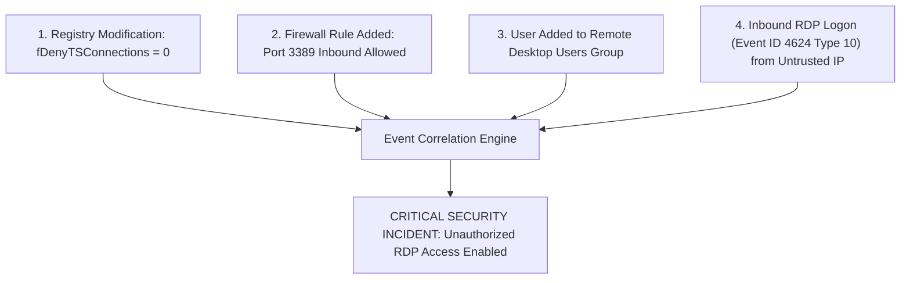

#### 11.6.1 SOC Telemetry Monitoring
- **Successful RDP Logons:** Windows Security Event ID 4624 with Logon Type 10 (RemoteInteractive).
- **Failed Logon Spikes:** Event ID 4625 indicating RDP brute-force or password-spraying attempts.
- **RDP Configuration Changes:** Windows Event ID 4738 (user account modified) and Event ID 4728 (user added to privileged security group).

#### 11.6.2 Incident Correlation Chain
A single logon event or firewall rule update might represent authorized system administration. However, when these events occur in close succession, they form a high-fidelity indicator of post-exploitation activity:
$$\text{Registry Modification} + \text{Firewall Rule Change} + \text{Logon Type 10} \implies \text{High-Priority Incident Alert}$$

## 12. Meterpreter Detection & DFIR

Securing environments against advanced post-exploitation tools requires a defense-in-depth architecture combining endpoint telemetry, network analytics, and multi-source correlation.

### 12.1 Comprehensive Meterpreter Detection Strategy

#### 12.1.1 Absence of a Single Universal Signature
Meterpreter operates as a dynamic, modular, in-memory framework. Because payload configurations, transport layers, encryption keys, and injected processes can be adjusted at runtime, **no single static signature exists that reliably detects all Meterpreter activity**.

#### 12.1.2 Multi-Telemetry Defense-in-Depth
Reliable detection requires monitoring across four telemetry layers:

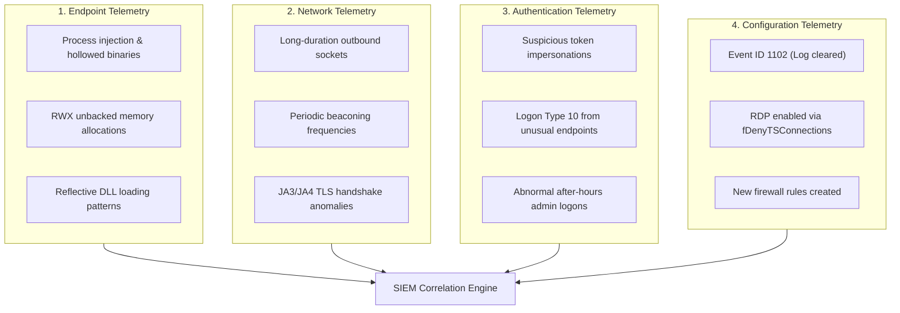

### 12.2 SOC Telemetry Correlation Principle

#### 12.2.1 Single Anomaly vs. Correlated Incident
A single isolated event (such as an unknown outbound TCP connection or an updated registry key) often turns out to be benign administrative activity. However, correlating related events across multiple sources provides high confidence in detecting active compromises:

```mermaid
flowchart TD
  A["Suspicious Host Process Spawning"]
  B["Unexpected Outbound Network Socket"]
  C["Registry Persistence / Configuration Change"]
  D["Unusual Remote User Login"]

  A --> Link["Multi-Source Correlation Engine"]
  B --> Link
  C --> Link
  D --> Link

  Link --> Final["High-Confidence Incident Alert: Confirmed Post-Exploitation Activity"]
```

#### 12.2.2 Correlation Rule
$$\text{Confidence Level} \propto \sum (\text{Endpoint} + \text{Network} + \text{Authentication} + \text{Configuration Anomaly})$$

### 12.3 DFIR 6-Step Post-Exploitation Investigation Lifecycle

When investigating suspected post-exploitation or Meterpreter activity, digital forensics teams follow a structured six-step workflow:

```mermaid
flowchart TD
  S1["1. Identify Initial Access: How did the session originate?"]
  S2["2. Identify Execution: Which parent and child processes executed?"]
  S3["3. Identify Communication: Where did the host communicate (IP, URI, Port)?"]
  S4["4. Identify Privileges: Which user accounts and tokens were leveraged?"]
  S5["5. Identify Actions: What commands, files, or lateral pivots occurred?"]
  S6["6. Build Timeline: Correlate all forensic artifacts chronologically"]

  S1 --> S2 --> S3 --> S4 --> S5 --> S6
```

1. **Identify Initial Access:** Trace the entry vector (e.g., spear-phishing attachment, unpatched external service exploit, brute-forced VPN credential).
2. **Identify Execution:** Pinpoint the exact binary or memory process that executed the initial payload (inspecting command-line arguments and parent-child process relationships).
3. **Identify Communication:** Isolate all external Command and Control (C2) IP addresses, domain names, transport protocols, and communication ports.
4. **Identify Privileges:** Determine whether the payload operated under low-privileged user rights, elevated local administrator tokens, or `NT AUTHORITY\SYSTEM`.
5. **Identify Actions:** Reconstruct commands executed during the session (keystrokes logged, credentials dumped, registry keys modified, lateral movement attempts).
6. **Build Chronological Timeline:** Compile forensic artifacts from endpoint event logs, disk timestamps, memory dumps, and network flows into a single unified incident timeline.

### 12.4 Evidence Sources & Analysis Tooling Matrix

| Telemetry Category | Evidence Source | Primary Artifacts Identified | Recommended Investigation Tools |
|---|---|---|---|
| **Endpoint** | Windows Security Event Logs, Sysmon, EDR agents | Event ID 1 (Process creation), Event ID 8 (CreateRemoteThread), Event ID 10 (ProcessAccess), unbacked RWX memory allocations | Sysmon, Volatility Framework, Windows Event Viewer |
| **Network** | Egress Firewall Logs, IDS/IPS, NetFlow, DNS Queries | Abnormal outbound ports, beaconing intervals, repetitive DNS lookups, JA3/JA4 TLS mismatches | Wireshark, Zeek, Suricata, Snort, Arkime |
| **System** | Windows Registry, NTFS $MFT, Event Logs, SAM Hive | Modified Run keys, `fDenyTSConnections`, Event ID 1102 (Log cleared), new service installations | Registry Viewer, FTK Imager, Autopsy, KAPE |
| **Enterprise SIEM** | Centralized Log Repositories | Correlated event alerts across endpoint, identity provider, and network perimeter | Splunk, Elastic (ELK) Stack, Wazuh, Microsoft Sentinel |

### 12.5 Real-World Case Study Analysis

#### 12.5.1 Incident Scenario Breakdown
A corporate Windows workstation triggers five sequential alerts on a security monitoring dashboard:
1. **Unusual Process Execution:** An unknown process spawns from an unexpected path.
2. **Outbound Network Connection:** An immediate outbound network socket opens to an untrusted external IP address.
3. **Registry Modification:** A system registry key changes under the `Terminal Server` tree.
4. **Unexpected RDP Configuration Change:** Local firewall policies update to allow incoming connections on TCP port 3389.
5. **Remote Login:** A successful remote desktop login occurs from an external IP address.

#### 12.5.2 Investigative Analysis & Technical Solutions

##### Question 1: Which event occurred first, and what is the attack sequence?
- **Root Event:** Event 1 (*Unusual Process Execution*) occurred first.
- **Likely Attack Sequence:**
  1. Initial exploitation causes the unauthorized execution of an in-memory stager/payload.
  2. The payload establishes an outbound C2 connection back to the attacker's handler.
  3. The attacker issues registry commands modifying `fDenyTSConnections` to enable the RDP service.
  4. The attacker reconfigures the local Windows Firewall to allow inbound traffic on TCP port 3389.
  5. The attacker initiates an inbound RDP session over port 3389, gaining full graphical control of the desktop.

##### Question 2: Which events serve as strong indicators of compromise (IoCs)?
- **Event 3 (Registry Modification to `fDenyTSConnections`):** Standard user workstations rarely reconfigure terminal server settings without centralized Group Policy intervention.
- **Event 4 (Firewall Change for Port 3389):** Spontaneous firewall modifications permitting inbound RDP traffic on an endpoint are high-fidelity indicators of compromise.
- **Event 2 combined with Event 5:** An unexpected outbound connection followed shortly by an external inbound RDP login strongly indicates command-and-control activity.

##### Question 3: What telemetry sources confirm this activity?
- **Endpoint Telemetry:** Sysmon Event 1 (Process Creation) and Event 13 (Registry value set to `0`).
- **Firewall & Network Telemetry:** Network flow logs confirming outbound C2 traffic followed by an inbound TCP 3389 connection.
- **Authentication Logs:** Windows Security Event ID 4624 with Logon Type 10 (RemoteInteractive) recording the external source IP and authenticated account.

##### Question 4: What defensive controls could have prevented this compromise?
- **Attack Surface Reduction (ASR) & Application Control:** AppLocker or Windows Defender Application Control (WDAC) would block the initial unapproved executable from running.
- **Network Level Authentication (NLA):** Enforcing NLA prevents unauthorized pre-authentication RDP sessions.
- **Network Segmentation & Host Firewall Hardening:** Restricting inbound port 3389 access to authorized administrative jump boxes stops direct external RDP connections.
- **Principle of Least Privilege:** Removing local administrative rights prevents users and compromised processes from modifying system-wide registry keys and firewall policies.

### 12.6 Comprehensive Meterpreter Post-Exploitation Architecture

The complete Meterpreter post-exploitation lifecycle integrates communication channels, system access primitives, automation engines, remote access tools, and defensive monitoring layers:

```mermaid
flowchart TD
  subgraph MP ["Meterpreter Core Architecture"]
    Core["Meterpreter Payload Core"]
  end

  subgraph Comm ["1. Communication Layer"]
    T["Transports: TCP / HTTP / HTTPS / SMB"]
    P["Pivoting: Port Forwarding & Tunnels"]
    Core --> T
    Core --> P
  end

  subgraph SysAccess ["2. System Access & Footprint"]
    R["Registry: Keys / Persistence / Redirection"]
    D["Desktop: Screen Sharing & Screenshots"]
    I["Input: Keystroke Sniffing (Keyscan)"]
    Core --> R
    Core --> D
    Core --> I
  end

  subgraph Automation ["3. Automation Layer"]
    RS["Resource Scripts (.rc)"]
    ARS["AutoRunScript / Post-Handlers"]
    Core --> RS
    Core --> ARS
  end

  subgraph RemoteAccess ["4. Remote Access Layer"]
    VNC["In-Memory VNC Injection"]
    RDP["Remote Desktop (RDP TCP 3389)"]
    Comm --> VNC
    Comm --> RDP
  end

  subgraph DetectionLayer ["5. Defensive Detection & DFIR"]
    EDR["Endpoint: EDR & Memory Forensics (Volatility)"]
    SIEM["SIEM: Event Logs (ID 1102 / 4624) & Sysmon"]
    DFIR["DFIR: 6-Step Incident Timeline Reconstruction"]
    RemoteAccess --> EDR
    RemoteAccess --> SIEM
    RemoteAccess --> DFIR
  end
```
