# Unit - 4
:::info[TITLE]
## Wireless Network Penetration Testing
:::

## 1. Wireless Security Fundamentals

Wireless penetration testing is the authorized, structured evaluation of Wi-Fi networks (IEEE 802.11), access points, and connected client devices to identify security vulnerabilities and assess operational risks.

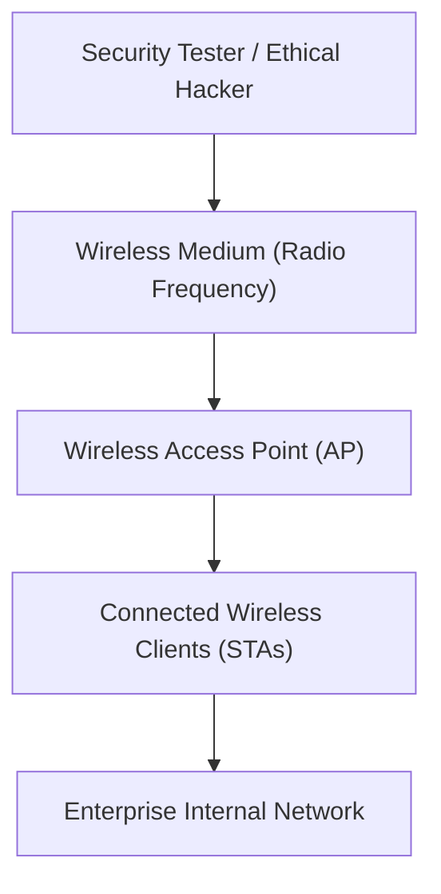

### 1.1 Core Objectives of Wireless Penetration Testing
- **Identify Security Flaws:** Uncover configuration weaknesses, weak encryption suites, and outdated protocol implementations.
- **Evaluate Authentication:** Test Pre-Shared Keys (PSK) and 802.1X/RADIUS enterprise authentication configurations.
- **Detect Rogue Devices:** Locate unauthorized access points, rogue bridges, and misconfigured ad-hoc networks.
- **Assess Client Behavior:** Evaluate client roaming behavior, probe request leakage, and auto-association vulnerabilities.
- **Audit Network Segmentation:** Verify that guest Wi-Fi networks are properly isolated from sensitive corporate subnets.
- **Validate Monitoring Controls:** Test Wireless Intrusion Detection and Prevention Systems (WIDS/WIPS).

:::warning[AUTHORIZED LAB REQUIREMENT]
Wireless penetration testing broadcasts over shared radio frequency bands. Assessments must be conducted strictly within authorized boundaries, Faraday cages, or isolated RF laboratory environments.
:::

### 1.2 Wired vs. Wireless Medium: Security Implications
The fundamental security distinction between wired and wireless networks lies in the transmission medium:
- **Wired Networks:** Physical transmission lines (Ethernet cables, fiber optics) enforce a defined physical perimeter. Attackers typically require physical access to a switch port or wall jack to intercept data.
- **Wireless Networks:** Radio waves radiate openly in all directions across a shared broadcast medium. An attacker can observe 802.11 management frames, capture handshakes, and inject packets from outside the physical perimeter without connecting a single cable.

## 2. Wireless Attack Surface & 802.11 Architecture

The wireless attack surface spans physical radio hardware, access point firmware, client endpoints, and central authentication backends.

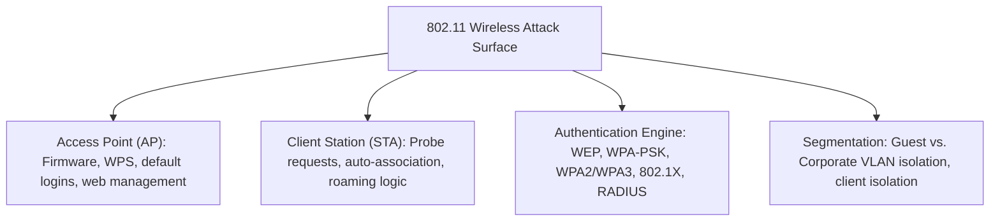

### 2.1 Core Wireless Architecture Components
- **Access Point (AP):** Layer-2 bridge providing wireless connectivity between 802.11 radio clients and the wired network.
- **Station / Client (STA):** Any computing device (laptop, smartphone, IoT sensor) equipped with an 802.11 wireless network interface card (WNIC).
- **Wireless LAN Controller (WLC):** Enterprise appliance that centrally manages radio frequencies, roaming, and security policies across distributed APs.
- **Authentication Server (RADIUS):** Centralized backend validating user credentials in 802.1X enterprise environments.

### 2.2 Wireless Security Models and Historical Evolution

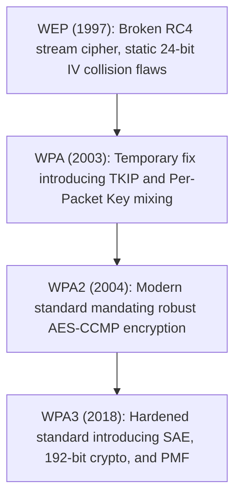

| Security Protocol | Cipher Algorithm | Key Management | Primary Architectural Weakness |
|---|---|---|---|
| **Open Network** | None (Cleartext) | None | Zero confidentiality; all traffic vulnerable to packet sniffing |
| **WEP** | RC4 (Stream Cipher) | Static 40/104-bit key | Small 24-bit IV; vulnerable to statistical key recovery in minutes |
| **WPA** | TKIP / RC4 | 4-Way Handshake / PSK | Vulnerable to message integrity checks (MIC) and Beck-Tews attacks |
| **WPA2** | AES-CCMP | 4-Way Handshake / PSK | Vulnerable to offline dictionary attacks if 4-way handshake or PMKID is captured |
| **WPA3** | AES-GCMP / CNSA | SAE (Dragonfly Handshake) | Resists offline dictionary attacks; requires Protected Management Frames (PMF) |
| **802.1X Enterprise**| Dynamic AES keys | Centralized RADIUS / EAP | Certificate validation bypasses on misconfigured client supplicants |

## 3. Metasploit and Wireless Networks

The Metasploit Framework is primarily designed for service exploitation, payload delivery, and post-exploitation. It works alongside external wireless tools to execute targeted wireless attacks.

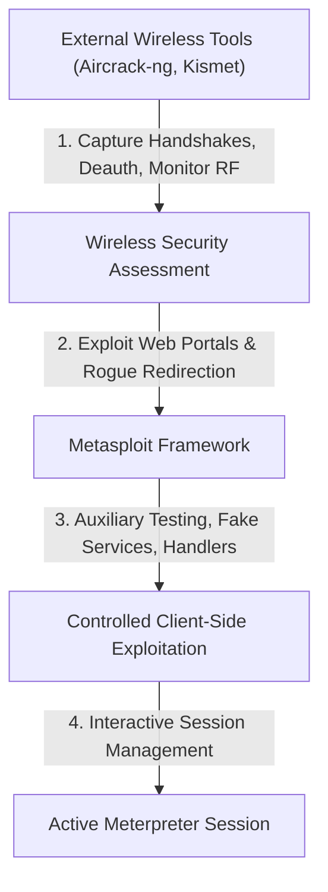

### 3.1 The Hybrid Tooling Model
Metasploit does not directly manage low-level 802.11 radio states, monitor mode transitions, or packet injection. Instead, wireless penetration testing uses a two-tier approach:
1. **Tier 1 (Wireless-Specific Tools):** Tools like `aircrack-ng`, `airbase-ng`, `kismet`, and `wifite` handle raw frame capture, monitor mode, deauthentication, and 802.11 beacon/probe management.
2. **Tier 2 (Metasploit Framework):** Once clients associate with a rogue AP or traffic is redirected, Metasploit takes over to provide fake network services (DNS, DHCP, HTTP), capture credentials, and deliver browser exploits.

### 3.2 Metasploit Wireless Capabilities
- **Auxiliary Fuzzers & Scanners:** Testing wireless management daemons and administrative web consoles.
- **Credential Sniffing Servers:** Running mock authentication services (`auxiliary/server/capture/smb`, `auxiliary/server/capture/http_ntlm`).
- **Fake Update Delivery:** Exploiting cleartext HTTP traffic to serve backdoored software updates.
- **Automated Exploitation Frameworks:** Integrating with scripts like Karmetasploit to exploit connecting client browsers.

## 4. Wireless Reconnaissance & Addressing

Wireless reconnaissance maps radio environments, identifies deployed encryption suites, and uncovers connected client devices.

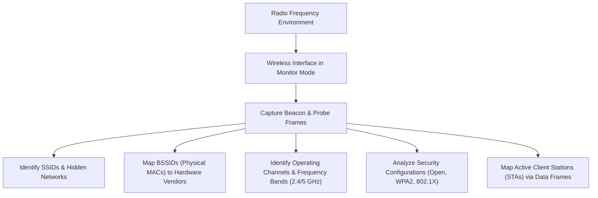

### 4.1 SSID vs. BSSID

#### 4.1.1 Network Identification Terminology
- **SSID (Service Set Identifier):** The human-readable network name broadcast to users (e.g., `Corporate-Guest`, `Campus-WiFi`). An SSID can span multiple physical access points in an Extended Service Set (ESSID).
- **BSSID (Basic Service Set Identifier):** The unique 48-bit MAC address of a specific physical access point radio interface.
- **Client Station (STA):** The MAC address identifying an individual connected client endpoint.

#### 4.1.2 The ESSID Relationship
In enterprise networks, a single SSID is often broadcast across dozens of access points, each using a unique BSSID:

$$\text{Single SSID (e.g., "Corporate-WiFi")} \implies \begin{cases} \text{BSSID 1: } \text{00:11:22:33:44:01} & (\text{Conference Room}) \\ \text{BSSID 2: } \text{00:11:22:33:44:02} & (\text{Executive Floor}) \\ \text{BSSID 3: } \text{00:11:22:33:44:03} & (\text{Cafeteria}) \end{cases}$$

### 4.2 Wireless Channels and Frequency Bands

802.11 networks operate across defined radio frequency channels to minimize mutual interference:

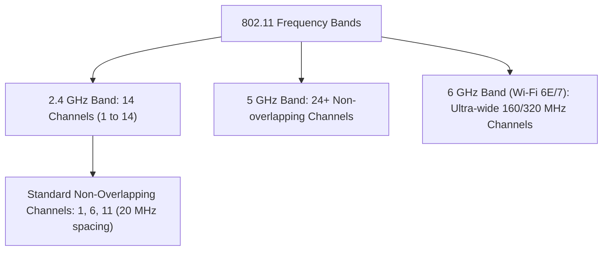

- **Channel Overlap in 2.4 GHz:** Channels are spaced 5 MHz apart but require 20 MHz of bandwidth. Only channels **1, 6, and 11** do not overlap.
- **Reconnaissance Objective:** Identifying channel assignments helps security testers spot overlapping coverage, co-channel interference, and unauthorized rogue access points operating on non-standard channels.

## 5. Wireless Authentication & Association

Clients follow a defined handshake and association process when joining an 802.11 network.

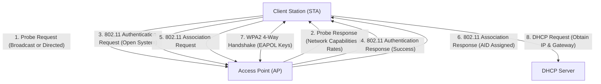

### 5.1 Personal vs. Enterprise Authentication Models

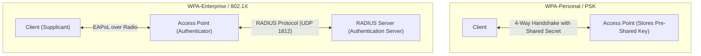

- **WPA-Personal (PSK):** Every user shares the same static passphrase. If an attacker captures the 4-way handshake, they can launch offline dictionary attacks to crack the passphrase.
- **WPA-Enterprise (802.1X):** Each user authenticates with individual domain credentials or client certificates via a RADIUS server. Even if an attacker intercepts one user's session, other users' communications remain protected.

## 6. Evil Twin Attacks

An Evil Twin is a rogue access point that mimics a legitimate wireless network by advertising the same SSID, tricking clients into connecting to the attacker's hardware.

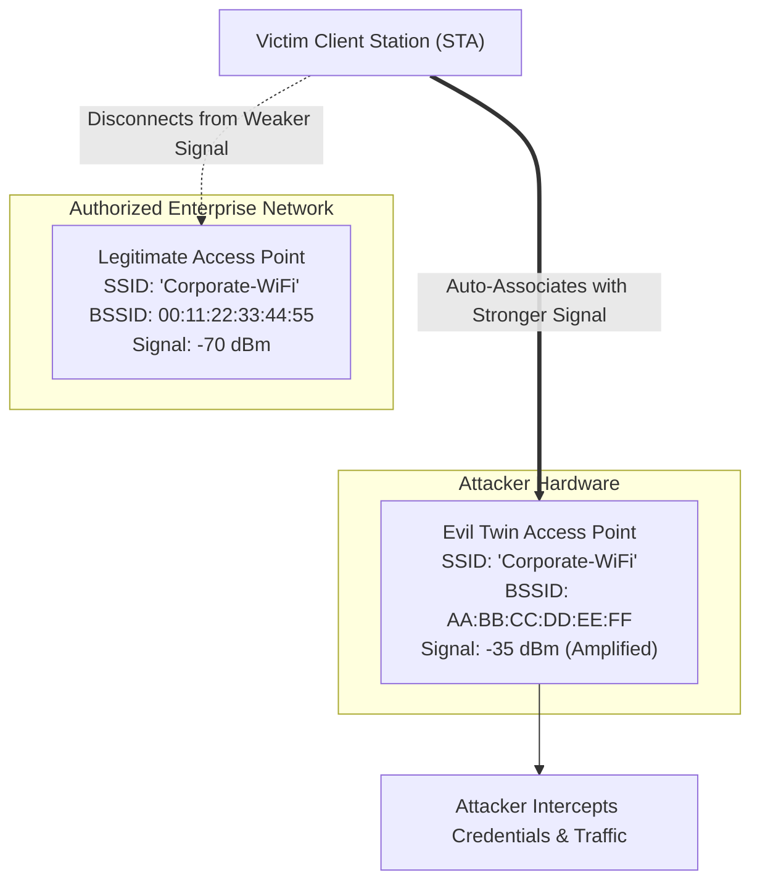

### 6.1 Why Clients Connect to Evil Twins
Wireless client roaming algorithms make association decisions automatically based on:
1. **SSID Matching:** The beacon frame matches an SSID stored in the client's Preferred Network List (PNL).
2. **Signal Strength (RSSI):** 802.11 clients naturally roam to the access point advertising the highest signal strength.
3. **Deauthentication Frames:** Attackers can transmit spoofed 802.11 deauthentication frames from the legitimate BSSID to disconnect the victim, forcing them to reconnect to the stronger Evil Twin.

:::tip[CORE WIRELESS FLAW]
**Matching an SSID name does not prove that an access point is legitimate.** Standard 802.11 beacon frames are unauthenticated, allowing any radio to broadcast arbitrary network names.
:::

### 6.2 Evil Twin Attack Chain

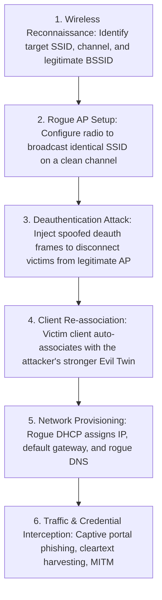

### 6.3 Detecting Evil Twin Attacks

Security operations and wireless network administrators spot Evil Twins by monitoring:
- **Duplicate SSIDs:** Multiple access points broadcasting the same SSID with mismatched BSSID vendor prefixes.
- **Channel Mismatches:** Network names appearing on radio channels not configured on corporate controllers.
- **Anomalous Signal Strength:** Unexpectedly strong signals originating from parking lots or public lobbies.
- **Encryption Inconsistencies:** An enterprise network configured for WPA2-Enterprise suddenly appearing as open or PSK.
- **WIDS Alerts:** Detection of high-volume deauthentication frame bursts.

## 7. Rogue Access Points

A Rogue Access Point is any unauthorized wireless device connected to an enterprise network without administrative approval.

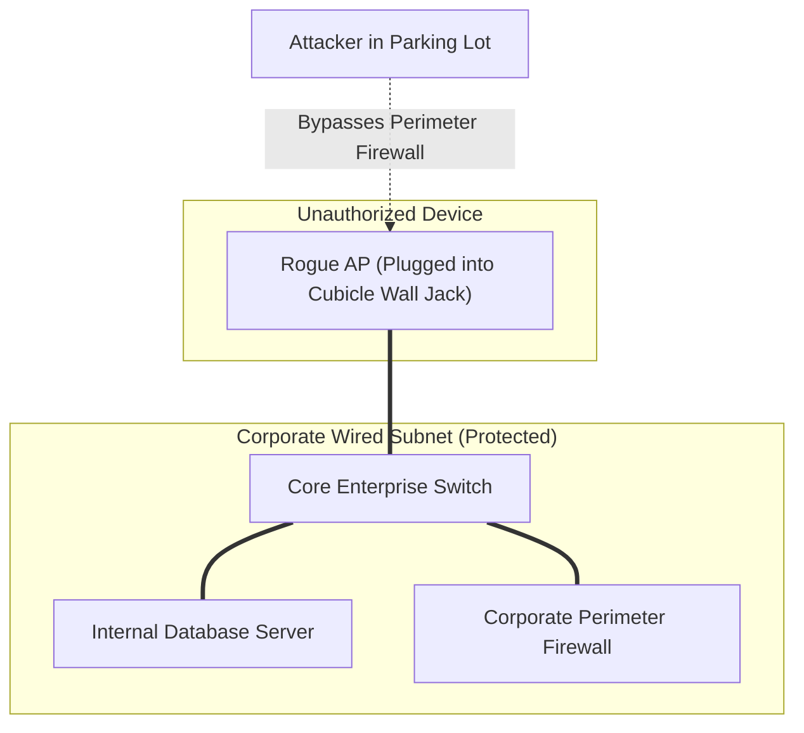

### 7.1 Rogue AP vs. Evil Twin Comparison

| Feature | Rogue Access Point | Evil Twin |
|---|---|---|
| **Definition** | Any unauthorized AP connected to the internal network | A specialized rogue AP specifically impersonating a legitimate SSID |
| **Network Name (SSID)** | Often uses default or arbitrary SSIDs (e.g., `NETGEAR`, `Linksys`) | Copies the exact SSID of a legitimate, authorized target network |
| **Primary Intent** | Accidental convenience (employee) or unauthorized bypass | Malicious credential theft, traffic interception, and MITM attacks |
| **Physical Location** | Usually plugged directly into an internal corporate Ethernet port | Can operate completely standalone as a battery-powered radio |
| **Primary Risk** | Bridges the secure internal LAN directly to the air | Tricks clients into connecting to an attacker-controlled system |

### 7.2 Defending Against Rogue APs & Evil Twins
- **Wireless Intrusion Prevention Systems (WIPS):** Continuously scans for unauthorized radios and sends automated deauthentication frames to contain rogue devices.
- **802.1X Port Security:** Enforces 802.1X authentication on all physical Ethernet switch ports, blocking unauthorized access points plugged into cubicle wall jacks.
- **EAP-TLS Mutual Authentication:** Requires both the client and server to validate cryptographic certificates, preventing clients from connecting to unauthenticated Evil Twins.
- **Managed Client Profiles:** Restricting employee devices from automatically connecting to open or unapproved networks.

## 8. Karmetasploit & Karma Attacks

Karmetasploit combines wireless access point emulation with the Metasploit Framework to automate client-side attacks.

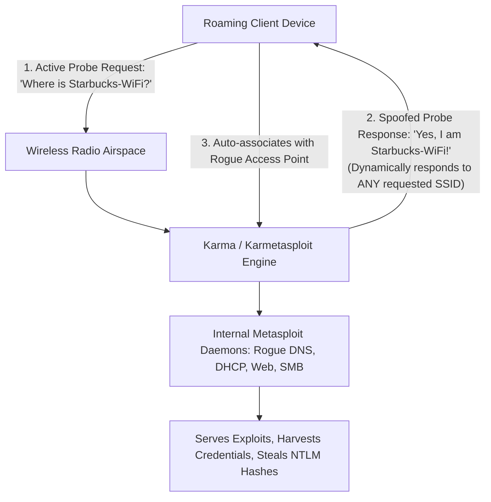

### 8.1 The Karma Attack Concept
When client devices leave their home or office, their operating systems continuously search for previously remembered networks stored in their **Preferred Network List (PNL)**:
- The client broadcasts 802.11 Probe Request frames asking for specific networks (e.g., "Is `Home-Network` nearby?").
- A Karma-enabled access point listens in promiscuous mode and immediately replies to *any* probe request with a matching Probe Response ("Yes, I am `Home-Network`").
- The client's auto-connect feature accepts the response and establishes an immediate association.

### 8.2 Karmetasploit Architecture and Workflow

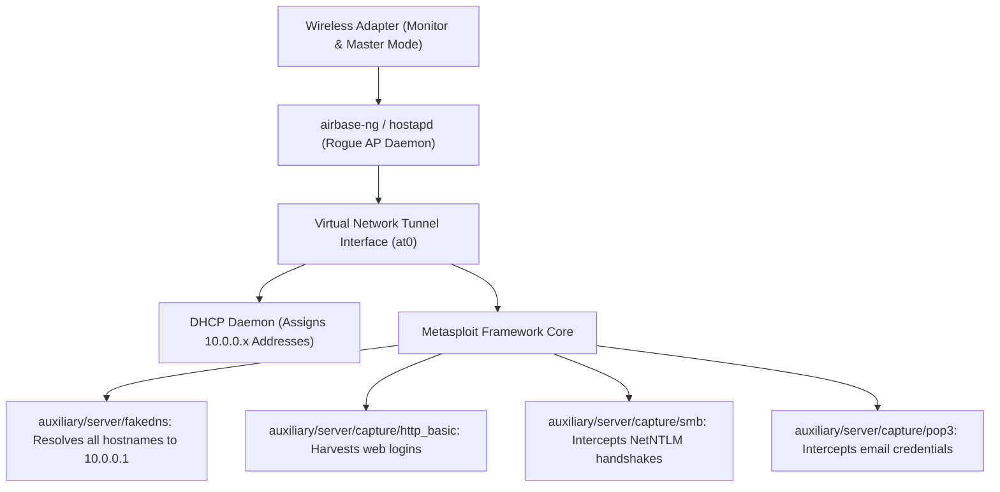

#### 8.2.1 Operational Lifecycle
1. **Lab Preparation:** Configure an injection-capable wireless adapter in monitor mode.
2. **AP Emulation:** Launch `airbase-ng` with Karma options enabled to respond to all SSID probes.
3. **Network Configuration:** Bring up the virtual network interface (`at0`) and start a DHCP daemon to assign IP addresses to connecting clients.
4. **Metasploit Service Orchestration:** Load Metasploit resource scripts (`karmetasploit.rc`) to launch fake DNS, HTTP, SMB, and mail listeners.
5. **Client Analysis:** Monitor connected clients as their applications generate background traffic against the simulated services.

### 8.3 Detecting Karma-Style Attacks
- **Unsolicited Probe Responses:** Monitoring for access points sending probe responses to SSIDs they were not originally configured to broadcast.
- **Single BSSID Advertising Multiple SSIDs:** Flagging a single physical MAC address responding to probe requests for dozens of different network names simultaneously.
- **Abnormal Gateway DNS Configuration:** Clients receiving DNS server addresses pointing directly to non-standard internal addresses that resolve all domains to a single IP.

## 9. Wireless Man-in-the-Middle (MITM)

Once a client associates with an Evil Twin or rogue access point, the attacker gains a Man-in-the-Middle (MITM) position over all communications.

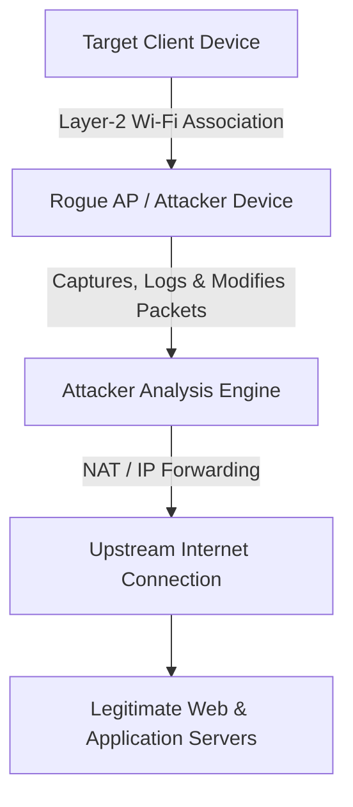

### 9.1 The Attacker's Network Position
By controlling the access point, the attacker serves as the client's default gateway and DNS server. This enables:
- **Traffic Sniffing:** Inspecting all unencrypted communication passing through the wireless interface.
- **DNS Redirection:** Spoofing DNS responses to route traffic intended for legitimate domains to local phishing servers.
- **Packet Injection:** Injecting malicious payloads, tracking scripts, or backdoors into unencrypted HTTP downloads.
- **Protocol Downgrade Attacks:** Attempting SSL-stripping to downgrade connections from HTTPS to plaintext HTTP where HSTS is not enforced.

### 9.2 The Wireless MITM Attack Lifecycle

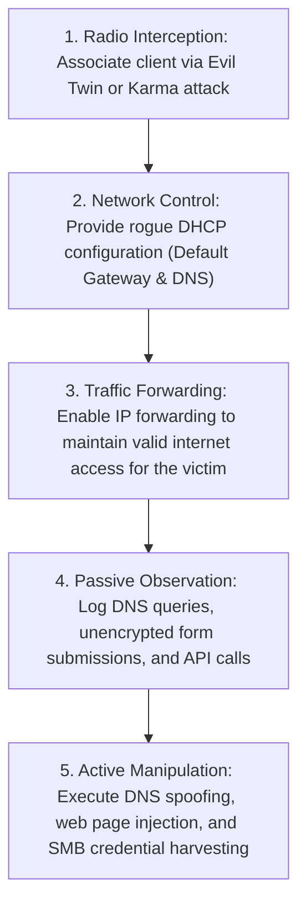

## 10. Traffic Interception & Encryption Analysis

Controlling the wireless link exposes network traffic, but modern end-to-end encryption limits an attacker's visibility.

### 10.1 What Can Wireless MITM Reveal?

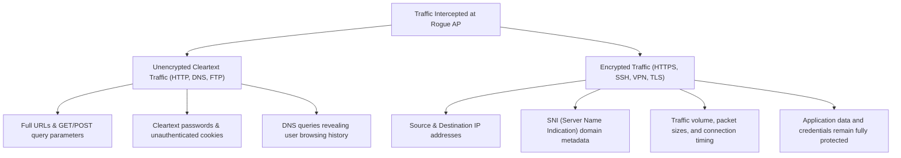

### 10.2 The Role of HTTPS in Wireless Security

:::important[CRITICAL ENCRYPTION PRINCIPLE]
**A rogue Wi-Fi network does not automatically compromise encrypted HTTPS traffic.** When a client connects to a web service over validated TLS, end-to-end encryption protects the session:
- **Payload Confidentiality:** Application data, form fields, and passwords remain encrypted.
- **Data Integrity:** Attackers cannot inject scripts or modify web page content without triggering TLS certificate warnings.
- **Server Authentication:** Digital certificates signed by trusted Certificate Authorities (CAs) prevent the rogue AP from impersonating the server unless the client manually bypasses browser warnings.
:::

## 11. Credential Security & SMB Relay Attacks

Connecting an enterprise client to a rogue network exposes operating system background services to credential capture and relay attacks.

### 11.1 The SMB Relay Attack

An SMB Relay attack intercepts a client's network authentication attempt and forwards it to a secondary target server, gaining access without cracking the underlying password.

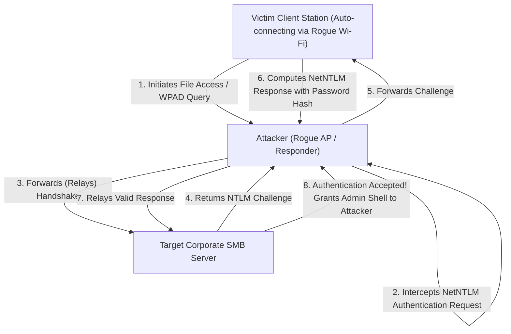

### 11.2 SMB Relay vs. Password Attacks

| Dimension | SMB Relay Attack | Password Attack (Brute Force / Cracking) |
|---|---|---|
| **Core Operation** | Forwards live authentication handshakes in real-time | Attempts to guess or reverse-calculate the password hash |
| **Password Knowledge**| Does **not** require discovering or cracking the password | Requires cracking the hash into cleartext to log in |
| **Primary Dependency**| Inadequate SMB signing and vulnerable NTLM protocols | Weak password complexity and insufficient hash algorithms |
| **Attack Target** | Targets the **authentication process** | Attacks **credential secrecy** |

### 11.3 SMB Signing: The Primary Defensive Control

SMB Signing protects message integrity and authenticity by calculating a cryptographic signature for every SMB packet using a session key derived during authentication.

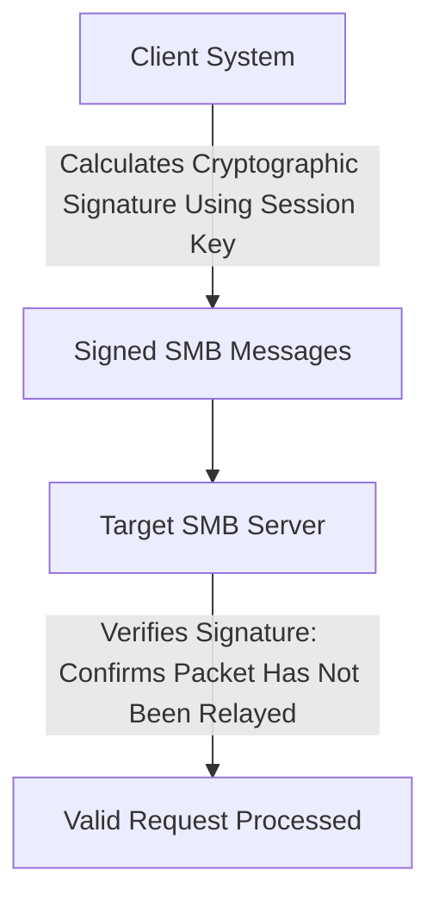

- When SMB Signing is **required**, an attacker cannot relay authentication packets to a secondary server because they lack the session key needed to sign subsequent commands.
- If SMB Signing is disabled or optional, an attacker can relay the authentication handshake and execute arbitrary code on the target server.

### 11.4 Mitigations Against SMB Relay
- **Enforce SMB Signing:** Require SMB Signing across all domain workstations and servers via Group Policy:
  - `Microsoft network client: Digitally sign communications (always) = Enabled`
  - `Microsoft network server: Digitally sign communications (always) = Enabled`
- **Disable LLMNR and NetBIOS:** Turn off legacy broadcast name resolution protocols that attackers use to trigger authentication attempts.
- **Enable Extended Protection for Authentication (EPA):** Binds TLS channels to authentication handshakes to prevent relaying across protocols.
- **Network Segmentation:** Use VLANs and host firewalls to block workstation-to-workstation SMB traffic on port 445.

## 12. Comparative Analysis of Wireless Attack Vectors

| Attack Vector | Primary Target | Core Operational Mechanism | Primary Defensive Countermeasure |
|---|---|---|---|
| **Evil Twin** | Client station | Impersonates legitimate APs by copying known SSIDs | 802.1X EAP-TLS, certificate validation, WIPS |
| **Karma Attack** | Client station | Dynamically replies to any SSID probe requests from client PNLs | Disable auto-connect, use WPA3, disable open Wi-Fi |
| **Rogue Access Point** | Wired enterprise LAN | Connects unauthorized APs to internal physical switch ports | 802.1X port security, rogue AP sweeps, switch port auditing |
| **Wireless MITM** | Traffic stream | Intercepts Layer-2/Layer-3 traffic between client and gateway | End-to-end TLS/HTTPS, HSTS, always-on corporate VPNs |
| **SMB Relay** | Authentication flow | Forwards live NetNTLM authentication handshakes to target servers | Mandatory SMB Signing, disable NTLM in favor of Kerberos |

## 13. Comprehensive Case Studies

### 13.1 Case Study 1: University Campus Evil Twin Attack

#### 13.1.1 Incident Scenario
A university campus operates an enterprise Wi-Fi network broadcasting `SSID: University-WiFi`. A network administrator notices an alert on the campus WIDS console indicating a second access point broadcasting `SSID: University-WiFi` with:
- A completely different BSSID registered to a consumer hardware vendor.
- A physical location mapped near the campus perimeter.
- A basic WPA2-Personal (PSK) security configuration, whereas the legitimate network enforces WPA2-Enterprise (802.1X).

#### 13.1.2 Investigative Analysis & Solutions

##### Question 1: What is the likely attack?
- This is an **Evil Twin attack**. The rogue device is imitating the legitimate `University-WiFi` SSID to deceive campus users into connecting.

##### Question 2: Which evidence supports this conclusion?
- **Identical SSID with Mismatched BSSID:** A consumer hardware MAC address broadcasting the enterprise network name.
- **Security Downgrade:** The unauthorized AP uses WPA2-Personal, designed to prompt users for credentials or display a captive portal instead of the campus 802.1X/RADIUS server.
- **Physical Anomaly:** Signal triangulation locates the source near the campus perimeter rather than installed ceiling APs.

##### Question 3: What should the wireless administrator investigate?
- Triangulate the physical location of the rogue radio using directional antennas or controller RSSI mapping.
- Inspect 802.11 management frames for high-volume deauthentication frame bursts.
- Check switch MAC address tables to confirm whether the device is plugged into an internal Ethernet port.

##### Question 4: How could connecting clients detect the difference?
- Properly configured client devices configured for 802.1X will alert users or refuse to connect because the rogue network does not present the university's trusted root CA certificate.
- Users can observe unexpected captive portals or prompts requesting passwords instead of standard 802.1X credentials.

##### Question 5: What controls prevent this attack?
- Deploy 802.1X with mutual certificate validation (EAP-TLS).
- Enable Wireless Intrusion Prevention Systems (WIPS) to transmit containment frames against the rogue BSSID.
- Distribute managed device profiles that prevent auto-connecting to open or PSK-based networks.

### 13.2 Case Study 2: Wireless MITM Traffic Interception

#### 13.2.1 Incident Scenario
An employee working remotely connects a corporate laptop to an unknown wireless network. Shortly after association:
- The default gateway IP changes to an unexpected local subnet address.
- DNS queries begin resolving to an unknown, non-corporate DNS server.
- The user accesses several internal and external websites, producing unencrypted HTTP and encrypted HTTPS traffic.

#### 13.2.2 Investigative Analysis & Solutions

##### Question 1: What attack position exists?
- The attacker has established a **Wireless Man-in-the-Middle (MITM)** position, controlling the client's Layer-2 and Layer-3 traffic as the default gateway and DNS provider.

##### Question 2: Which traffic is potentially exposed?
- **Exposed:** Cleartext HTTP requests, unencrypted form submissions, session cookies without the `Secure` flag, and cleartext DNS queries revealing browsing activity.
- **Protected:** All traffic encrypted under properly validated HTTPS/TLS sessions.

##### Question 3: Why does HTTPS traffic remain protected?
- TLS provides end-to-end encryption between the browser and the target web server. Unless the attacker presents a certificate trusted by the client's root certificate store and the user ignores browser security warnings, the session payload remains encrypted and tamper-proof.

##### Question 4: What digital evidence should be collected?
- **Endpoint Event Logs:** DHCP configuration history and adapter IP assignments.
- **Network Traffic (PCAP):** Packet captures verifying DNS responses, ARP tables, and rogue gateway IP addresses.
- **Browser History & Cache:** Active browser sessions and any SSL/TLS certificate warnings prompted during the session.

##### Question 5: What controls reduce this operational risk?
- Mandate an **always-on corporate VPN** that encrypts all outbound traffic from the endpoint regardless of the underlying network.
- Enforce **DNS-over-HTTPS (DoH)** or secure internal DNS resolvers.
- Enforce **HTTP Strict Transport Security (HSTS)** to prevent protocol downgrade attacks.