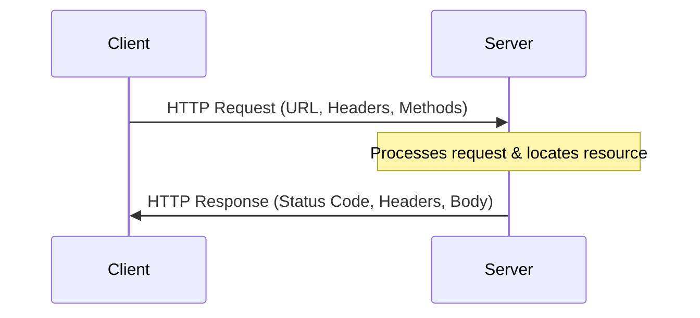
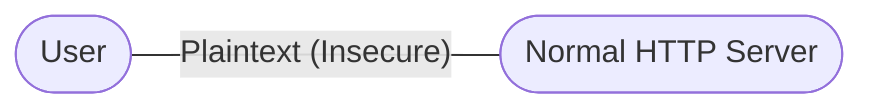
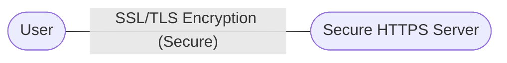
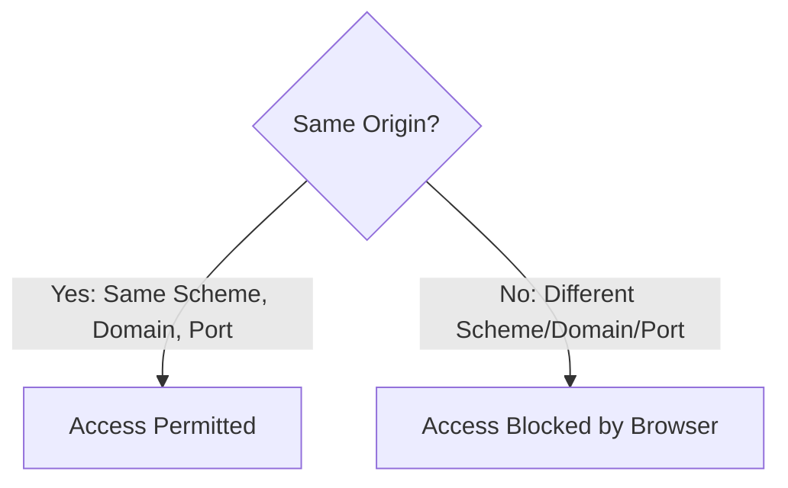
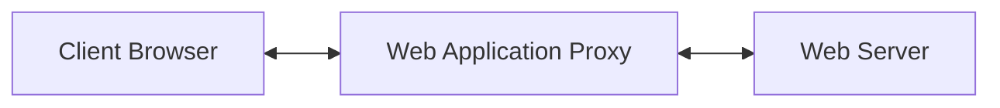
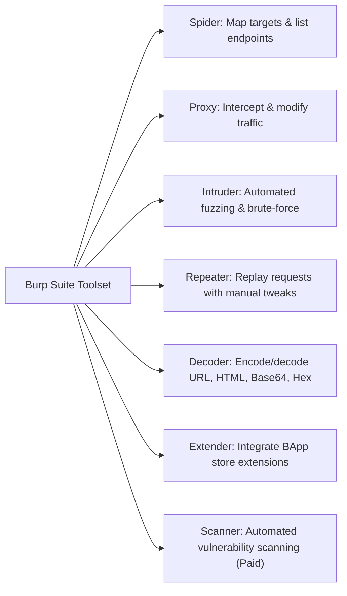

# Unit - 1
:::info[Title]
## Basics of HTTP and HTTPS
:::

## 1. Client-Server Architecture & HTTP Basics
---
The Hypertext Transfer Protocol (HTTP) is the foundation of data communication on the World Web. It operates on a client-server architecture where a client (browser) sends a request, and a server returns a response.

### 1.1 Client-Server Communication Flow
An HTTP request is initiated by a client to a named host located on a web server. The goal of the request is to retrieve, delete, or modify a resource on the server.
- **URL (Uniform Resource Locator):** The client uses the components of a URL to locate and access the resource. A URL contains:
  - **Scheme:** Specifies the protocol used (e.g., `http` or `https`).
  - **Domain / Host:** The IP address or domain name of the target server.
  - **Port:** The communication port (default: 80 for HTTP, 443 for HTTPS).
  - **Path:** The specific resource directory or file path on the server.
  - **Query Parameters:** Key-value pairs providing additional arguments to the server.



### 1.2 HTTP Request Methods
HTTP defines a set of request methods to indicate the desired action to be performed on a given resource:

- **GET:** Requests a representation of the specified resource. Requests using GET should only retrieve data and should not have side effects.
- **HEAD:** Asks for a response identical to a GET request, but without the response body. Used to retrieve metadata (e.g., check file size or headers).
- **POST:** Submits an entity to the specified resource, often causing a change in state or side effects on the server (e.g., submitting forms, uploading files).
- **PUT:** Replaces all current representations of the target resource with the request payload.
- **DELETE:** Deletes the specified target resource from the server.
- **CONNECT:** Establishes a network tunnel to the server identified by the target resource (commonly used for SSL/TLS tunneling through web proxies).
- **OPTIONS:** Describes the communication options and allowed methods supported by the target resource.
- **TRACE:** Performs an application-layer loop-back test along the path to the target resource (useful for network debugging).
- **PATCH:** Applies partial modifications to a resource (unlike `PUT`, which requires replacing the entire entity).

#### HTTP Request Structure (Example)
```http showLineNumbers
POST /api/v1/users HTTP/1.1
Host: targetapp.com
User-Agent: Mozilla/5.0 (Windows NT 10.0; Win64; x64)
Accept: application/json
Content-Type: application/json
Content-Length: 47
Connection: close
Cookie: SESSIONID=abc123xyz

{
  "username": "ankur",
  "email": "ankur@example.com"
}
```

### 1.3 HTTP Responses & Status Codes
An HTTP response is sent by the server to provide the client with the requested resource, confirm the execution of an action, or report errors.

#### HTTP Response Structure (Example)
```http 
HTTP/1.1 200 OK
Date: Sun, 28 Aug 2017 08:56:53 GMT
Server: Apache/2.4.27 (Linux)
Last-Modified: Fri, 20 Jan 2017 07:16:26 GMT
ETag: "10000000565a5-2c-3e94b66c2e680"
Accept-Ranges: bytes
Content-Length: 44
Connection: close
Content-Type: text/html
X-Pad: avoid browser bug

<html><body><h1>It works!</h1></body></html>
```

#### HTTP Status Code Classes
HTTP response status codes indicate the outcome of the request. They are grouped into five distinct classes:

| Class Range | Category | Description / Purpose |
|---|---|---|
| **100 – 199** | **Informational** | Request received, continuing process. |
| **200 – 299** | **Successful** | Action successfully received, understood, and accepted. |
| **300 – 399** | **Redirection** | Further action must be taken to complete the request. |
| **400 – 499** | **Client Error** | Request contains bad syntax or cannot be fulfilled. |
| **500 – 599** | **Server Error** | Server failed to fulfill an apparently valid request. |

### 1.4 HTTP Header Fields
HTTP headers carry metadata about the request/response messages or the payload body:

- **General-header:** Headers applicable to both request and response messages but unrelated to the entity body (e.g., `Connection`, `Date`, `Cache-Control`).
- **Client Request-header:** Headers applicable only to request messages, providing client context (e.g., `User-Agent`, `Accept-Language`, `Authorization`, `Referer`).
- **Server Response-header:** Headers applicable only to response messages, providing server context (e.g., `Server`, `WWW-Authenticate`, `Set-Cookie`, `Access-Control-Allow-Origin`).
- **Entity-header:** Define meta-information about the entity-body or, if no body is present, about the resource identified by the request (e.g., `Content-Type`, `Content-Length`, `Last-Modified`, `ETag`).

## 2. HTTP vs. HTTPS

The primary security challenge with standard HTTP is plaintext transmission, which exposes web applications to sniffing and tampering.

### 2.1 Security Limitations of HTTP
- **Plaintext Risk:** Standard HTTP transmits requests and responses in plaintext.
- **Eavesdropping:** Any malicious actor monitoring the network path can read sensitive data (e.g., passwords, credit card numbers, personal records).
- **Tampering:** Network intermediaries or attackers can intercept, modify, or inject malicious payloads into HTTP communications.



### 2.2 HTTPS (Secure Transport)
HTTPS stands for Hypertext Transfer Protocol Secure (also referred to as HTTP over TLS or HTTP over SSL). It uses TLS (Transport Layer Security) or SSL (Secure Sockets Layer) to encrypt requests and responses.



- **Encryption Mechanism:** An attacker intercepting HTTPS traffic sees only a series of seemingly random characters rather than plaintext.
- **Public Key Encryption:** TLS uses public key cryptography featuring two keys:
  - **Public Key:** Shared publicly with client devices via the server's SSL certificate.
  - **Private Key:** Maintained securely on the server to decrypt data encrypted by the public key.
- **Certificate Authority (CA):** SSL certificates are cryptographically signed by a trusted Certificate Authority (CA). Browsers maintain a pre-loaded list of trusted root CAs. Verified certificates display a green padlock in the browser address bar. Let's Encrypt provides free certificate issuance.
- **Session Keys:** When establishing a connection, the client and server verify identity using public/private keys and agree on symmetric **session keys** to encrypt all subsequent communication.

## 3. Same-Origin Policy (SOP)

The Same-Origin Policy (SOP) is a critical security mechanism implemented by web browsers to isolate documents and protect web applications from malicious cross-origin interactions.

### 3.1 Definition and Purpose
SOP permits scripts on a first web page to access data in a second web page **only if** both pages share the same origin.
- **Definition of Origin:** An origin is defined by the combination of three components:
  1. **URI Scheme** (e.g., `http` vs. `https`)
  2. **Domain** (e.g., `example.com` vs. `api.example.com`)
  3. **Port Number** (e.g., port `80` vs. port `8080`)



### 3.2 Same-Origin Evaluation Examples
The table below displays origin access outcomes for a script running on `http://normal-website.com/example/`:

| Target URL | Access Permitted? | Reason |
|---|---|---|
| `http://normal-website.com/example2/` | **Yes** | Same scheme (`http`), domain (`normal-website.com`), and port (default `80`). |
| `https://normal-website.com/example/` | **No** | Different scheme (`https`) and port (default `443` vs `80`). |
| `http://en.normal-website.com/example/` | **No** | Different domain (`en.normal-website.com` vs `normal-website.com`). |
| `http://www.normal-website.com/example/` | **No** | Different domain (`www.normal-website.com` vs `normal-website.com`). |
| `http://normal-website.com:8080/example/` | **No** | Different port (`8080` vs default `80`). |

### 3.3 Necessity of Same-Origin Policy
Without SOP, web applications would be vulnerable to severe data compromise:
- **Automatic Cookie Transmission:** Browsers automatically attach relevant domain cookies (including authentication session cookies) to all outgoing HTTP requests directed at that domain, regardless of which website initiated the request.
- **Attack Scenario:** If a user logs into their webmail account and then visits a malicious site in another tab, the malicious site's scripts could make requests to the webmail domain.
- **Security Check:** Because the browser automatically attaches the webmail session cookie, the webmail server accepts the request. Without SOP, the malicious site's script could read the response and steal emails, private messages, or account credentials.

### 3.4 Interaction with CORS (Cross-Origin Resource Sharing)
While SOP blocks cross-origin reading by default, developers use CORS to safely share resources:
- **Access-Control-Allow-Origin:** Response header that tells the browser which origins can read the response.
- **OPTIONS Preflight Requests:** For "non-simple" requests (e.g., containing JSON headers), the browser sends an OPTIONS preflight request first. The server responds with allowed methods and origins, and the browser only sends the actual request if allowed.

## 4. Cookies & Session Management

Because HTTP is stateless, servers use cookies and sessions to track user authentication states and customize web experiences.

### 4.1 What are Cookies?
Cookies (sometimes referred to as "biscuits" in network security contexts) are small text files containing key-value data sent from a web server and stored on the user's computer by the browser. The browser automatically sends these cookies back with subsequent requests to the same server.
- **Uses:** Session tracking, user authentication, preference storage, shopping carts, and web analytics.

#### Cookie Types
- **Session Cookies:** Stored temporarily in volatile memory. They are deleted automatically when the user closes their browser. Commonly used to track short-term session states (e.g., active shopping cart items).
- **Persistent Cookies:** Stored on the client's local storage for a longer duration defined by their expiration date. They persist even after closing the browser to keep users logged in or track analytics.
- **Third-Party Cookies:** Set by domains other than the one the user is directly visiting (e.g., external advertising trackers). Modern browsers frequently block third-party cookies by default to protect user privacy.

#### Critical Security Flags for Cookies
- **Secure Flag:** Instructs the browser to only transmit the cookie over secure HTTPS connections, protecting it from eavesdropping over plaintext channels.
- **HttpOnly Flag:** Restricts client-side scripts (like JavaScript) from accessing the cookie via `document.cookie`. This mitigates the risk of session theft via Cross-Site Scripting (XSS) attacks.
- **SameSite Flag:** Controls whether cookies are sent with cross-site requests, providing protection against CSRF (Cross-Site Request Forgery):
  - `Strict`: The cookie is never sent in cross-site requests.
  - `Lax`: The cookie is sent only when the user is navigating to the origin site (e.g., clicking a link).
  - `None`: The cookie is sent in all cross-site requests (requires the `Secure` flag).

### 4.2 Sessions
A **Session** is a temporary, interactive state representing an information exchange between two communicating devices or a user and a server.
- **Web Session:** A series of contiguous user actions on an individual website within a given timeframe (e.g., form submissions, page views, search queries).
- **Session Tracking Method:** The server generates a unique session ID, stores it in its server-side memory or database, and sends the session ID to the client browser in a cookie. The client sends this cookie with each request, allowing the server to retrieve the user's state.

### 4.3 Cookies vs. Sessions Comparison
- **Storage Location:** Cookies are stored on the client (browser), while sessions are stored on the server.
- **Data Capacity:** Cookies are limited to a small size (typically 4KB), while sessions have virtually unlimited storage.
- **Security:** Sessions are generally more secure because sensitive data is stored on the server; cookies can be read or modified by users if security flags are not configured.

## 5. Web Application Proxies

A Web Application Proxy is an intermediary tool that sits between a client browser and a target web server. It intercepts, monitors, and modifies HTTP/HTTPS traffic in real-time.



### 5.1 Proxy Core Operations
- **Interception:** Captures HTTP request and response payloads in transit.
- **Traffic Analysis:** Helps security professionals map endpoints, examine parameter values, locate hidden APIs, and detect sensitive data exposures.
- **Request Modification:** Allows testers to alter parameters, headers, or cookies to test authorization and bypass client-side checks.
  - *Example:* Changing `role=user` to `role=admin` in the request headers to verify privilege escalation controls.
- **Response Modification:** Evaluates how the application handles custom header responses, error pages, and security headers.
- **Deployment:** Web application proxies are commonly deployed for external application pre-authentication (e.g., ADFS integration in Windows Server 2012 R2) or as a secure barricade between internal corporate servers and the public internet.

## 6. Burp Suite

Burp Suite is the leading web application penetration testing platform developed by PortSwigger (founded by Dafydd Stuttard). It is used to analyze, intercept, and test web applications for security vulnerabilities.



### 6.1 Burp Suite Main Components
- **Spider:** A crawler used to map the target web application and identify directories and endpoints to maximize the attack surface.
- **Proxy:** An intercepting proxy that runs on a local loopback IP and port. It lets the tester view and modify request and response headers and bodies. It can send monitored requests directly to other Burp tools.
- **Intruder:** An automated fuzzer. It runs sets of payload values through input points and monitors responses for success/failure or changes in content length. Used for:
  - Brute-force attacks on password or PIN forms.
  - Dictionary attacks against parameters suspected of XSS or SQL Injection.
  - Testing and attacking rate-limiting controls.
- **Repeater:** Replays single HTTP requests manually. Testers use it to tweak parameters, verify server responses, analyze input sanitization styles, identify session cookies, and test CSRF protections.
- **Decoder:** Encodes or decodes data formats (URL, HTML, Base64, Hex, Binary) to construct payloads and analyze session parameters.
- **Extender:** Integrates third-party add-ons (called BApps) from the BApp Store to expand Burp Suite's technical capabilities.
- **Scanner:** An automated vulnerability scanner (restricted to paid Professional and Enterprise editions) that automatically identifies common web vulnerabilities and lists them with confidence levels.

### 6.2 Burp Intruder Attack Modes (Fuzzing)
When running fuzzing attacks in Intruder, testers select one of four configurations:
1. **Sniper:** Uses a single payload set. It targets one parameter at a time, moving to the next after finishing the list.
2. **Battering Ram:** Uses a single payload set. It injects the same payload value into all target parameters simultaneously.
3. **Pitchfork:** Uses multiple payload sets (one per parameter position). It iterates through the lists in lockstep (i.e., payload 1 of List A and payload 1 of List B are sent together).
4. **Cluster Bomb:** Uses multiple payload sets. It iterates through all permutations and combinations of the payload lists (essential for brute-forcing username/password combinations).
