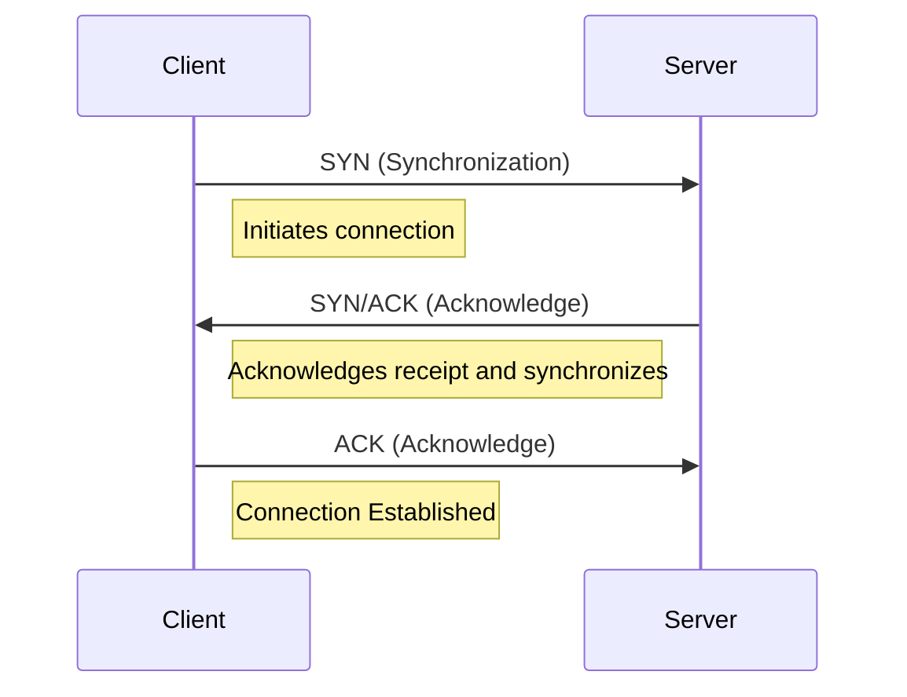

# Unit - 2
:::info[Title]
## Information Gathering
:::

## 1. Information Gathering

### 1.1 Introduction
**Information Gathering** (or Reconnaissance) is the first and most critical stage of Ethical Hacking. It involves collecting intelligence about a target (victim or system) before launching an attack.
- **Purpose:** Maximizes the probability of identifying vulnerabilities and finding attack vectors. It provides the foundation for the entire penetration test.
- **Scope:** Involves using tools, techniques, and public sources to gather metadata, employee names, email addresses, phone numbers, domain details, and infrastructure configuration. This information can be used for social engineering, password guessing, or discovering unprotected assets.

### 1.2 Categories of Information Gathering

#### 1.2.1 Footprinting
Footprinting is the technique used to collect as much information as possible about the targeted network, system, or organization to determine its security posture.
- **Passive Footprinting (Pseudonymous):** Collecting data without directly interacting with the target. The target remains unaware. Examples include checking public records, WHOIS databases, and search engine results (OSINT).
- **Active Footprinting:** Involves direct interaction with the target's infrastructure, which may leave traces or trigger alerts in Intrusion Detection Systems (IDS). Examples include network scanning, ping sweeps, and interacting with web servers.

#### 1.2.2 Scanning
Scanning refers to a set of techniques used to identify live hosts, open ports, and running services within a network.
- **Network Scanning:** Used to create a complete map of the target's network topology, finding active IP addresses and discovering the overall architecture.
- **Port Scanning:** Probing specific ports on identified hosts to see which ones are open and listening.
- **Vulnerability Scanning:** Using automated tools to detect known security flaws, missing patches, weak authentication, or unnecessary services.

**TCP/IP Handshake:**
Scanning heavily relies on the TCP/IP 3-way handshake, which is the automated process used to establish a reliable connection between a client and a server.



**Common Scanning Tools:**
- **Nmap:** The industry standard for network discovery and security auditing. It extracts information like live hosts, services, firewalls, and OS versions.
- **Angry IP Scanner:** A fast, cross-platform IP address and port scanner for discovering systems in a specific range.
- **Hping2/Hping3:** Command-line packet crafting and network scanning tools. Often used for custom TCP/IP packet generation and firewall testing.
- **Superscan:** A Windows-based TCP port scanner, pinger, and hostname resolver by McAfee.
- **ZenMap:** The official graphical user interface (GUI) for Nmap.
- **Net Scan Tool Suite Pack:** A collection of network testing tools capable of port scanning, flooding, and mass emailing.
- **Wireshark & Omnipeak:** Protocol analyzers that capture and inspect network traffic packets in real-time.

## 2. Information Gathering Tools

### 2.1 WHOIS
WHOIS is a query and response protocol used for querying databases that store the registered users or assignees of an Internet resource, such as a domain name.
- **Information Included:** Domain ownership details, registrar information, registration and expiration dates, administrative and technical contacts, and assigned nameservers.
- **Usage:** Essential for identifying the entity behind a domain and discovering contact emails that could be used for social engineering or phishing assessments.

### 2.2 NsLookup
NsLookup (Name Server Lookup) is a command-line tool used to query the Domain Name System (DNS) to obtain domain name or IP address mapping and other specific DNS records.
- **Modes:** 
  - **Interactive:** Allows users to continuously query the DNS server for various records.
  - **Non-interactive:** Returns just the requested information for a single query.
- **Usage:** Helps identify the IP addresses behind a domain, mail exchange (MX) records, or authoritative nameservers.

### 2.3 Netcraft
Netcraft is a web-based tool and security service that provides internet data analysis. It can uncover the operating system, web server version, and hosting provider of a given domain.
- **Alternatives:** Search engines like **SHODAN** (which indexes IoT devices and open ports globally) and **Spiderfoot** (an automated OSINT gathering tool) are often preferred for deeper, more comprehensive footprinting.

## 3. Web Server & Framework Fingerprinting

### 3.1 Web Server Fingerprinting
The process of accurately identifying the type, version, and configuration of the web server (e.g., Apache, Nginx, IIS) running on the target.
- **Importance:** Identifying outdated or unpatched server software is critical, as it may be susceptible to known version-specific exploits.

#### Banner Grabbing
Banner grabbing is a technique used to glean information about a computer system on a network and the services running on its open ports by examining the initial response (the "banner").
- **Tools:** `telnet`, `netcat` (nc), or `openssl` (for SSL/TLS encrypted services).

```http
HTTP/1.1 200 OK
Server: nginx/1.17.3
Date: Thu, 05 Sep 2019 17:50:24 GMT
Content-Type: text/html
Content-Length: 117
Last-Modified: Thu, 05 Sep 2019 17:40:42 GMT
Connection: close
ETag: "5d71489a-75"
Accept-Ranges: bytes
```
*In this example, the `Server` header clearly reveals the target is running Nginx version 1.17.3.*

### 3.2 Framework Fingerprinting
Identifying the specific web application framework used to build a site (e.g., Django, Spring, Struts, Laravel).
- **Techniques:** Examining HTTP headers (like `X-Powered-By`), analyzing HTML source code structure, identifying specific cookie names (like `JSESSIONID` for Java), or observing default error pages and directory structures.
- **Risk:** Once a framework is identified, attackers can search exploit databases for known vulnerabilities associated with that specific framework version.

## 4. Subdomain Enumeration
The systematic process of identifying sub-domains (e.g., `dev.example.com`, `admin.example.com`) associated with a primary domain.

**Why enumerate sub-domains?**
- **Broadens the Attack Surface:** Reveals more targets that are in scope for a security assessment.
- **Discovers Forgotten Assets:** Often uncovers hidden development, staging, or legacy applications that lack the strict security controls of the main production site, making them prime targets for exploitation.

## 5. Enumeration and its Types

### 5.1 Introduction
**Enumeration** is an active information gathering process where the attacker establishes an active connection to the target system and performs directed queries to extract specific data. It is generally more intrusive than footprinting.
- **Goal:** To extract actionable data like usernames, machine names, network resources, shares, and services to identify weak points for the exploitation phase.

### 5.2 Types of Information Enumerated
- **Network Resource and shares:** Discovering accessible file shares (SMB/NFS).
- **Users and Groups:** Extracting local or domain user lists to facilitate brute-force or password spraying attacks.
- **Routing tables:** Understanding internal network topology.
- **Auditing and Service settings:** Checking what services are running and how they are configured.
- **Machine names:** Identifying the roles of servers (e.g., `SQL-PROD-01`).
- **SNMP and DNS details:** Extracting management data or internal DNS records.

### 5.3 Techniques for Enumeration
- **Extracting user names using email IDs:** Scraping directories or guessing conventions (e.g., `first.last@company.com`).
- **Extracting information using default passwords:** Attempting factory default credentials on exposed administrative interfaces.
- **Brute Force Active Directory:** Querying LDAP or using tools to map AD structures.
- **Extracting user names using SNMP:** Querying Simple Network Management Protocol (if community strings are public or default) to dump extensive system information.
- **Extracting user groups from Windows:** Using tools like `enum4linux` or null sessions (on older Windows) to list groups.
- **Extracting information using DNS Zone transfer:** Attempting an `AXFR` request to a misconfigured DNS server, which can dump all DNS records for a domain, revealing the entire external infrastructure.

## 6. Security Misconfiguration
Security misconfigurations occur when security controls are inaccurately configured or left insecure, directly putting systems and data at risk. This is one of the most common web application vulnerabilities.

**Probable Reasons:**
- **Human errors:** Accidental changes by administrators.
- **Using out-of-the-box settings:** Deploying software with default passwords, keys, or unrestricted access.
- **Disabled security controls:** Turning off firewalls or protections temporarily for troubleshooting and forgetting to turn them back on.
- **Excess privilege:** Running applications or granting users higher permissions than strictly necessary (violating the Principle of Least Privilege).
- **Misconfigured logging:** Failing to log security events, leaving attackers undetected.
- **Insecure services:** Leaving unnecessary ports open or running legacy protocols (like Telnet or FTP).
- **Improper versioning:** Leaking internal code versions or running outdated software dependencies.

## 7. Google Hacking Database (GHDB)
The Google Hacking Database is an index of specialized Internet search engine queries (often called "Google Dorks") designed to uncover interesting, sensitive, or hidden information accidentally made publicly available.

**Google Dorking Advanced Operators:**
- `cache:` Shows the last cached version of a website stored by Google, useful if the live site is down or modified.
- `allintext:` Searches for specific text strictly contained within the body of a webpage.
- `allintitle:` Restricts results to pages where the title contains all the specified words (e.g., `allintitle:"Index of /admin"`).
- `allinurl:` Fetches results whose URL contains all specified characters.
- `filetype:` Restricts searches to specific file extensions (e.g., `filetype:sql` or `filetype:env` to find exposed database dumps or environment variables).
- `inurl:` Similar to `allinurl`, but applies to a single keyword (e.g., `inurl:admin`).
- `intitle:` Searches for specific keywords inside the page title.
- `inanchor:` Searches for exact anchor text used on links pointing to a page.
- `site:` Restricts the search to a specific domain and its subdomains (e.g., `site:example.com`).
- `*` (Wildcard): Acts as a placeholder for any unknown word or phrase.
- `|` (OR Operator): Shows results that contain either the first word, the second word, or both.
- `+` (Concatenate): Forces the exact inclusion of a word.
- `-` (Minus Operator): Excludes pages that contain a specific word (e.g., `security -trails`).

## 8. OSINT Framework
**Open-Source Intelligence (OSINT)** is the collection, analysis, and dissemination of information that is publicly available and legally accessible.
- **Sources:** Social media platforms, WHOIS records, online forums, public government records, news articles, and corporate websites.
- **Purpose:** Used heavily in the reconnaissance phase to build a profile of the target organization, understand employee hierarchies, and gather data for social engineering attacks without raising suspicion.

## 9. NMAP Scanning

### 9.1 Introduction
**Nmap (Network Mapper)** is an open-source command-line tool used to discover hosts and services on a computer network by sending packets and analyzing the responses. Created by Gordon Lyon (Fyodor), it is a staple in penetration testing.
- It can rapidly map out a network without sophisticated configurations.
- Its capabilities can be vastly extended using the **Nmap Scripting Engine (NSE)** to automate vulnerability detection.
- **Zenmap** is the official graphical user interface, useful for generating visual topology maps.

### 9.2 Key Capabilities
- **Host Discovery:** Identifying which devices are active on a network.
- **Port Scanning:** Discovering open ports on target hosts.
- **Service Enumeration:** Interrogating open ports to identify running applications and their versions.
- **OS Fingerprinting:** Analyzing network responses (like TTL and TCP window size) to determine the target's operating system.
- **Vulnerability Scanning:** Utilizing NSE scripts to test for known vulnerabilities or misconfigurations.

### 9.3 Nmap Command Options & Techniques

#### Host Discovery (Ping Scans)
- `-sn`: Ping Scan. Disables port scanning, only checks if hosts are online.
- `-sL`: List Scan. Simply lists the IP addresses in the target range without sending packets to the target hosts.
- `-Pn`: Treat all hosts as online. Skips the host discovery phase (useful if firewalls block ping requests).
- `-PS / PA / PU / PY [portlist]`: TCP SYN, TCP ACK, UDP, or SCTP discovery probes to specified ports.
- `-PE / PP / PM`: ICMP Echo, Timestamp, and Netmask request discovery probes.

#### Port Scanning Techniques
- `-sS`: TCP SYN Scan (Stealth Scan). The default and most popular scan. Sends a SYN packet, waits for SYN/ACK, and immediately tears down the connection before it's fully established, making it less likely to be logged.
- `-sT`: TCP Connect Scan. Completes the full 3-way handshake. Slower and easily logged, but doesn't require raw packet privileges.
- `-sU`: UDP Scan. Scans for UDP services (like DNS or SNMP). Often slow and unreliable due to UDP's connectionless nature.
- `-sN / sF / sX`: TCP Null, FIN, and Xmas scans. These manipulate TCP flags to sneak past stateless firewalls.
- `-sA`: TCP ACK scan. Used to map out firewall rulesets to determine if they are stateful or not.
- `-sI`: Idle scan. A truly blind scan that uses a "zombie" host to spoof the origin IP, completely hiding the attacker's identity.

#### Port Specification & Scan Order
- `-p`: Scan specified ports (e.g., `-p22,80,443` or `-p1-65535` for all ports).
- `-F`: Fast mode. Scans fewer ports than the default top 1000.
- `-r`: Scan ports consecutively instead of randomizing the order.
- `--top-ports [number]`: Scans the `n` most common ports.

#### Service and OS Detection
- `-sV`: Version detection. Probes open ports to determine the exact service and version running.
- `-O`: Enable OS detection.
- `-A`: Aggressive scan options. Enables OS detection, version detection, script scanning, and traceroute simultaneously.

#### Nmap Scripting Engine (NSE)
- `-sC`: Equivalent to `--script=default`. Runs the default set of non-intrusive security scripts.
- `--script=[name/category]`: Specifies the script or category (e.g., `vuln`, `exploit`, `safe`) to run against the target.

#### Command Examples
```bash
# Comprehensive aggressive scan on a single domain
nmap -v -A scanme.nmap.org

# Ping sweep of an entire subnet (No port scan)
nmap -v -sn 192.168.0.0/16 10.0.0.0/8

# Scan 10,000 random external IPs, treating them as online, only scanning port 80
nmap -v -iR 10000 -Pn -p 80

# Version d etection scan on all 65,535 ports for a specific subnet
nmap -sV -p 1-65535 192.168.1.1/24
```

## 10. Telnet & FTP

### 10.1 Telnet
Telnet is an application-layer network protocol used to establish a text-based, bidirectional interactive communication session between two hosts connected over an IP network. Developed in the late 1960s, it was one of the first standard protocols for the ARPANET. Telnet operates on TCP port 23 by default. It functions by transmitting data as plain, unencrypted text, making it inherently insecure for modern network environments.

### 10.2 File Transfer Protocol (FTP)
FTP is a standard network protocol used to transfer computer files between a client and a server on a computer network. FTP uses the Transmission Control Protocol (TCP) and establishes two separate connections between the client and server: a control connection and a data connection. The control connection, typically on port 21, handles commands and replies, while the data connection, using variable ports depending on the mode (active or passive), handles the actual transfer of file data. Like Telnet, traditional FTP transmits data, including login credentials, in plaintext, making it vulnerable to interception and eavesdropping.

### 10.3 Security Risks
Both Telnet and FTP pose significant security risks due to their reliance on plaintext transmission of sensitive information, including usernames, passwords, and data. Interception of these protocols allows attackers to easily capture and exploit credentials, leading to unauthorized access to systems and data. Furthermore, the lack of encryption makes these protocols unsuitable for transmitting confidential information in modern computing environments. Due to these security vulnerabilities, the use of Telnet and FTP has been widely deprecated in favor of more secure alternatives such as Secure Shell (SSH) and Secure File Transfer Protocol (SFTP).
