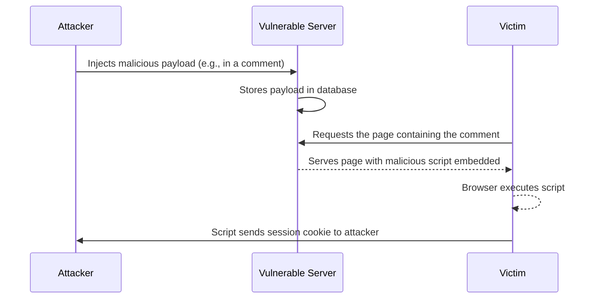

# Unit - 4
:::info[Title]
## Advanced Web Application Attacks
:::

## 1. Cross-Site Scripting (XSS)

### 1.1 What is XSS?
Cross-Site Scripting (XSS) is a critical web security vulnerability that allows an attacker to inject malicious client-side scripts (usually JavaScript) into web pages viewed by other users. 
- **Core Issue:** It allows attackers to circumvent the **Same Origin Policy (SOP)**, a fundamental browser security mechanism designed to segregate different websites from each other.
- **Mechanism:** By manipulating a vulnerable website to return malicious JavaScript, the attacker's code executes inside the victim's browser within the context of that user's session.

### 1.2 Anatomy of an XSS Exploitation
An XSS attack typically involves three parties: the attacker, the vulnerable application, and the victim.



### 1.3 What can XSS be used for?
If an attacker successfully exploits an XSS vulnerability, they can:
- **Impersonate:** Masquerade as the victim user.
- **Perform Actions:** Carry out any action that the user is authorized to perform (e.g., changing passwords, making unauthorized purchases).
- **Data Theft:** Read any data the user can access and capture login credentials.
- **Defacement:** Perform virtual defacement of the website.
- **Intranet Pivoting:** Scan and exploit intranet appliances and applications the victim's browser can reach, bypassing external firewalls.
- **Malware:** Inject trojan functionality or spread web worms.

## 2. Types of XSS Attacks

### 2.1 Reflected XSS (Non-Persistent)
Reflected XSS occurs when an application receives data in an HTTP request and immediately includes that data within the HTTP response in an unsafe, unescaped way.
- **Delivery:** Attackers must trick the victim into clicking a maliciously crafted link (often delivered via phishing emails or shortened URLs).
- **Common Targets:** Search result pages and error message pages that reflect user input back to the screen (e.g., displaying "You searched for: [input]").
- **Example Payload:** 
  `https://insecure-website.com/search?q=<script>alert(document.cookie)</script>`

### 2.2 Stored XSS (Persistent / Second-Order)
Stored XSS occurs when an application receives untrusted input and permanently stores it on the target server (e.g., within a database). 
- **Delivery:** The malicious script is served automatically to any user who visits the affected page later. No direct social engineering of the victim is required after the initial injection.
- **Common Targets:** Message forums, blog comments, user profile pages, or support ticket systems.
- **Example Payload:** An attacker posts a forum comment containing `<script>/* Malicious Code */</script>`. Every user viewing that thread executes the script.

### 2.3 DOM-Based XSS (Client-Side XSS)
DOM-based XSS occurs entirely within the browser. The vulnerability exists purely in the client-side JavaScript execution rather than the server-side code.
- **Mechanism:** The application contains legitimate client-side JavaScript that processes data from an untrusted source (like the URL query string or a fragment `#`) and writes it back to the Document Object Model (DOM) unsafely (e.g., using `innerHTML`).
- **Example:**
  ```javascript showLineNumbers
  // Vulnerable script on the page
  let search = window.location.hash.substring(1);
  document.getElementById('results').innerHTML = 'You searched for: ' + search;
  ```
  An attacker provides the link `http://site.com/#`. The backend server never sees the payload after the `#`, but the browser parses and executes it.

## 3. Preventing XSS Attacks

Preventing XSS requires a defense-in-depth approach, combining several technical measures:

### 3.1 Input Filtering and Output Encoding
- **Filter input on arrival:** Validate input strictly based on expected formats (allow-listing). Reject anything that doesn't conform.
- **Encode data on output:** This is the most effective and critical defense. Before rendering user-controllable data into an HTTP response, encode it so the browser interprets it strictly as data, not as executable content.
  - Apply context-specific encoding (HTML entity encoding, JavaScript encoding, CSS encoding, or URL encoding) depending on where the data is placed within the document.

### 3.2 Security Headers
- **Content-Type & X-Content-Type-Options:** Use these headers to ensure the browser interprets responses correctly and prevents MIME-sniffing, forcing the browser to respect your declared content type.
- **Content Security Policy (CSP):** A crucial last line of defense. CSP allows site administrators to declare an allow-list of approved sources of executable scripts, preventing the browser from running dangerous inline scripts or scripts loaded from untrusted domains.

## 4. Blocking Malicious Requests (WAF)

A **Web Application Firewall (WAF)** is a specialized security layer that sits between the web application and the internet, examining HTTP/HTTPS requests to detect and block malicious traffic before it ever reaches the backend servers.

### 4.1 Capabilities of a WAF
- **Threat Detection:** Rapidly identifies SQLi, XSS, web shells, code injections, CSRF, and malicious crawlers by cross-referencing incoming requests against dynamic databases of known attack signatures.
- **Content Filtering:** Scans inbound content for objectionable character strings, executable files, or traffic originating from known malicious IP addresses/botnets.
- **DDoS Protection:** Mitigates application-layer denial-of-service attacks, such as Challenge Collapsar (CC) attacks.

### 4.2 WAF Deployment Models
- **Cloud-based (Fully Managed):** Fastest deployment and hassle-free, ideal for teams with limited in-house security or IT resources.
- **Cloud-based (Self Managed):** Offers cloud flexibility while retaining granular control over traffic and specific security policy settings.
- **On-premises (Advanced WAF):** Hardware or virtual appliances deployed internally within the corporate network. Best for mission-critical applications requiring maximum performance and strict data compliance.

## 5. User Enumeration

**User (or Username) Enumeration** is a widespread vulnerability that occurs when an attacker can definitively determine whether a specific username exists in the system based on the application's responses.
- **Common Locations:** Login portals, "Forgot Password" forms, and account registration pages.

### 5.1 Exploitation Consequences
While not a direct system compromise, enumeration is a critical stepping stone for severe attacks:
1. **Brute Forcing Passwords:** Once valid usernames are confirmed, attackers confidently target those specific users with common passwords (e.g., `Password@123`).
2. **Credential Stuffing:** Attackers use the confirmed usernames to search previously breached databases on the dark web, exploiting the fact that users heavily recycle passwords across different platforms.
3. **Social Engineering:** Attackers identify valid employees and target them directly with highly personalized, convincing phishing campaigns.

### 5.2 Discovering Enumeration Flaws
Attackers observe minute differences in application behavior when submitting known valid vs. invalid usernames. These differences can include:
- **Explicit Error Messages:** Distinct messages like "Username not found" vs. "Password incorrect".
- **Time Differences:** Processing a valid user might take slightly longer (due to complex password hashing algorithms like bcrypt) than immediately rejecting an invalid one.
- **Subtle HTML Changes:** Hidden line breaks, varying content lengths, or different HTTP status codes.

### 5.3 Mitigation Strategies
- **Identical Server Responses:** The industry-standard defense is to return the exact same generic message (e.g., "The username or password is not valid") regardless of whether the user exists or not.
- **Consistent Timing:** Ensure authentication responses take a mathematically uniform amount of time to prevent sophisticated time-based enumeration attacks.

## 6. Password Reset Features & Flaws

The "Forgot Password" functionality is notoriously difficult to implement securely and remains a prime target for attackers to hijack accounts.

### 6.1 Secure Implementation Guidelines
- Return consistent messages for both existent and non-existent accounts to prevent enumeration.
- Implement rate-limiting and CAPTCHAs to prevent attackers from abusing the system to flood users with reset emails or SMS messages.
- Ensure tokens expire quickly and can strictly only be used once.
- Do not automatically log the user in after a password reset; force them to authenticate normally with their new credentials.
- Provide the option (or force) to invalidate all other active sessions across devices upon a successful reset.

### 6.2 Password Reset Methods
- **URL Tokens:** The most common approach. A unique token is generated and attached to a URL sent via email.
  - *Security:* Tokens must be cryptographically random, sufficiently long, and the URL must use HTTPS. Never rely on the `Host` header to generate the reset URL to avoid Host Header Injection attacks.
- **PINs:** 6 to 12 digit numbers sent via a side-channel like SMS.
  - *Security:* Requires strict rate-limiting and lockout policies on the entry form to prevent brute-forcing the short PIN space.
- **Offline Methods:** Using hardware OTP tokens or enterprise certificates.
- **Security Questions:** Should *never* be used as a sole mechanism, as answers (mother's maiden name, high school) are often easily guessable or discoverable via OSINT/social media.

## 7. Authentication and Session Flaws

### 7.1 Remember Me Functionality
This feature allows users to remain logged in across browser restarts using a persistent cookie, bypassing the need to enter 2FA or passwords repeatedly.
- **Risks:** The persistent cookie is highly valuable. If stolen via an XSS attack or network sniffing, it grants long-term, unauthenticated access to the attacker.
- **Best Practices:** Only use on trusted, personal devices. Warn users against using it on public or shared computers. The underlying token must be strongly encrypted, non-predictable, and frequently rotated.

### 7.2 Logout Flaws (Session Termination)
Secure session termination is vital to reduce the window of opportunity for session hijacking, XSS, and Cross-Site Request Forgery (CSRF) attacks.
- **Requirements for Secure Termination:**
  1. **Clear UI:** Clearly visible UI controls on every page to manually log out.
  2. **Timeout:** Automatic session termination after a period of inactivity (Session Timeout).
  3. **Proper Server-Side Invalidation:** The server-side session state *must* be destroyed. Simply deleting the cookie on the client-side via JavaScript or redirecting the user is critically insufficient; if the attacker captured the old cookie, it should immediately be rejected by the backend server.

## 8. CAPTCHA Mechanisms

**CAPTCHA** (Completely Automated Public Turing test to tell Computers and Humans Apart) is used to reliably distinguish human users from automated bot scripts.
- **Uses:** Preventing poll skewing, limiting spam registrations, preventing automated ticket scalping, and stopping automated brute-force login attempts.

### 8.1 Types of CAPTCHAs
- **Text CAPTCHAs:** Distorted letters and numbers. Variations include *Gimpy* (emotionally charged words), *EZ-Gimpy*, and *Simard's HIP* (alphanumerics altered with complex curves and shadings).
- **Image CAPTCHA:** Users identify semantic elements in photos (e.g., selecting all images containing traffic lights or crosswalks). Example: Google's reCAPTCHA/Street View integration.
- **Audio CAPTCHA:** Moving characters or numbers read aloud over background noise, primarily implemented for accessibility.
- **Math/Verbal Problems:** Simple arithmetic (e.g., "What is 4 + 14?"). Often too simple and easily bypassed by basic parsing scripts.

### 8.2 Securing CAPTCHAs
Bots have become highly advanced, utilizing OCR (Optical Character Recognition) and machine learning vision models to bypass basic checks.
- **Random Distortion:** Images must be heavily and randomly distorted to defeat OCR algorithms.
- **Unpredictability:** Do not use predictable patterns or simple, parsable math equations.
- **Combine Techniques:** Combine text reading with image selection or audio to increase complexity.
- **Backend Validation:** Ensure the CAPTCHA validation occurs securely on the server-side, not just in client-side JavaScript, and never pass the solution in plaintext within the page source.